# Chapter 11: LOW ALTITUDE APPROACHES

#### 11.1.{#11_1} Introduction.

Low altitude approaches are used to transition aircraft from the low altitude environment to final approach for landing. Low altitude instrument approach procedures exist for one purpose -- to assist you in guiding your aircraft to the final approach fix, on course, on altitude, and in the final approach configuration (Figure 11.1). It has become normal to expect ATC to provide radar vectors to final; however, you must always be prepared to execute the "full procedure" when appropriate.

11.1.1. NOTE: This chapter deals primarily with low altitude approaches flown in FAA airspace. All procedures detailed in this chapter apply to FAA and ICAO airspace unless annotated otherwise in Chapter 17, ICAO Procedures.

11.1.2. CAUTION: Aircrews should use caution when flying a "high altitude" IAP in the low altitude environment, especially if there are multiple approaches based on the same NAVAID at the airport. If you are receiving radar vectors in the low altitude structure, ATC expects you to fly the low altitude version of the approach. Often the high and low altitude approaches are the same, but sometimes they are not. Ask for and receive a clearance for the exact approach you intend to fly. Query the controller if you receive an unclear or incomplete approach clearance.

##### Figure 11.1. Low Altitude Approach.
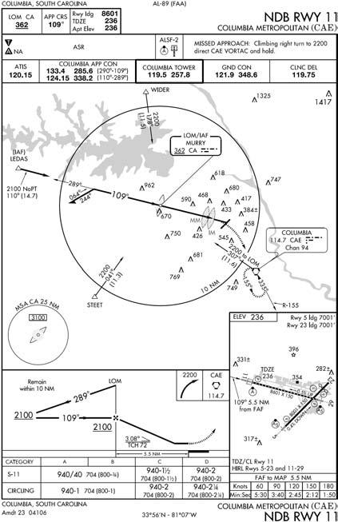

----

#### 11.2.{#11_2} Overview.

There are two broad categories of low altitude approaches: course reversals and procedure tracks. Before we look at each type in detail, here are some guidelines that apply to all low altitude approaches:

11.2.1. Initial Approach Fix (IAF). Most approaches begin at an IAF. ATC will normally clear you to the appropriate IAF and then clear you for the approach. Unless ATC specifically clears you otherwise, you are expected to fly to the IAF and execute the full instrument approach procedure as published.

11.2.2. Final Approach Segment. Some approaches depict only a final approach segment, starting at the FAF (Figure 11.2). In these cases, radar is required to ensure you are properly aligned with the final approach course at the appropriate altitude. When ATC clears you for the approach, maintain the last assigned altitude until established on a segment of the published IAP.

##### Figure 11.2. Approach Depicting Only the Final Approach Segment.
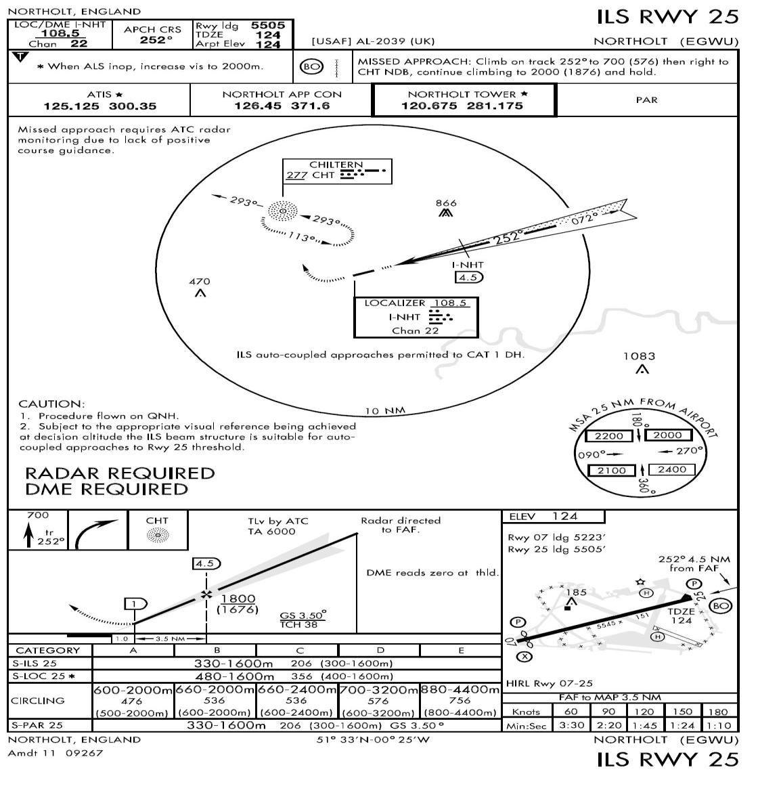

11.2.3. Aircraft Speed. Prior to reaching the initial approach fix, the pilot must slow to aircraft maneuvering speed. Use holding airspeed if maneuvering airspeed is not specified for your aircraft. Establish approach configuration and airspeed before the final approach fix unless your aircraft flight manual procedures require otherwise.

----

#### 11.3.{#11_3} Types of Course Reversals.

There are two common types of course reversals: the procedure turn (PT) (Figure 11.3) and the holding pattern in lieu of procedure turn (HILO PT) (Figure 11.4).

11.3.1. Restrictions. Do not execute a procedure turn or HILO PT in the following situations. (Many people use the memory aid – SNERT).

+ 11.3.1.1. When ATC gives you clearance for a "Straight-in" approach.

+ 11.3.1.2. If you are flying the approach via No PT routing (Figure 11.5).

+ 11.3.1.3. When you are Established in holding, subsequently cleared the approach, and the holding course and procedure turn course are the same.

	+ 11.3.1.3.1. NOTE: This generally applies if you are already established at the minimum holding altitude. If you are in doubt as to what action the controller expects, query the controller.

+ 11.3.1.4. When ATC provides Radar vectors to the final approach course.

+ 11.3.1.5. When ATC clears you for a Timed approach. Timed approaches are in progress when you are established in a holding pattern and given a time to depart the FAF inbound.

+ 11.3.1.6. In any of the situations described above, proceed over the FAF at the published FAF altitude and continue inbound on the final approach course without making a procedure turn, holding pattern, or any other aligning maneuver before the FAF unless otherwise cleared by ATC. If you need to make additional circuits in a published holding pattern or to become better established on course before departing the FAF, it is your responsibility to request such maneuvering from ATC.

	+ 11.3.1.6.1. NOTE: Historically, these restrictions have created a lot of confusion between pilots and controllers. If you are ever in doubt about what ATC expects you to do, query the controller.

##### Figure 11.3. Procedure Turn Course Reversal.
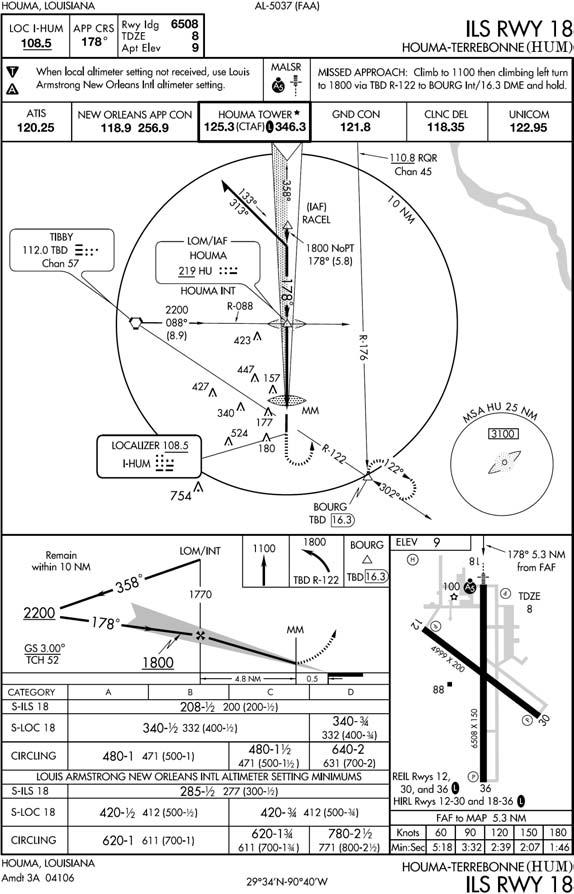

##### Figure 11.4. HILO Approach.
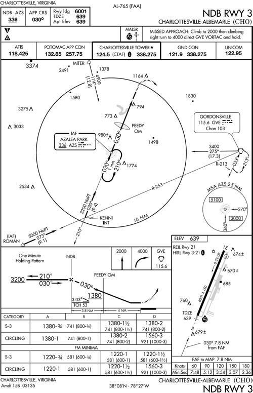

##### Figure 11.5. NoPT Routing.
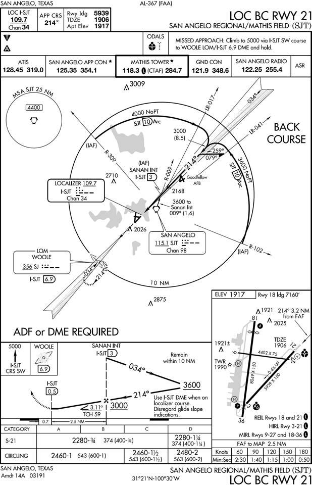

----

#### 11.4.{#11_4} Procedure Turns.

One of the most common types of low altitude course reversals is the procedure turn. Procedure turns are depicted in the plan view of U.S. government charts with a barb symbol (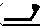) indicating the direction or side of the outbound course on which the procedure turn or maneuvering is to be accomplished (Figure 11.3). The procedure turn fix is identified on the profile view of the approach at the point where the IAP begins. To give you an idea of what the procedure turn airspace looks like, refer to Figure 11.6. The actual radii of a PT area are dependent on the altitude and airspeed of the specific procedure.

##### Figure 11.6. Procedure Turn Area.
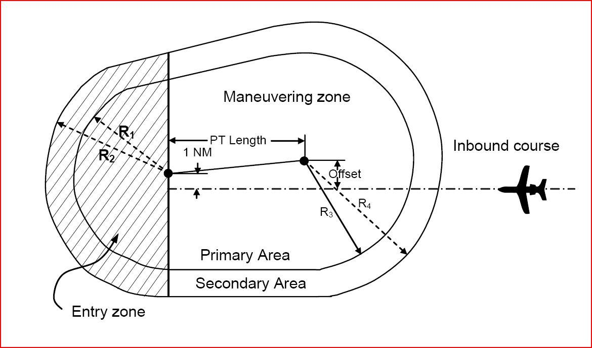

11.4.1. Aircraft Speed. Procedure turns may be safely flown at speeds up to 250 KIAS provided the pilot takes into consideration all factors which may affect the aircraft's turn performance (e.g., winds, TAS at altitude, bank angle, etc.).

+ 11.4.1.1. NOTE: The FAA recommends a maximum airspeed of 200 KIAS while performing procedure turn course reversals, and when possible, USAF aircraft should also observe this speed restriction. If a speed of 200 KIAS is not practical, you must exercise caution to ensure your aircraft remains in the protected airspace provided by TERPS.

----

#### 11.5.{#11_5} Methods for Flying Procedure Turns.

There are three common methods for executing a procedure turn course reversal: the holding technique, the 45/180, and the 80/260. Regardless of the method you choose to fly the procedure turn, take the following two notes into consideration when planning your approach:

11.5.1. Plan the outbound leg to allow enough time for configuration and any descent required prior to the FAF. Adjust the outbound leg length to ensure your aircraft will stay inside the "remain within distance" noted on the profile view of the approach plate. The remain within distance is measured from the procedure turn fix unless the IAP specifies otherwise. At the completion of the outbound leg, turn to intercept the procedure turn course inbound.

11.5.2. When the NAVAID is on the field and no FAF is depicted (Figure 11.7), plan the outbound leg so the descent to MDA can be completed with sufficient time to acquire the runway and position the aircraft for a normal landing. Consideration should be given to configuring on the outbound leg to minimize pilot tasking on final. When flying this type of approach, the FAF is considered to be the point when you begin your descent from the procedure turn completion altitude. Since this point is considered the FAF, you should establish approach configuration and airspeed prior to departing procedure turn completion altitude unless your aircraft flight manual procedures require otherwise.

##### Figure 11.7. Procedure Turn Approach with No FAF Depicted.
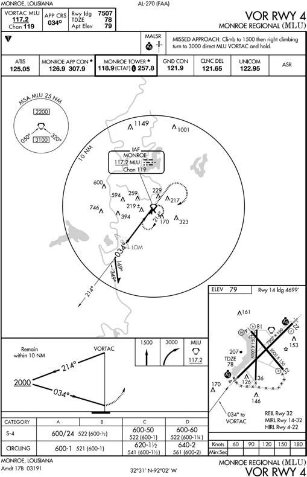

----

#### 11.6.{#11_6} Holding Method.

Enter the procedure turn according to the holding procedures described in Chapter 8 with the following exceptions:

11.6.1. If your heading is within 90° of the outbound procedure turn course, you may use normal lead points to intercept the procedure turn course outbound.

11.6.2. If you elect a teardrop entry, your teardrop course must be within 30 degrees of the procedure turn course. Use course guidance if it is available.

11.6.3. If you intercept the procedure turn course outbound, maintain the course for the remainder of the outbound leg, then turn toward the maneuvering side to reverse course.

11.6.4. Timing. Begin timing once you are outbound abeam the procedure turn fix. If you cannot determine the abeam position while in the turn, start timing after completing the outbound turn.

11.6.5. Descent. Do not descend from the procedure turn fix altitude (published or assigned) until abeam the procedure turn fix heading outbound. If unable to determine when you are abeam, start descent after completing the outbound turn. Do not descend from the procedure turn completion altitude until established on the inbound segment of the approach. Some procedures may contain a note in the chart profile that says "Maintain (altitude) or above until established outbound for procedure turn". Newer procedures will simply depict an "at or above" altitude at the PT fix without a note. Both are there to ensure required obstacle clearance is provided in the procedure turn entry zone (Figure 11.8). Absence of a chart note or a specified minimum altitude adjacent to the PT fix is an indication that descent to the procedure turn altitude can commence immediately upon crossing over the PT fix, regardless of the direction of flight. 

##### Figure 11.8. PT Fix Altitude.
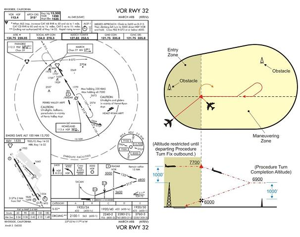

----

#### 11.7.{#11_7} The 45°/180° and the 80°/260° Course Reversals.

Two other methods to accomplish a procedure turn approach are the 45°/180° and the 80°/260° course reversal maneuvers. The procedures for flying each maneuver are identical with the exception of the actual course reversal.

11.7.1. Entry. Upon reaching the procedure turn fix, turn in the shortest direction to intercept the procedure turn course outbound. Use normal lead points if practical.

11.7.2. Proceeding Outbound. Intercept and maintain the procedure turn course outbound as soon as possible after passing the procedure turn fix.

11.7.3. Descent. Do not descend from the procedure turn fix altitude (published or assigned) until abeam the procedure turn fix and on a parallel or intercept heading to the outbound track. Do not descend from the procedure turn completion altitude until established on the inbound segment of the approach.

+ 11.7.3.1. NOTE: When flying procedure turns designed in FAA airspace, there is no requirement to wait until you are on a parallel or intercept heading to begin descent from the procedure turn fix altitude; however, when flying these types of course reversals in ICAO airspace, this procedure is MANDATORY due to different TERPS criteria. In the interest of forming good habit patterns, the ICAO method has been adopted by the USAF as procedural.

11.7.4. Executing the Course Reversal Maneuver. At the appropriate time on the outbound leg, begin the course reversal maneuver. In both cases, comply with the published remain within distance.

+ 11.7.4.1. The 45°/180°. To begin the reversal maneuver, turn 45° away from the outbound track toward the maneuvering side. Begin timing upon initiating the 45° turn; time for 1 minute (Categories A and B) or 1 minute and 15 seconds (Categories C, D, and E); then begin a 180° turn in the opposite direction from the initial turn to intercept the procedure turn course inbound.

+ 11.7.4.2. The 80°/260°. To begin the reversal maneuver, make an 80° turn away from the outbound track toward the maneuvering side followed by an immediate 260° turn in the opposite direction to intercept the inbound course.

----

#### 11.8.{#11_8} Holding Pattern in Lieu of Procedure Turn (HILO PT).

The HILO PT is another common way to execute a low altitude course reversal. The HILO PT is depicted like any other holding pattern except the holding pattern track is printed with a heavy black line (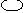) in the plan view. The depiction of the approach in the profile view varies depending on where the descent should begin.

11.8.1. Flying the Holding Pattern. The holding pattern should be flown as depicted, to include leg length or timing. Enter and fly the HILO PT holding pattern according to the holding procedures described in Chapter 8.

11.8.2. Descent. Descent from the minimum holding altitude may be depicted in two ways: descent at the holding fix or descent on the inbound leg. When a descent is depicted on the inbound leg, you must be established on the inbound segment of the approach before beginning the descent.

11.8.3. Additional Guidance for HILO PTs. If cleared for the approach while holding in a published HILO PT, complete the holding pattern and commence the approach without making additional turns in the holding pattern (altitude permitting). If an additional turn is needed to lose excessive altitude, request clearance from ATC since additional circuits of the holding pattern are not expected by ATC. If the aircraft is at an altitude from which the approach can be safely executed and you are ready to turn inbound immediately, you may request approval for an early turn from ATC.

----

#### 11.9.{#11_9} Procedural Tracks.

11.9.1. Depiction. There is no specific depiction for a procedural track. (Figures 11.9, 11.10 and 11.11) It may employ arcs, radials, courses, turns, etc. When a specific flight path is required, procedural track symbology is used to depict the flight path between the IAF and FAF. The depiction used is a heavy black line showing intended aircraft ground track. 

##### Figure 11.9. Procedure Track Approach (Straight-in).
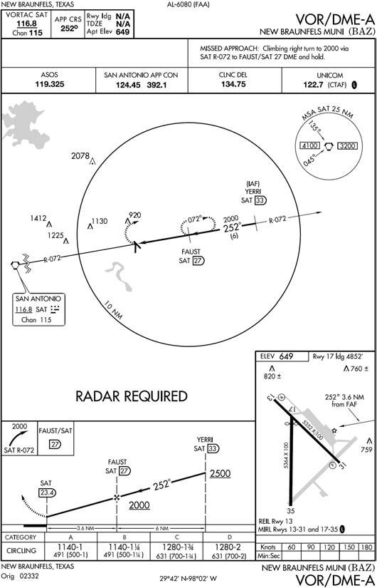

##### Figure 11.10. Procedure Track Approach (Arcing Final).
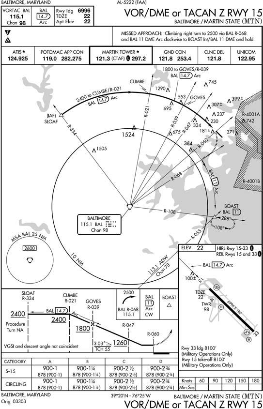

##### Figure 11.11. Procedure Track Approach (Arc to Radial).
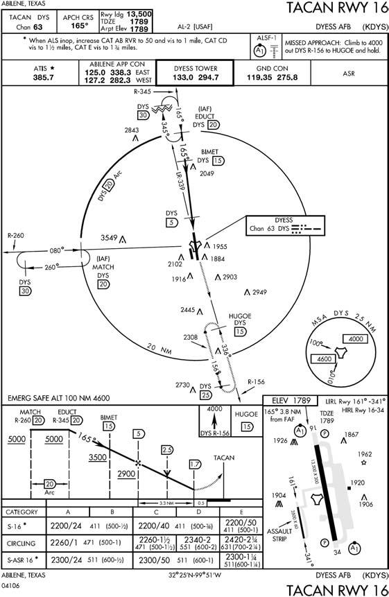

11.9.2. Entry. When over the IAF, turn immediately in the shorter direction to intercept the published track. If your heading is within 90° of the procedure track course, you may use normal lead points to intercept the course. If your heading is not within 90° of the course, overfly the fix and turn in the shorter direction to intercept the procedure track course.

11.9.3. Maneuvering. Conform to the specific ground track shown on the IAP. Where a teardrop turn is depicted, you may turn to the inbound course at any time unless otherwise restricted by the approach plate. Determine when to turn by using the aircraft turn performance, winds, and the amount of descent required on the inbound course; however, do not exceed the published remain within distance.

11.9.4. Descent. A descent can be depicted at any point along the procedural track.

+ 11.9.4.1. IAF. When a descent is depicted at the IAF, start descent when abeam or past the IAF and on a parallel or intercept heading to the procedural track course. Except for initial descents at an IAF, be established on the appropriate segment of the procedural track before descending to the next altitude shown on the IAP.

	+ 11.9.4.1.1. Note: Low altitude approaches may include arc-to-radial, arc-to localizer and radial-to-arc combinations. An arc-to-radial and arc-to localizer altitude restrictions apply only while established on that segment of the IAP. Once a lead point is reached and a turn to the next segment is begun, you may consider yourself established on the next segment and descend to the next applicable altitude. When an altitude restriction is depicted at a fix defined as an inter a radial and an arc, the restriction must be complied with no later than the completion of the lead turn associated with that fix. If the restriction is met during the lead turn, consider yourself established on the next segment, and you may continue to descend to the next applicable altitude restriction.

	+ 11.9.4.1.2. CAUTION: Maximum designed obstacle clearance is based on your ability to maintain the course centerline; you must use your position orientation and your judgment to determine when to descend while attempting to intercept the procedural track.

+ 11.9.4.2. Teardrop. (Figure 11.12) Where a teardrop is depicted, do not descend from the turn altitude until you are established on the inbound segment of the procedural track.

##### Figure 11.12. Procedure Track Approach (Teardrop).
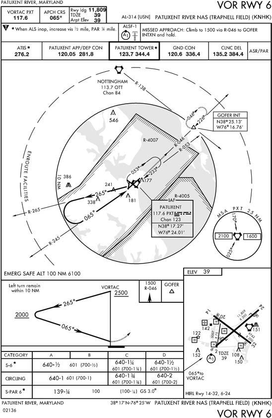

----

#### 11.10.{#11_10} RNAV (GPS) Entry Procedures Via the Terminal Arrival Area (TAA).

Entry for RNAV (GPS) approaches is normally accomplished via the TAA. Entry may be accomplished either via a NoPT routing, or via a course reversal maneuver if depicted.

11.10.1. Objective. The objective of the TAA is to provide a seamless transition from the en route structure to the terminal environment for arriving aircraft equipped with Flight Management System (FMS) and/or Global Positioning System (GPS) navigational equipment. The TAA will not be found on all RNAV procedures, particularly in areas of heavy concentration of air traffic. When the TAA is published, it replaces the MSA for that approach procedure.

11.10.2. The TAA structure. The RNAV procedure underlying the TAA will be the "T" design (also called the "Basic T"), or a modification of the "T." The "T" design incorporates from one to three IAFs; an intermediate fix (IF) that serves as a dual purpose IF (IAF); a final approach fix (FAF), and a missed approach point (MAP) usually located at the runway

 threshold (see Figure 11.13). The three IAFs are normally aligned in a straight line perpendicular to the intermediate course, which is an extension of the final course leading to the runway, forming a "T." The initial segment is normally from 3-6 NM in length; the intermediate 5-7 NM, and the final segment 5 NM. Specific segment length may be varied to accommodate specific aircraft categories for which the procedure is designed. However, the published segment lengths will reflect the highest category of aircraft normally expected to use the procedure. 

 ##### Figure 11.13. Terminal Arrival Area (TAA).
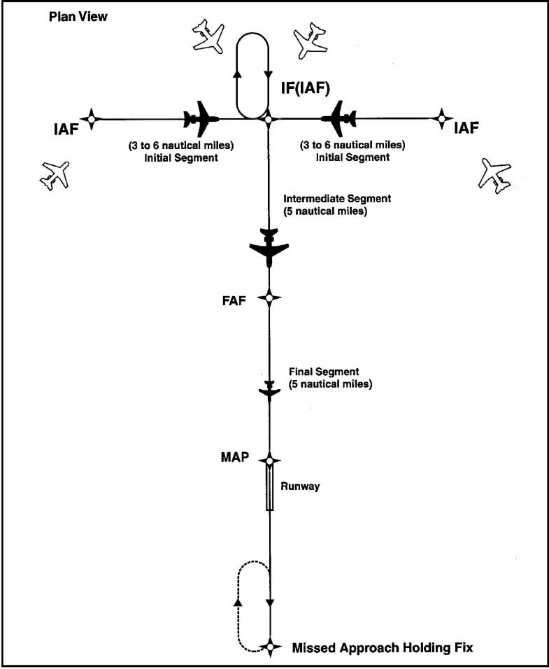

11.10.3. Holding-in-Lieu Entry. A standard racetrack holding pattern may be provided at the center IAF, and if present may be necessary for course reversal and for altitude adjustment for entry into the procedure. In the latter case, the pattern provides an extended distance for the descent required by the procedure. Depiction of this pattern in U.S. Government publications will utilize the "hold-in-lieu-of-PT" holding pattern symbol.

11.10.4. Entry via NoPT routing. The published procedure will be annotated to indicate when the course reversal is not necessary when flying within a particular TAA area; e.g., "NoPT." Otherwise, the pilot is expected to execute the course reversal. The pilot may elect to use the course reversal pattern when it is not required by the procedure, but must inform air traffic control and receive clearance to do so.

+ 11.10.4.1. Modified "T" designs. The "T" design may be modified by the procedure designers where required by terrain or air traffic control considerations (Figure 11.14). For instance, the "T" design may appear more like a regularly or irregularly shaped "Y", or may even have one or both outboard IAFs eliminated resulting in an upside down "L" or an "I" configuration. Further, the leg lengths associated with the outboard IAFs may differ. 

##### Figure 11.14. Modified T Design.
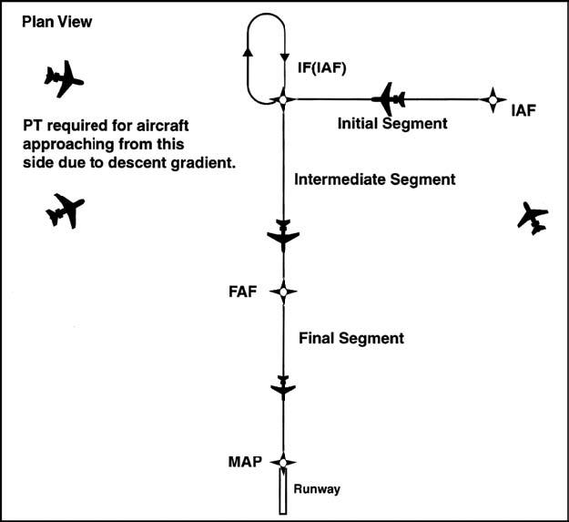

	
11.10.4.1.1. Parallel Runway "T". Another modification of the "T" design may be found at airports with parallel runway configurations (Figure 11.15). Each parallel runway may be served by its own "T" IAF, IF (IAF), and FAF combination, resulting in parallel final approach courses. Common IAFs may serve both runways; however, only the intermediate and final approach segments for the landing runway will be shown on the approach chart.

##### Figure 11.15. Parallel T Design.
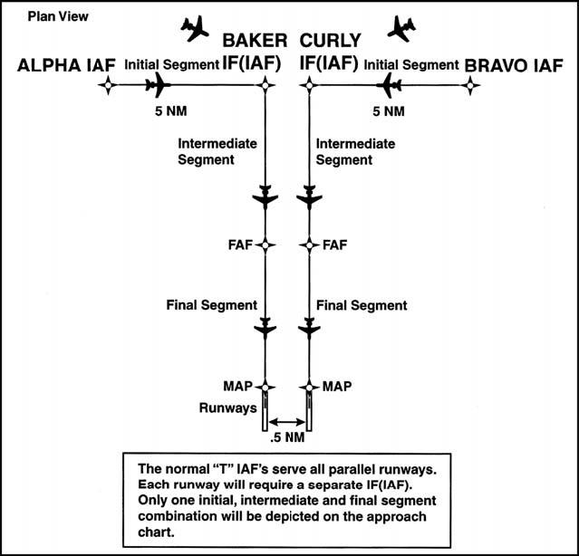

11.10.5. TAA areas. The standard TAA consists of three areas defined by the extension of the IAF legs and the intermediate segment course (Figure 11.16). These areas are called the straight-in, left-base, and right-base areas. TAA area lateral boundaries are identified by magnetic courses TO the IF (IAF). The straight-in area can be further divided into pie-shaped sectors with the boundaries identified by magnetic courses TO the IF (IAF), and may contain stepdown sections defined by arcs based on RNAV distances (DME or ATD) from the IF (IAF). The right/left-base areas can only be subdivided using arcs based on RNAV distances from the IAFs for those areas. Minimum MSL altitudes are charted within each of these defined areas/subdivisions that provide at least 1,000 feet of obstacle clearance, or more as necessary in mountainous areas.

##### Figure 11.16. Standard TAA Area.
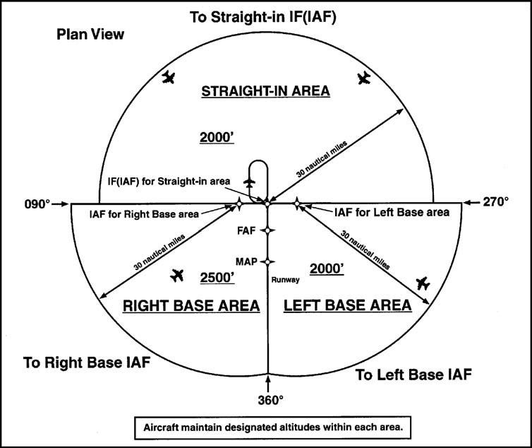

11.10.6. Selecting the Entry IF. Prior to arriving at the TAA boundary, the pilot should determine which area of the TAA the aircraft will enter by selecting the IF (IAF) and determine the magnetic bearing TO the IF (IAF). That bearing should then be compared with the published bearings that define the lateral boundaries of the TAA areas. This is critical when approaching the TAA near the extended boundary between the left and right-base areas, especially where these areas contain different minimum altitude requirements.

11.10.7. Proceeding Direct to IAF. Pilots entering the TAA and cleared by air traffic control are expected to proceed directly to the IAF associated with that area of the TAA at the altitude depicted, unless otherwise cleared by air traffic control. If in doubt, query ATC. Pilots entering the TAA with two-way radio communications failure must maintain the highest altitude assigned, expected, or filed until arriving at the appropriate IAF.

11.10.8. Depiction of TAA Icons. Depiction of the TAA on U.S. Government charts will be through the use of icons located in the plan view outside the depiction of the actual approach procedure (Figure 11.17). Use of icons is necessary to avoid obscuring any portion of the "T" procedure (altitudes, courses, minimum altitudes, etc.). The icon for each TAA area will be located and oriented on the plan view with respect to the direction of arrival to the approach procedure, and will show all TAA minimum altitudes and sector/radius subdivisions for that area. The IAF for each area of the TAA is included on the icon where it appears on the approach, to help the pilot orient the icon to the approach procedure. The IAF name and the distance of the TAA area boundary from the IAF are included on the outside arc of the TAA area icon. Examples here are shown with the TAA around the approach to aid pilots in visualizing how the TAA corresponds to the approach and should not be confused with the actual approach chart depiction.

##### Figure 11.17. RNAV GPS Approach With TAA.
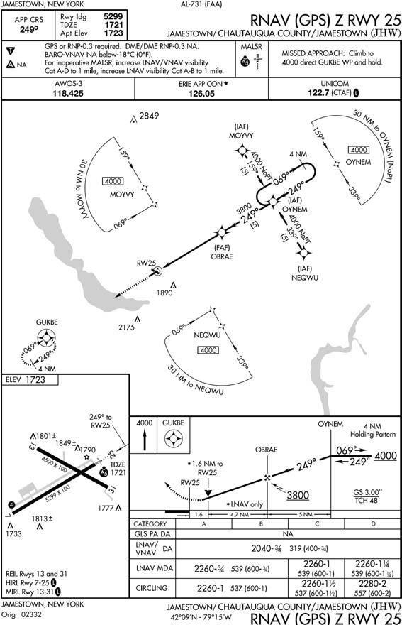

11.10.9. Waypoint names. Each waypoint on the "T", except the missed approach waypoint, is assigned a pronounceable 5-character name used in air traffic control communications, and which is found in the RNAV databases for the procedure. The missed approach waypoint is assigned a pronounceable name when it is not located at the runway threshold.

11.10.10. Descents. Once cleared to fly the TAA, pilots are expected to obey minimum altitudes depicted within the TAA icons, unless instructed otherwise by air traffic control. In Figure 11.18, pilots within the left or right-base areas are expected to maintain a minimum altitude of 6,000 feet until within 17 NM of the associated IAF. After crossing the 17 NM arc, descent is authorized to the lower charted altitudes. Pilots approaching from the northwest are expected to maintain a minimum altitude of 6,000 feet, and when within 22 NM of the IF (IAF), descend to a minimum altitude of 2,000 feet MSL until reaching the IF (IAF).

##### Figure 11.18. Descents in TAA.
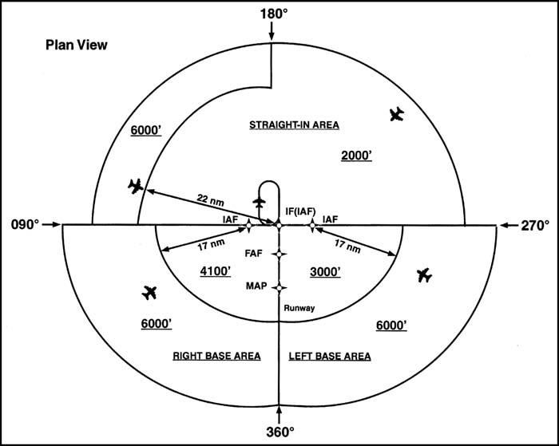

11.10.11. Entry procedures for Modified TAAs. Just as the underlying "T" approach procedure may be modified in shape, the TAA may contain modifications to the defined area shapes and sizes. Some areas may even be eliminated, with other areas expanded as needed. Figure 11.19 is an example of a design limitation where a course reversal is necessary when approaching the IF (IAF) from certain directions due to the amount of turn required at the IF (IAF). Design criteria require a course reversal whenever this turn exceeds 120 degrees. In this generalized example, pilots approaching on a bearing TO the IF (IAF) from 300° clockwise through 060° are expected to execute a course reversal. The term "NoPT" will be annotated on the boundary of the TAA icon for the other portion of the TAA.

##### Figure 11.19. Entry Procedures for Modified TAAs.
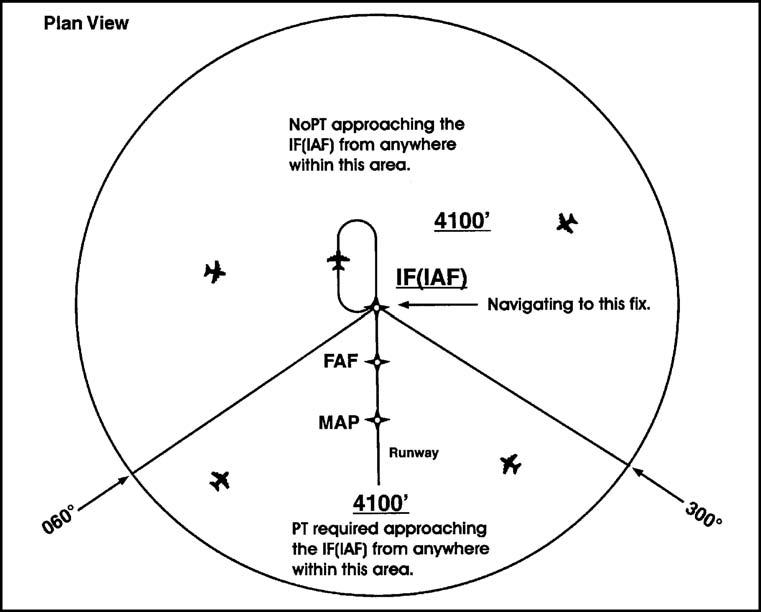

11.10.12. Entry Procedures for one-base TAAs. Figure 11.20 depicts another TAA modification that pilots may encounter. In this generalized example, the right-base area has been eliminated. Pilots operating within the TAA between 360° clockwise to 060° bearing TO the IF (IAF) are expected to execute the course reversal in order to properly align the aircraft for entry onto the intermediate segment. Aircraft operating in all other areas from 060° clockwise to 360° degrees bearing TO the IF (IAF) need not perform the course reversal, and the term "NoPT" will be annotated on the TAA boundary of the icon in these areas.

##### Figure 11.20. Entry Procedures for One-Base TAAs.
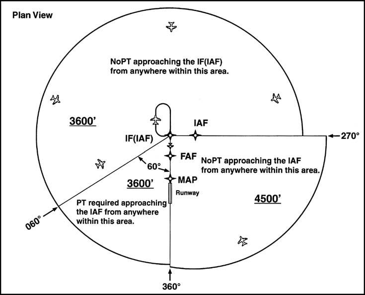

11.10.13. Feeder Routes. When an airway does not cross the lateral TAA boundaries, a feeder route will be established to provide a transition from the en route structure to the appropriate IAF (Figure 11.21). Each feeder route will terminate at the TAA boundary, and will be aligned along a path pointing to the associated IAF. Pilots should descend to the TAA altitude after crossing the TAA boundary and cleared by air traffic control.

##### Figure 11.21. TAA with Feeders from an Airway.
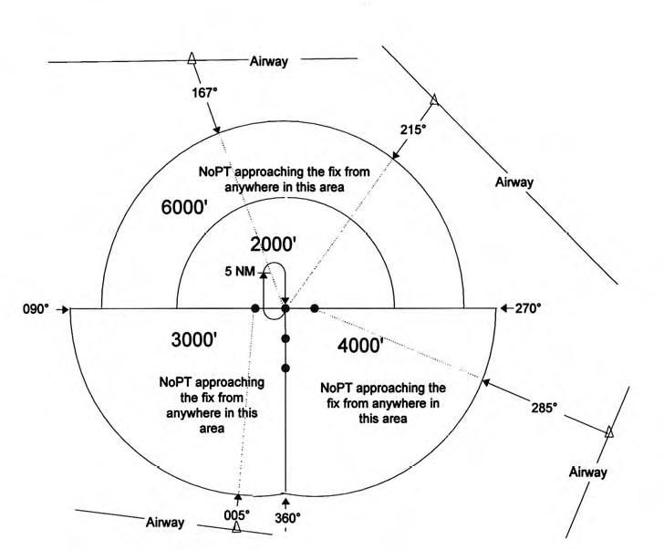

----

#### 11.11.{#11_11} Helicopter Only Approaches (Figure 11.22).

Helicopter only approaches are identified by the term "COPTER", the type of facility producing final approach course guidance, and a numerical identification of the final approach course; for example, COPTER VOR 336. The criteria for copter only approaches are based on the unique maneuvering capability of the helicopter at airspeeds not exceeding 90 knots (EXCEPT 70 KIAS when on the final approach or missed approach segment and, if annotated, in holding. See AFI 11-202V3). On the basis of this airspeed, these special helicopter only approaches may be used with the helicopter being considered an approach Category A aircraft. These approaches should all be considered "straight-in" and, therefore, a visibility only approach may be accomplished. Once the instrument approach has been accomplished, you should plan to touch down on the threshold of the procedure runway or helipad. If there are several helipads, the designated instrument helipad will be identified using "negative symbology".

##### Figure 11.22. Copter Only Approach.
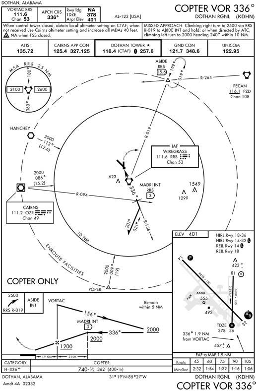

11.11.1. Low Altitude Approach. In a low altitude approach, a maximum 400 feet per nautical mile descent is normally planned. In copter only approaches, however, the gradient may be as high as 800 feet per nautical mile.

11.11.2. Short Procedures. Looking at Figure 11.23, we can see an example of a very short procedure. The initial approach fix is only .5 miles from the distance measuring equipment (DME) arc procedural track. From the final approach fix (FAF) to the missed approach point (MAP) is 2.3 miles. While this approach should not be difficult to accomplish, careful review could prevent you from becoming rushed during the maneuver.

##### Figure 11.23. Short Final Approach.
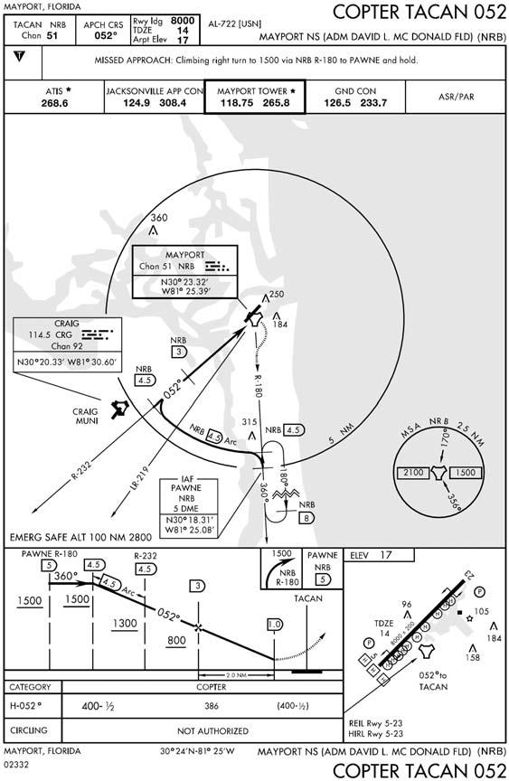

11.11.3. Point In Space. While the point in space approach (Figure 11.24) is rare, it does illustrate how approach design takes advantage of helicopter capability. This approach (see AFMAN 11-226 TERPS) places the helicopter up to 2,600 feet from the landing pad, and the pilot is expected to proceed visually, by ground reference, to the pad. If planning to use this type of approach, pay careful attention to weather conditions upon arrival, as VMC conditions are required to maneuver.

##### Figure 11.24. Point in Space Approach.
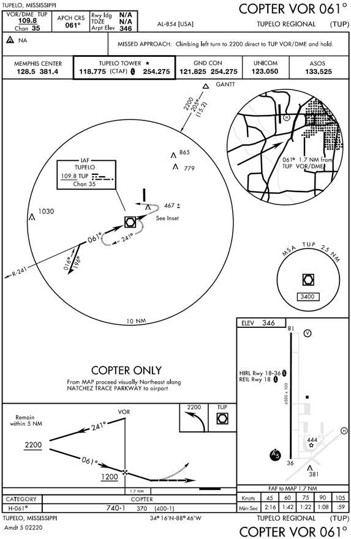