# Chapter 12: FINAL APPROACH

#### 12.1.{#12_1} Final Approach Guidance.

There are several types of final approach guidance. For the purposes of this chapter, final approach guidance will be categorized as: Non-radar, Radar, Procedures with a Visual Component (visual approach, contact approach, IAP with a visual segment and charted visual chart procedures), and Other Specialized Procedures (converging approaches, ILS Precision Runway Monitor (ILS/PRM), Simultaneous Offset Instrument Approaches (SOIA), and Transponder Landing System (TLS).) Once inside the final approach fix, one navigation receiver available to the pilot flying must remain tuned to and display the facility that provides final approach course guidance.

12.1.1. Final Approach Components. In general, final approach segments consist of a few basic items: The final approach fix (FAF), stepdown fixes, visual descent point (VDP), missed approach point (MAP), minimum descent altitude (MDA) and decision height/decision altitude (DH/DA). The first four can be defined by a NAVAID, a waypoint, crossing radials of two NAVAIDs, or a radial and DME. The optimum final approach course length is 5 miles but may be as long as 10 miles.

+ 12.1.1.1. The FAF is the point where the final approach begins and will be depicted by a Maltese cross in the profile view of the approach along with a recommended, minimum, or mandatory crossing altitude. Normally, aircraft will cross the FAF at approach speed in the landing configuration. Certain extenuating circumstances or unique aircraft procedures may cause procedural variations but the pilot should strive to have the aircraft on a stabilized profile by the FAF in order to mitigate spatial disorientation or deviations from the approach.

+ 12.1.1.2. Stepdown Fixes. Some non-precision approaches may have one or more stepdown fixes between the FAF and the MAP. These fixes are normally included to avoid an obstacle inside the FAF. Descent below stepdown fix altitude is limited to aircraft capable of simultaneous reception of final approach course guidance and the stepdown fix. Regardless of the type or number of navigation facilities used to define the stepdown fix, one navigation receiver must remain tuned to and display final approach course guidance. For example, aircraft equipped with a single VOR receiver will not descend below a stepdown fix altitude when two VOR radials define that fix.

+ 12.1.1.3. The VDP is a defined point on the final approach course of a non-precision straight-in approach procedure from which a normal descent (approximately 3°) from the MDA to the runway touchdown point may be commenced, provided visual reference with the runway environment is established. The VDP is normally identified by DME and is computed for the non-precision approach with the lowest MDA on the IAP. A 75 MHz marker may be used on those procedures where DME cannot be implemented. VDPs are not a mandatory part of the procedure, but are intended to provide additional guidance where they are implemented. A visual approach slope indicator (VASI) lighting system is normally available at locations where VDPs are established. Where VASI is installed, the VDP and VASI glide paths are normally coincident. If VASI is not installed, the descent is computed from the MDA to the runway threshold. On multi-facility approaches, the depicted VDP will be for the lowest MDA published. Therefore, on an approach with a higher MDA, the published VDP will not be correct and must be computed by the pilot. No special technique is required to fly a procedure with a VDP; however, to be assured of the proper obstacle clearance, the pilot should not descend below the MDA before reaching the VDP and acquiring the necessary visual reference with the runway environment. The VDP is identified on the profile view of the approach chart by the symbol "V" (Figure 12.1.)

	+ 12.1.1.3.1. In some cases a published VDP may be absent from an IAP due to an obstacle that penetrates a 20:1 surface. In addition, there was a period of time where the FAA did not place any emphasis on publishing VDPs on IAPs. As a result, many IAPs were designed without published VDPs. When an IAP is published without a VDP, there is currently no way for the pilot to know why. WARNING: While pilots should calculate a VDP if one is not published, if performing a non-precision approach to an unfamiliar field at night (or very low visibility) without a published VDP, and no visual or "normal" electronic glide path guidance to that runway is available, use extreme caution when departing the MDA, as there may be an obstacle penetrating the 20:1 surface. Unless familiar with the airfield, if visibility is limited, consider remaining at the MDA even if the runway environment is in sight if terrain and obstacles along the final approach cannot be discerned. See Chapter 15, Visual Glide Slope Indicators (VGSI) for more information on obstacles in the 20:1 surface.

	+ 12.1.1.3.2. One technique for calculating a VDP is to divide the HAT by the glideslope in degrees times 100. For instance, for a HAT of 450 feet and a desired glideslope to the runway of 3 degrees, divide 450 by (3 x 100) to get 1.5 miles to descend from the MDA to field elevation.

	+ 12.1.1.3.3. On approaches with no distance reference (i.e. DME), another technique involves making a calculation based on final approach timing. For most aircraft in the USAF inventory, about 10 percent of the HAT in seconds is the approximate amount of time needed to descend from the HAT to the runway on a normal glidepath. Using the numbers in the previous example, 10 percent of the 450 foot HAT would put the VDP 45 seconds prior to the end of the runway. For a final approach that is six miles long and a groundspeed of 180 knots (3 miles per minute), total time from FAF to the runway is 2 minutes. Subtracting 45 seconds from 2 minutes, the VDP would occur 1 minute and 15 seconds past the FAF.

##### Figure 12.1. Visual Descent Point (VDP).
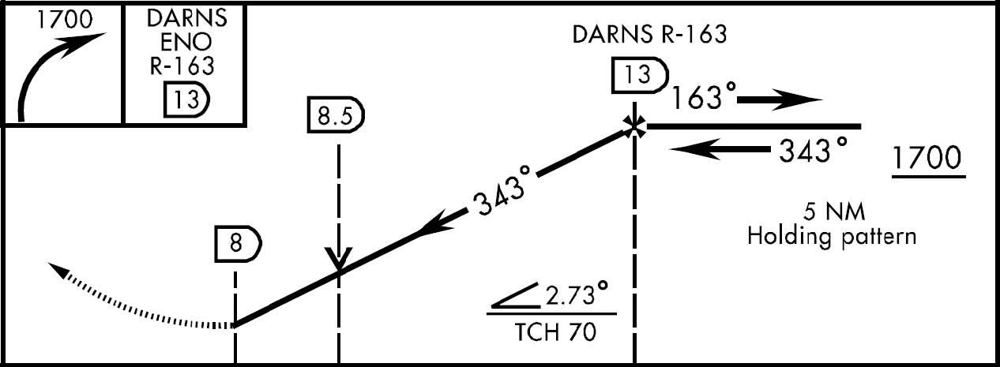

+ 12.1.1.4. The MAP is the point on non-precision approaches where an aircraft will execute a missed approach if the runway environment is not in sight or a safe landing cannot be accomplished. A more detailed description of the MAP and associated procedures is found in Chapter 14. CAUTION: Depending on the location of the MAP, the descent from the MDA (once the runway environment is in sight) will often have to be initiated prior to reaching the MAP in order to execute a normal (approximately 3°) descent to landing. (See previous discussion on VDPs.) On precision approaches there is no MAP. Rather, the pilot executes the missed approach upon reaching the Decision Altitude (DA).

12.1.2. Flying the approach. In general: Avoid rapid descents on final by crossing the FAF at the published altitude. When a turn is required over the FAF, turn immediately and intercept the final approach course to ensure that obstruction clearance airspace is not exceeded. Do not descend to the minimum descent altitude (MDA) or step down fix altitude until past the FAF (if published). Note that when the FAF is the NAVAID for the approach, a course change of up to 30 degrees may be required and the approach still be considered a straight-in approach. The Instrument Procedure Designer (TERPS) accounts for turns and designs the procedure to ensure obstacle clearance with a descent commencing at the FAF. Arrive at the MDA with enough time and distance remaining to identify and descend to the runway environment at a normal rate for your aircraft (i.e. At or prior to the VDP.) To determine the approximate initial descent rate required on final approach by referring to the VVI chart in the IAP books or by using one of the formulas for two of the most common glideslopes:



3° \text{ glideslope VVI} = \frac{\text{Groundspeed}\times 10}{2}
\\
2½° \text{ glideslope VVI} = \frac{\text{Groundspeed}\times 10-200}{2}



Example: For a final approach groundspeed of 180 knots and a 3° glideslope: 


\text{VVI} = 180 \times 10 = 900 \text{ fpm}


+ 12.1.2.1. Timing is required when the final approach does not terminate at a published fix. If timing is required to identify the missed approach point, begin timing when passing the FAF or the starting point designated in the timing block of the approach plate. This point is usually the FAF but it may be a fix not co-located with the FAF such as a LOM, NDB, crossing radial, or DME fix. Time and distance tables on the approach chart are based on groundspeed; therefore, the existing wind and TAS must be factored when computing final approach timing.

	+ 12.1.2.1.1. If timing is not specifically depicted on the instrument approach procedure, timing is not authorized as a means of identifying the MAP.

	+ 12.1.2.1.2. If both timing and another means of identifying the MAP are published (e.g. DME), timing will only be used as a backup unless the other means of MAP identification is not operational or fails during the approach. If the primary means of identifying the MAP indicates arrival over the MAP, do not delay execution of the missed approach based on calculated timing.

+ 12.1.2.2. Runway Environment. Descent below MDA/DA/DH is not authorized until sufficient visual reference with the runway environment has been established and the aircraft is in position to execute a safe landing. Thorough preflight planning will aid in locating the runway environment (lighting, final approach displacement from runway, etc.) The runway environment consists of one or more of the following elements:

	+ 12.1.2.2.1. The approach light system, except that the pilot may not descend below 100 feet above the TDZE using the approach lights as a reference unless the red termination bars or the red side row bars are also visible and identifiable. CAUTION: Most approach lighting systems serving runways where no electronic glide path guidance is available do not have red termination bars or red side row bars.

	+ 12.1.2.2.2. The threshold, threshold markings or threshold lights.

	+ 12.1.2.2.3. The runway end identifier lights.

	+ 12.1.2.2.4. The touchdown zone, touchdown zone markings, or touchdown zone lights.

	+ 12.1.2.2.5. The runway or runway markings.

	+ 12.1.2.2.6. The runway lights.

	+ 12.1.2.2.7. The visual approach slope indicator.

----

#### 12.2.{#12_2} Non-radar Approaches.

Defined as approaches that do not require radar vectoring or radar services on final and may or may not provide electronic glide path guidance. Examples of non-radar approaches include ILS, VOR, TAC, NDB, RNAV/GPS and MLS. Procedures that can be flown with or without glide path guidance using the same final approach course guidance include ILS, MLS, and RNAV/GPS. (There are instances of all of these types of approaches where radar is required to identify some portion of the approach procedure, which will be discussed in a later section.)

12.2.1. ILS (Includes LOC, Localizer Back Course, Localizer Type Directional Aid (LDA), and Simplified Directional Facility (SDF).

+ 12.2.1.1. Required Components. In the United States, the glide slope, localizer, and outer marker are required components for an ILS. If the outer marker is inoperative or not installed, it may be replaced by DME, another NAVAID, a crossing radial, or radar, provided these substitutes are depicted on the approach plate or identified by NOTAM. If the glide slope fails or is unavailable, the approach reverts to an approach without glide path guidance. If the localizer fails, the procedure is not authorized. If the OM (or at least one of its substitutes) is not available, then the procedure is not authorized.

+ 12.2.1.2. Transition to the ILS Localizer Course. This is performed by using either radar vectors or a published approach procedure.

	+ 12.2.1.2.1. Tune. Tune the ILS as soon as practicable during the transition, and monitor the identifier during the entire approach.

		+ 12.2.1.2.1.1. NOTE: Airborne marker beacon receivers that have a selective sensitivity feature should always be operated in the "Low" sensitivity position to ensure proper reception of the ILS marker beacons.

	+ 12.2.1.2.2. Front Course. Set the published localizer front course in the course selector window prior to attempting localizer interception. The front course is the proper course to set even when flying a back course approach.

	+ 12.2.1.2.3. Orientation. Where available, use other NAVAIDs (e.g. TACAN) to help identify the localizer course and glide slope intercept point. (The glide slope has a usable range of 10 miles.) WARNING: It is possible to receive a false or erroneous glide slope signal with both the ground and air components of the glide slope system operating normally, normal ident, and no off flags or warnings, while established on the localizer course. Where available, use other navigational resources to confirm aircraft position on the approach.

+ 12.2.1.3. Localizer signal. The localizer signal typically has a usable range of 18 miles within 10° of the course centerline unless otherwise stated on the IAP. ATC may clear you to intercept the localizer course beyond 18 miles or the published limit, however, this practice is only acceptable when the aircraft is in radar contact and ATC is sharing responsibility for course guidance.

	+ 12.2.1.3.1. CAUTION: The ILS/LOC approach must be discontinued if the localizer course becomes unreliable, or any time full-scale deflection of the CDI occurs on final approach. Do not descend below localizer minimums if the aircraft is more than one dot (half scale) below or two dots (full scale) above the glide slope. If the glide slope is recaptured to within the above tolerance, descent may be continued to DA/DH.

	+ 12.2.1.3.2. NOTE: If making an autopilot coupled approach or landing, use the aircraft flight manual procedures for the category of ILS approach being conducted. When the weather is below 800 foot ceiling and/or 2 miles visibility, vehicles and aircraft are not authorized in or over the ILS critical area when an arriving aircraft is between the ILS final approach fix and the airport (except for aircraft that land, exit a runway, depart or miss approach). However, when autopilot coupled or auto land operations are to be conducted, and the weather is above ceiling 800 feet and/or visibility 2 miles, advise the ATC approach or tower controller as soon as practical but not later than the FAF. This will allow time for the appropriate ILS critical area to be cleared or an advisory issued. The advisory used by controllers will be: "Localizer/glide slope signal not protected." In this case be alert for unstable or fluctuating ILS indications that may prevent an autopilot-coupled approach. When aircraft equipment and crew qualification permit, the localizer and glide slope may be used for autopilot operations to the points specified in FLIP for each category of ILS approach, unless a restriction is published on the approach procedure.

	+ 12.2.1.3.3. NOTE: Some types of tests performed by ground technicians may produce "erroneous" glide slope or course indications in the cockpit with no off flags. Usually technicians carry out these tests in good weather with the affected runway not in use, however this is not always possible. It is extremely important to monitor for a proper identifier and have current NOTAM information for the approach being flown. You must also listen for your specific approach clearance (i.e. glide slope out of service) in addition to doing a proper altitude check at the glide slope intercept point. Several near Controlled Flight Into Terrain (CFIT) incidents involving commercial airliners highlight the seriousness of this problem.

+ 12.2.1.4. Descent. When on the localizer course, maintain glide slope intercept/FAF altitude (published or assigned) until intercepting the glide slope/passing the FAF. Published altitudes may be minimum, maximum, mandatory, or recommended altitudes. The glide slope intercept altitude is identified by a lightning bolt (). When the glide slope intercept altitude is a recommended altitude, you must only comply with other IAP altitudes (FAF altitude for example) until established on the glide slope. On some ILS approaches a "Glide slope Altitude at Outer Marker/FAF" will be published to allow the pilot to verify proper position on the glideslope when crossing the Outer Marker/FAF. Do not descend below a descent restrictive altitude (minimum or mandatory) unless established on final approach course.

+ 12.2.1.5. Steering Commands. If using pitch and bank steering commands supplied by a flight director system or FMS, monitor flight path and aircraft performance instruments to ensure the desired flight path is being flown and aircraft performance is within acceptable limits. Failure of the flight director computer (steering bars) may NOT always be accompanied by the appearance of warning flags. Steering commands must be correlated with flight path (CDI/GSI) and aircraft performance instruments.

+ 12.2.1.6. Decision Height (DH). DH is a height above touchdown referenced by a radar altimeter and is the height at which a decision must be made during a precision approach to continue the approach or execute a missed approach. Do not descend below DH if sufficient visual reference with the runway environment is not established. Obstacle clearance is provided to allow a momentary descent below DH while transitioning from the final approach to the missed approach. Definition of runway environment is found in paragraph 12.1.2.2.

+ 12.2.1.7. LOC Procedures Without Glide Path Guidance.

	+ 12.2.1.7.1. The middle marker may never be used as the sole means of identifying the MAP. The middle marker may assist you in identifying the MAP on certain localizer approaches provided it is coincident with the published localizer MAP. To determine the location of the MAP, compare the distance from the FAF to MAP adjacent to the timing block. It may not be the same point as depicted in the profile view. If the MM is received while executing such an approach, and your primary indications (DME and/or timing) agree, you may consider yourself at the MAP and take appropriate action. If the middle marker is the only way to identify the MAP (e.g. no timing published and DME out of service), then the approach is not authorized.

	+ 12.2.1.7.2. CAUTION: Approach procedures without glide path guidance (i.e. LOC) published in conjunction with an ILS cannot always clearly depict the FAF crossing altitude. Careful review of the IAP using the following guidance is required. The minimum altitude to be maintained until crossing the fix following the glide slope intercept point (normally the FAF will be the next fix) is the published glide slope intercept altitude, altitude published at that fix, or ATC assigned altitude. For most approaches without glide path guidance the glide slope intercept altitude will be the minimum FAF crossing altitude.

	+ 12.2.1.7.3. "Back Course" Localizer. In order to fly a back course localizer approach, set the published front course in the course selector window. The term "front course" refers to the inbound course depicted on the ILS/localizer approach for the opposite runway. On the back course approach plate, the published front course is depicted in the feather as an outbound localizer course.

12.2.2. MLS. There are two types of MLS approaches: non-computed and computed (Figures 12.2 and 12.3). These approaches may be flown in the automatic mode (preferred) or the manual mode. MLS approaches are assumed to be non-computed unless noted on the approach procedure. Computed MLS approaches will have the following note in the plan view of the approach plate: "COMPUTED APPROACH: FOR USE BY AIRCRAFT CAPABLE OF COMPUTING OFFSET RUNWAY CENTERLINE ONLY." An example of a computed approach is provided in Figure 12.2.

##### Figure 12.2. Computed MLS Approach.
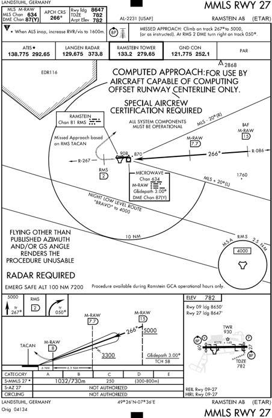

##### Figure 12.3. Non-Computed MLS Approach at Boise, ID.
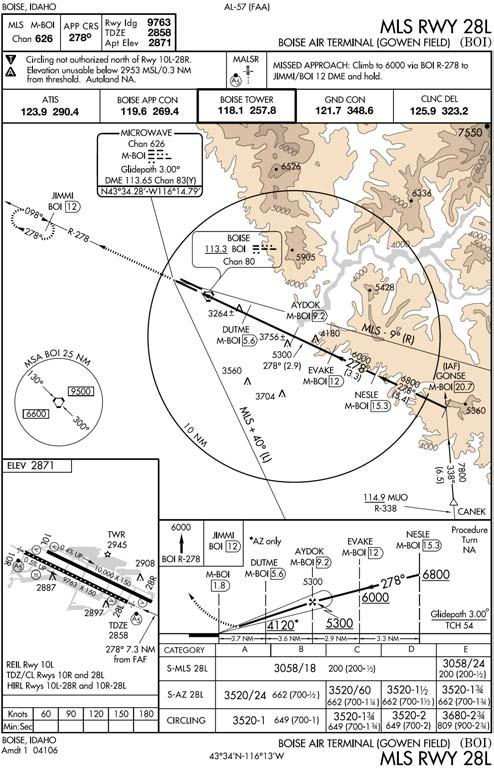

+ 12.2.2.1. Non-Computed (Figure 12.4). When flying a non-computed MLS approach, the azimuth signal steers your aircraft to the azimuth antenna just as approaches to traditional NAVAIDs such as VOR or TACAN do. Consequently, it is important for you to know where the azimuth antenna is located on the airfield. In the most common MLS installation, the antenna is located along the runway centerline between 1,000 and 1,500 feet from the departure end of the runway. When flying a non-computed approach to this type of installation, your final approach will normally be lined up along the extended runway centerline. Non-computed approaches should be flown using the default settings (AUTO and NON-COMP) of your MLS equipment.

	+ 12.2.2.1.1. Offset Installation. In some installations, the azimuth antenna may be installed alongside the runway (offset). In this case, when flying a non-computed approach, the azimuth guidance will not steer the aircraft to the runway along the extended runway centerline. In this particular configuration, the azimuth is rotated so that the azimuth signal guides the aircraft to the azimuth antenna along a course that is not parallel to the runway centerline. Review the approach plate carefully for notes to that effect and for the arrow leading up to the aerodrome sketch to determine where to look for the runway at the missed approach point.

	+ 12.2.2.1.2. WARNING: If you are flying a non-computed MLS approach, and you select the "COMPUTED" approach mode on your MLS equipment, the published approach is no longer valid and the actual approach flown will no longer guarantee obstacle clearance. The only time the "COMPUTED" mode should be selected is when the approach to be flown is a computed approach as indicated on the approach plate.

+ 12.2.2.2. Computed (COMP) (Figure 12.4). A computed MLS approach steers your aircraft to the runway along a course aligned with the extended runway centerline regardless of the location of the ground transmitters. Only aircraft having MLS receivers capable of using computed approach guidance can fly computed approaches. Computed approaches should be flown using the AUTO and COMP settings of your MLS equipment.

	+ 12.2.2.2.1. WARNING: In order to fly a computed MLS approach, all system components (AZ, EL, and DME) must be operational. Failure of any component will result in aircraft receiver course and glide slope off/warning flags and loss of course information.

	+ 12.2.2.2.2. WARNING: If flying a computed MLS approach and the "NONCOMPUTED" approach mode on the MLS is selected, the published approach is no longer valid and the actual approach flown will no longer guarantee obstacle clearance. "COMPUTED" mode should be selected when the approach to be flown is a computed approach as indicated in the plan view on the approach plate.

+ 12.2.2.3. Manual vs. Automatic Mode. Likewise, if you switch to manual mode and change either the approach azimuth or glide slope, the IAP you are using is no longer valid.

	+ 12.2.2.3.1. Elevation Angle. An elevation angle less than what the approach was designed for may not provide obstacle clearance, and an elevation higher than the published angle mandates higher approach minima.

	+ 12.2.2.3.2. Approach Azimuth. Changing the published approach azimuth in manual mode, will steer the aircraft to the runway along a different course than published, which may take the aircraft outside of protected airspace.

	+ 12.2.2.3.3. WARNING: If operating in manual mode, selecting an azimuth and/or elevation angle different from the published procedure invalidates the approach and obstacle clearance. Follow MAJCOM directives regarding flying MLS approaches in the manual mode.

##### Figure 12.4. Non-Computed Mode/Computed Mode.
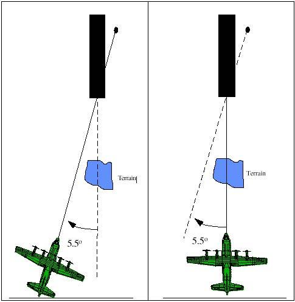

+ 12.2.2.4. Tune the MLS as soon as practicable during the transition to final and monitor the MLS identifier during the entire approach. The MLS is identified by a four-letter identifier always beginning with the letter "M." The four-letter ident is transmitted at least six times per minute by the approach azimuth (or back azimuth) ground equipment. Some aircraft installations do not include the audible identification feature; in this case, observing the correct 4-letter identifier on the aircraft's avionics display can identify the MLS.

+ 12.2.2.5. Azimuth and Glide Slope Selection. The MLS receiver will automatically select the appropriate azimuth and glide slope as well as tune the TACAN for distance information. When operating in the manual mode, you may change the published azimuth and glide slope angle.

	+ 12.2.2.5.1. WARNING: If operating in manual mode and the pilot selects a course and/or glide slope different from the published procedure, the published approach is no longer valid and the actual approach flown will no longer guarantee obstacle clearance.

+ 12.2.2.6. Orientation. Use appropriate navigation facilities (for example: VOR, TACAN, GPS, or NDB) to remain position-oriented during the approach.

+ 12.2.2.7. If using a flight director, it should be configured in accordance with instructions in the aircraft flight manual for the intercept and final approach modes of operation.

	+ 12.2.2.7.1. NOTE: aircraft may only fly MMLS approaches with the proper equipment as determined by aircraft flight manual and/or MAJCOM. All other procedures to fly the approach will be the same as for conventional MLS.

	+ 12.2.2.7.2. WARNING: The MLS approach must be discontinued if the course becomes unreliable, or any time full-scale deflection of the CDI occurs on final approach. Do not descend below azimuth-only minimums if the aircraft is more than one dot (half scale) below or two dots (full scale) above the glide slope. If the glide slope is recaptured to within the above tolerances, descent may be continued to DH.

	+ 12.2.2.7.3. NOTE: If making an autopilot-coupled approach or landing, follow the aircraft flight manual procedures. When autopilot coupled operations are to be conducted, advise the ATC approach controller as soon as practical, but not later than the FAF. This will allow time for the appropriate critical area to be cleared or an advisory issued.

+ 12.2.2.8. When flying the final approach without glide path guidance, the automatic mode is referred. In that mode the receiver will automatically select the appropriate azimuth as well as tune the TACAN or DME for distance information. If operating in manual mode, you must manually set the desired azimuth.

	+ 12.2.2.8.1. NOTE: Computed MLS azimuth-only approaches may only be flown by aircraft with the proper equipment, and all system components (azimuth, elevation, and DME) must be operational.

	+ 12.2.2.8.2. WARNING: When flying an MLS azimuth-only approach, if operating in manual mode and the pilot selects an azimuth different from the published procedure, the published approach is no longer valid and the actual approach flown will no longer guarantee obstacle clearance.

	+ 12.2.2.8.3. WARNING: If you are flying a non-computed approach and you select the "COMPUTED" approach mode on your MLS equipment, the published approach is no longer valid and the actual approach flown will no longer guarantee obstacle clearance. The only time the "COMPUTED" mode should be selected is when the approach to be flown is a computed approach.

	+ 12.2.2.8.4. WARNING: If you are flying a computed MLS approach, and you select the "NON-COMPUTED" approach mode on your MLS equipment, the published approach is no longer valid and the actual approach flown will no longer guarantee obstacle clearance. "COMPUTED" mode should be selected when the approach to be flown is a computed approach as indicated on the approach plate.

+ 12.2.2.9. Flying the Approach. In general: Avoid rapid descents on final by crossing the FAF at the published altitude. When a turn is required over the FAF, turn immediately and intercept the final approach course to ensure that obstruction clearance airspace is not exceeded. Non-precision approach procedures published in conjunction with an MLS do not always clearly depict the FAF crossing altitude. The minimum altitude to be maintained until crossing the fix following the glide slope intercept point (normally the FAF will be the next fix) is the published glide slope intercept altitude, altitude published at that fix, or ATC assigned altitude. For most non-precision approaches, the glide slope intercept altitude will be the minimum FAF crossing altitude. Do not descend to the minimum descent altitude (MDA) or step down fix altitude until you are established on course and past the FAF (if published). Arrive at the MDA with enough time and distance remaining to identify and descend to the runway environment at a normal rate for your aircraft (i.e. At or prior to the VDP.)

	+ 12.2.2.9.1. Timing is required when the final approach does not terminate at a published fix. If timing is required to identify the missed approach point, begin timing when passing the FAF or the starting point designated in the timing block of the approach plate. This point is usually the FAF but it may be a fix not co-located with the FAF such as a LOM, NDB, crossing radial, or DME fix. Time and distance tables on the approach chart are based on groundspeed; therefore, the existing wind and TAS must be factored when computing final approach timing. If timing is not specifically depicted on the instrument approach procedure, timing is not authorized as a means of identifying the MAP.

	+ 12.2.2.9.2. VDP. Arrive at MDA (MDA is determined by the barometric altimeter) with enough time and distance remaining to identify runway environment and depart MDA from a normal visual descent point to touchdown at a rate normally used for a visual approach in your aircraft. Descent below MDA is not authorized until sufficient visual reference with the runway environment has been established and the aircraft is in a position to execute a safe landing. Be aware that the final approach course on a non-radar final may vary from the runway heading as much as 30° and still be published as a straight-in approach.

+ 12.2.2.10. Inoperative System Components.

	+ 12.2.2.10.1. In non-computed approaches, if the azimuth transmitter is inoperative, no approach is authorized. Additionally, if the elevation transmitter is inoperative, only the non-precision (azimuth-only) approach is authorized. Ensure you can identify all required fixes with the MLS DME inoperative.

	+ 12.2.2.10.2. In computed approaches. All components must be fully operational; if any component is not available (as indicated by aircraft receiver course and glide slope off/warning flags and loss of course information), then the approach is not authorized.

12.2.3. RNAV (GPS), GPS and RNP SAAAR Approach Procedures. A Receiver Autonomous Integrity Monitor (RAIM) check is required prior to flying a GPS approach. This is necessary since delays of up to two hours can occur before an erroneous satellite transmission can be detected and corrected by the satellite control segment. The RAIM function is also referred to as fault detection. If predictive RAIM is not available, another type of navigation and approach system must be used, another destination selected, or the trip delayed until RAIM is predicted to be available on arrival. A predictive RAIM check allows crews to plan for an alternate means of navigation if necessary. If a RAIM failure occurs prior to the Final Approach Way Point (FAWP) or the approach mode does not activate prior to the FAWP, do not commence the approach and coordinate for an alternate clearance. If a RAIM failure occurs after the FAWP, the receiver, based on equipage, is allowed to continue operating without an annunciation for up to 5 minutes to allow completion of the approach. You must check the receiver operator manual to ensure you have this capability. If you do not have this capability and a RAIM flag/status annunciation appears after the FAWP, climb to the missed approach altitude, proceed to the MAWP and execute a missed approach.

+ 12.2.3.1. Flying the Approach Procedure

	+ 12.2.3.1.1. Retrieving the procedure from the Data Base. Do not fly the approach unless it can be retrieved in its entirety from a current approved database. Cross check data base waypoints against those contained on the published approach plate. If discrepancies exist, do not fly the approach. Exception: The FAWP altitude may be raised above that shown on the published chart in order to ensure adequate clearance at a step down fix.

		+ 12.2.3.1.1.1. Note: Manually selecting aircraft bank limiting functions may reduce the aircraft's ability to maintain its desired track and are not recommended. Pilots should recognize manually selectable aircraft bank-limiting functions might reduce their ability to satisfy ATC path expectations, especially when executing large angle turns. This should not be construed as a requirement to deviate from Airplane Flight Manual procedures; rather, pilots should limit the selection of such functions within accepted procedures.

	+ 12.2.3.1.2. Prior to commencing the approach. Determine which area of the TAA the aircraft will enter using bearing and distance to the IF (IAF). Fly the full approach from an Initial Approach Waypoint (IAWP) or feeder fix unless specifically cleared otherwise. Entry from other than an IAWP does not assure terrain clearance.

	+ 12.2.3.1.3. Approach Arming. Some receivers automatically arm the approach mode, while others require manual arming. Arming the approach mode switches the aircraft to terminal CDI scaling (+ 1 NM). If the IAWP is beyond 30NM from the airfield, CDI sensitivity will not change until the aircraft is within 30NM of the airport reference point. Feeder route obstacle clearance is predicated on terminal sensitivity and RAIM at the IAWP. For manual systems, aircrews must ensure the approach is loaded prior to being established on any portion of the approach.

	+ 12.2.3.1.4. Activating the approach. When within 2NM of the FAWP with the approach mode armed, the receiver will automatically initiate a RAIM check, and switch to approach sensitivity and RAIM (0.3NM). Distance is provided based on the active WP. Pilots must cross check the active WP identifier to ensure situational awareness. Some operations (e.g., holding, course reversal maneuvers) may require manual intervention to either stop or resume automatic waypoint sequencing. Pilots must ensure the receiver is sequenced to the appropriate waypoint, especially if not flying the full procedure. If on vectors to final, ensure that receiver is set IAW flight manual procedures. Being established on the final approach course prior to the initiation of the sensitivity change at 2 NM from the FAWP will aid in CDI interpretation prior to descent to MDA/DA. Also, requesting or accepting vectors that will cause the aircraft to intercept the final approach course within 2 NM of the FAWP is not recommended. When receiving vectors to final, most receiver operating manuals suggest placing the receiver in the non-sequencing mode prior to the FAWP and manually setting the course. This provides an extended final approach course in cases when vectors will place the aircraft outside any existing segment that is aligned with the runway. Assigned altitudes must be maintained until established on a published segment of the approach. Required altitudes at waypoints outside the FAWP or stepdown fixes must also be considered.

	+ 12.2.3.1.5. Flying point to point on the approach does not assure compliance with the published procedure. The proper RAIM sensitivity will not be available and the CDI sensitivity will not automatically change to +0.3 NM. Manually setting CDI sensitivity does not automatically change the RAIM sensitivity on some receivers.

	+ 12.2.3.1.6. Loss of final approach guidance on an RNAV or GPS approach procedure is annunciated in a variety of ways depending on your particular avionics installation. In some aircraft the CDI will center when the "GPS Integrity" light illuminates and can give the illusion that you are on course. Insure you are thoroughly familiar with failure annunciations for your aircraft and discontinue the approach immediately if course guidance is suspect.

+ 12.2.3.2. Final Approach

	+ 12.2.3.2.1. Descent to MDA or DA. Do not descend to MDA, DA, or step down fix altitude until the aircraft is established on course and past the FAF.

	+ 12.2.3.2.2. Vertical Navigation. Unless circling from the approach, VNAV guidance should be followed if provided by aircraft avionics and certified for use IAW AFI 11-202V3. VNAV guidance may be used to LNAV minimums; however, the aircraft must level off prior to MDA if the runway environment is not in sight. Due to the temperature and pressure altitude effects, USAF crews shall not use VNAV guidance below published MDA or DA.

	+ 12.2.3.2.3. Step Down Fixes. USAF pilots must comply with all stepdown fixes depicted on the IAP. VNAV guidance should provide clearance from all step down fix altitudes, however, crews must monitor altitude at all step down fixes to ensure compliance.

	+ 12.2.3.2.4. Runway Environment. Do not descend below MDA/DA unless sufficient visual reference with the runway environment has been established and the aircraft is in position to execute a safe landing.

		+ 12.2.3.2.4.1. Missed Approach. To execute a missed approach, activate the missed approach after crossing the MAWP. GPS missed approach procedures require pilot action to sequence from the MAWP to the missed approach procedure. If the missed approach is not activated, the GPS receiver will display an extension of the inbound final approach course, and displayed distance will increase from the MAWP. Do not activate the missed approach prior to the MAWP. Once the missed approach is activated, CDI sensitivity is set to 1NM. Missed approach routings in which the first track is via a course rather than direct to the next waypoint require additional action from the pilot to set the course (consult your flight manual). Do not turn off of the final approach course prior to the MAWP.

----

#### 12.3.{#12_3} Radar.

These are approaches that require radar services. There are two basic types of approaches: the precision approach (PAR) and the surveillance approach (ASR). NOTE: Fixes that require RADAR for identification are depicted with the word "RADAR" appearing next to the fix and the words "RADAR REQUIRED" will appear on the approach plate. Only groundbased radar, such as airport surveillance, precision, or air route surveillance radar, may be used to position the aircraft.

12.3.1. The PAR provides the pilot with precise course, glideslope, and range information; the ASR provides course and range information and is classified as a non-precision approach. During an ASR and upon request, the controller will provide recommended altitudes on final to the last whole mile that is at or above the published MDA. Recommended altitudes are computed from the start descent point to the runway threshold. (At the MAP, the straight-in surveillance system approach error may be as much as 500 feet from the runway edges.)

12.3.2. Lost Communications.

+ 12.3.2.1. Backup. In preparation for the radar approach, select a backup approach that is compatible with the existing weather and your aircraft where available. If you experience lost communications, you are automatically cleared to fly any published approach unless the controller issues a lost communications approach.

+ 12.3.2.2. Contact. Attempt contact with the controlling agency if no transmissions are received for approximately:

	+ 12.3.2.2.1. One minute while being vectored to final,

	+ 12.3.2.2.2. Fifteen seconds while on final for an ASR approach, or

	+ 12.3.2.2.3. Five seconds while on final for a PAR approach.

+ 12.3.2.3. Backup Approach. If unable to reestablish communications and unable to maintain VFR, transition to your backup approach. Intercept the approach at the nearest point that will allow a normal rate of descent and not compromise safety. Maintain the last assigned altitude or the minimum safe/sector altitude (emergency safe altitude if more than 25 NM from the facility), whichever is higher, until established on a segment of the published approach.

+ 12.3.2.4. No Backup Approach. If there are no backup approaches compatible with the weather or with your aircraft, advise the controller upon initial contact of your intentions in the event of lost communications. It is the pilot's responsibility to determine the adequacy of any issued lost communications instructions.

12.3.3. Voice Procedures. The radar approach relies entirely on voice instructions from the radar controller. Repeat all headings, altitudes (departing and assigned), and altimeter settings until the final controller advises "do not acknowledge further transmissions." During high-density radar operations, keep transmissions brief and specific, commensurate with safety of flight. Never sacrifice aircraft control to acknowledge receipt of instructions.

12.3.4. Transition to Final. The radar controller directs heading and altitude changes as required to position the aircraft on final approach.

+ 12.3.4.1. Weather information issued by the radar controller will include altimeter setting, ceiling, and visibility. The controller is required to issue ceiling and visibility only when the ceiling is below 1,500 feet (1,000 feet at civil airports) or below the highest circling minimum, whichever is greater, or if the visibility is less than 3 miles.

+ 12.3.4.2. Field Conditions. The controller will furnish pertinent information that the controller considers necessary to the safe operation of the aircraft. Request additional information, as necessary, to make a safe approach.

+ 12.3.4.3. Orientation. Use available navigation aids to maintain situational awareness. The controller will report aircraft position at least once before starting final approach.

12.3.5. Accomplishing the Approach.

+ 12.3.5.1. ASR

	+ 12.3.5.1.1. Controller. The controller will inform the pilot of the runway to which the approach will be made, the straight-in MDA (if a straight-in approach is being made), the MAP location, and the start descent point. When the approach will terminate in a circling approach, furnish the controller with your aircraft category. The controller will then issue the circling MDA. Circling MDA for ASR approaches are found in the FLIP Terminal Book (the circling MDA found on the individual IAP refers only to non-radar approaches).

	+ 12.3.5.1.2. Descent. At the descent point, the controller will advise you to ‖begin descent.‖ If a descent restriction exists, the controller will announce the restriction altitude. When the aircraft is past the altitude limiting point, the controller will advise you to continue descent. The descent rate should be sufficient to allow the aircraft to arrive at the MDA in time to see the runway environment and make a normal descent to landing. NOTE: Upon request, the controller will provide recommended altitudes on final to the last whole mile that is at or above the published MDA. Due to the possible different locations of the MAP, recommended altitudes may position you at MDA at or slightly prior to the MAP. Consider this in relation to the normal VDP required for your aircraft.

	+ 12.3.5.1.3. Runway Environment. Arrive at the MDA with enough time and distance remaining to identify the runway environment and descend from MDA to touchdown at a rate normally used for a visual approach in your aircraft.

	+ 12.3.5.1.4. Course Guidance. The controller will issue course guidance when required and will give range information each mile while on final approach. You may be instructed to report the runway in sight. Approach guidance will be provided until the aircraft is over the MAP unless you request discontinuation of guidance. The controller will inform you when you are at the MAP.

	+ 12.3.5.1.5. MDA. Fly the aircraft at or above MDA until arrival at the MAP or until establishing visual contact with the runway environment. If the runway environment is not reported in sight, missed approach instructions will be given. CAUTION: Depending upon the location of the MAP, the descent from the MDA (once the runway environment is in sight) often will have to be initiated prior to reaching the MAP to execute a normal (approximately 3°) descent to landing.

+ 12.3.5.2. PAR. The PAR is accomplished the same as the ASR with the exception that the controller will also provide glidepath guidance. Approximately 10 to 30 seconds before final descent, the controller will advise that the aircraft is approaching the glide path. When the aircraft reaches the point where final descent is to start, the controller will state "begin descent." The pilot should descend at a standard precision descent rate. The controller will advise "On, Above, Below, Well above, Well below glidepath, etc." If the runway environment is not in sight at DA/DH, execute the appropriate missed approach procedure.

	+ 12.3.5.2.1. Approach Guidance Termination. The controller will cease providing course and glide path guidance when: The pilot reports the runway/approach lights in sight, and the pilot elects to proceed visually (e.g. "BRICK 10, runway in sight, taking over visual.") Note: A pilot's report of "runway in sight" OR "visual" alone does not constitute a request/advisement to proceed visually and the controller will continue to provide course and glide path guidance.

		+ 12.3.5.2.1.1. If the decision is made to discontinue the approach, advise the controller as soon as practical.

+ 12.3.5.3. No-Gyro Approach (Heading Indicator Inoperative). If the heading indicator should fail during flight, advise the radar controller and request a no-gyro approach. The final approach may be either precision or surveillance.

	+ 12.3.5.3.1. Perform turns during the transition to final by establishing an angle of bank on the ADI that will approximate a standard rate turn, not to exceed 30°. Perform turns on final by establishing an angle of bank on the ADI that will approximate a half-standard rate turn. NOTE: Do not begin using half-standard rate turns on final until the controller tells you. The controller may want standard rate turns even on final if abnormal conditions exist (i.e., strong crosswinds, turbulence, etc.) If unable to comply with these turn rates, advise the controller. Initiate turns immediately upon hearing the words "turn right" or "turn left." Stop the turn on receipt of the words "stop turn." Acknowledge the controller's commands to start and stop turns until advised not to acknowledge further transmissions.

----

#### 12.4.{#12_4} Visual Approach.

Visual approaches reduce pilot/controller workload and expedite traffic by shortening flight paths to the airport. A visual approach is conducted on an IFR flight plan and authorizes the pilot to proceed visually and clear of clouds to the airport. The pilot must have either the airport or the preceding identified aircraft in sight, and the approach must be authorized and controlled by the appropriate ATC facility.

12.4.1. Before a visual approach can be authorized, the airport must have a ceiling at or above 1,000 feet and visibility 3 miles or greater, ATC must determine that it will be operationally beneficial and pilots must be able to proceed visually while remaining clear of clouds. Additionally, ATC will not issue clearance until the pilot has the airport or the preceding aircraft in sight. If the pilot has the airport in sight but cannot see the preceding aircraft, ATC may still clear the aircraft for a visual approach; however, ATC retains both aircraft separation and wake separation responsibility. When visually following a preceding aircraft, acceptance of the visual approach clearance constitutes acceptance of pilot responsibility for maintaining a safe approach interval and adequate wake turbulence separation.

12.4.2. A Visual Approach is an IFR Approach. Although you are cleared for a "visual" approach, you are still operating under IFR. Do not cancel your IFR clearance when cleared for a visual approach. Be aware that radar service is automatically terminated (without advising the pilot) when the pilot is instructed to change to advisory frequency.

12.4.3. After being cleared for a visual approach, ATC expects you to proceed visually and clear of clouds to the airport in the most direct and safe manner to establish the aircraft on a normal straight-in final approach. Clearance for a visual approach does not authorize you to do an overhead/VFR traffic pattern.

12.4.4. Visual Approaches Have No Missed Approach Segment. A visual approach is not an instrument approach procedure and therefore does not have a missed approach segment. If a go-around is necessary for any reason, aircraft operating at controlled airports will be issued an appropriate advisory, clearance, or instruction by the tower. At uncontrolled airports, aircraft are expected to remain clear of clouds and complete a landing as soon as possible. If a landing cannot be accomplished, the aircraft is expected to remain clear of clouds and contact ATC as soon as possible for further clearance (separation from other IFR aircraft will be maintained under these circumstances).

12.4.5. Pilot Responsibilities During Visual Approaches. approach, the pilot has the following responsibilities: When cleared for a visual

+ 12.4.5.1. Advise ATC as soon as possible if a visual approach is not desired.

+ 12.4.5.2. Comply with controller's instructions for vectors toward the airport of intended landing or to a visual position behind a preceding aircraft.

+ 12.4.5.3. After being cleared for a visual approach, proceed visually and clear of clouds to the airport in the most direct and safe manner to establish the aircraft on a normal final approach. You must have the airport or the preceding aircraft in sight.

+ 12.4.5.4. If instructed by ATC to follow another aircraft, notify the controller if you do not see it, are unable to maintain visual contact with it, or for any other reason you cannot accept the responsibility for visual separation under these conditions.

----

#### 12.5.{#12_5} Contact Approach.

Pilots operating on an IFR flight plan, when clear of clouds with at least 1-mile flight visibility and can reasonably expect to continue to the destination airport in those conditions, may request ATC authorization for a contact approach.

12.5.1. ATC may only issue clearance for a contact approach under the following conditions:

+ 12.5.1.1. The pilot specifically requests the approach. ATC cannot initiate this approach.

+ 12.5.1.2. The reported ground visibility at the destination airport is at least 1 SM.

+ 12.5.1.3. The contact approach is made to an airport having a standard or special instrument approach procedure.

	+ 12.5.1.3.1. NOTE: A contact approach is a procedure that may be used by a pilot in lieu of conducting a standard or special approach IAP to an airport. It is not intended for use by a pilot to operate into an airport without a published and functioning IAP. Nor is it intended for an aircraft to conduct an approach to one airport, and then in the clear, proceed to another airport.

12.5.2. When executing a contact approach, the pilot assumes responsibility for obstruction clearance. If radar service is being received, it will automatically terminate when the pilot is instructed to change to advisory frequency.

12.5.3. Being cleared for a visual or contact approach does not authorize the pilot to fly a 360° overhead traffic pattern. An aircraft conducting an overhead maneuver is VFR and the instrument flight rules (IFR) flight plan is canceled when the aircraft reaches the "initial point." Aircraft operating at an airport without a functioning control tower must initiate cancellation of the IFR flight plan prior to executing the overhead maneuver or after landing.

----

#### 12.6.{#12_6} IAP with Visual Segment.

Some IAPs contain a published visual segment (Figure 12.5). In general, when the distance from the MAP to the end of the runway exceeds 3SM, the words "fly visual " will appear in the profile view of the IAP. A long dashed line in the profile view with an approximate heading and distance to the end of the runway will be depicted. The depicted ground track associated with the visual segment should be flown as "DR" course. When executing the visual segment, remain clear of clouds and proceed to the airport maintaining visual contact with the ground. Since missed approach obstacle clearance is assured only if the missed approach is commenced at the published MAP or above the MDA, the pilot should have preplanned climbout options based on aircraft performance and terrain features.

##### Figure 12.5. IAP with Visual Segment.
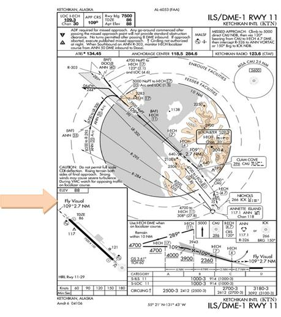

----

#### 12.7.{#12_7} Charted Visual Flight Procedures (CVFPs).

Charted Visual Flight Procedures (CVFPs) are published visual approaches where an aircraft on an IFR flight plan, operating in VMC and when authorized by air traffic control, may proceed to the destination airport under VFR via the route depicted on the CVFP (Figure 12.6). When informed CVFPs are in use, the pilot must advise the arrival controller on initial contact if unable to accept the CVFP.

12.7.1. Characteristics. CVFPs are established for noise abatement purposes to a specific runway equipped with a visual or electronic vertical guidance system. These procedures are used only in a radar environment at airports with an operating control tower. The CVFPs depict prominent landmarks, courses, and altitudes and most depict some NAVAID information for supplemental navigational guidance only.

12.7.2. Altitudes. Unless indicating a Class B airspace floor, all depicted altitudes are for noise abatement purposes and are recommended only. Pilots are not prohibited from flying other than recommended altitudes if operational requirements dictate. Weather minimums for CVFPs provide VFR cloud clearance at minimum vectoring altitudes. Therefore, clearance for a CVFP is possible at MVA, which may be below the depicted altitudes.

12.7.3. Clearance. CVFPs usually begin within 20 miles from the airport. When landmarks used for navigation are not visible at night, the approach will be annotated "PROCEDURE NOT AUTHORIZED AT NIGHT." ATC will clear aircraft for a CVFP after the pilot reports sighting a charted landmark or a preceding aircraft. If instructed to follow a preceding aircraft, pilots are responsible for maintaining a safe approach interval and wake turbulence separation. Pilots should advise ATC if at any point they are unable to continue an approach or lose sight of a preceding aircraft.

12.7.4. Climb-outs. CVFPs are not instrument approaches and do not have missed approach segments. Missed approaches are handled as a go-around (IAW FLIP, GP). The pilot should have preplanned climb-out options based on aircraft performance and terrain features.

##### Figure 12.6. Charted Visual Flight Procedure.
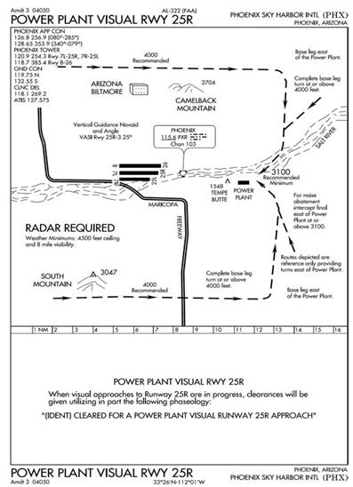

----

#### 12.8.{#12_8} Converging Approaches (Figure 12.7).

Converging approaches provide procedures for conducting simultaneous precision instrument approaches (normally ILS) to converging runways. Converging runways are defined as runways having a 15° to 100° angle between them. In simpler terms, if the runways are pointed at each other (extended centerlines intersect) they are converging runways and procedures must be established to de-conflict possible simultaneous missed approaches.

12.8.1. Procedures. Converging approaches are implemented when the volume and complexity of aircraft operations require the use of simultaneous converging instrument approaches. These approaches are specifically designed to ensure traffic deconfliction during all phases of the arrival procedure. Converging approaches are labeled as "converging" and ATC clearance must specify this type of approach. Theoretically no operational hardships on users and control facilities will result from these operations.

12.8.2. Differences. There are two subtle differences found in converging approaches that a pilot must be aware of. The missed approach departure instruction printed on the approach is the procedure the controller expects to be flown during a missed approach and it will not normally be modified. Although missed approach departure instructions for regular approaches are based primarily on obstacle clearance, converging approaches also include the deconfliction of aircraft on the other converging approach's missed approach. This is often done by moving the MAPs of each converging approach further out from the runway and turning the aircraft away from each other.

12.8.3. Missed Approach. If on arrival at the MAP or DH/DA (or at any time thereafter) any of the requirements in paragraph 12.1.2.2 are not met, the pilot shall immediately execute the appropriate missed approach procedure, ATC issued climb out instructions or other ATC clearance. Delaying initiation of missed approach may result in traffic conflict with other aircraft. For this reason, anytime a pilot continues flight beyond the MAP the pilot must be highly confident of completing the landing since traffic deconfliction cannot be assured for missed approaches initiated beyond the MAP.

12.8.4. Decision Altitude. Since converging approaches must provide precision approach guidance (normally ILS) the only way to adjust the missed approach point is to increase the decision altitude. Therefore, normally the primary difference between the converging approach and the regular approach to the same runway will be the approach minimums and the missed approach departure instruction. This increase in approach minimums will also result in an increase in the weather minimums required for the approach.

##### Figure 12.7. Converging ILS Approach.
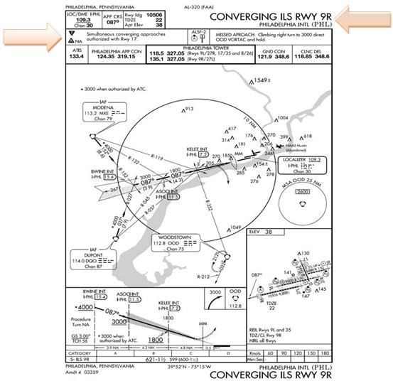

----

#### 12.9.{#12_9} ILS Precision Runway Monitor (ILS/PRM) Approaches (Figure 12.8).

12.9.1. ILS/PRM approaches are authorized at selected airports where parallel runways are separated by less than 4300 feet. Specialized equipment, procedures and training for both air traffic controllers and pilots are required prior to conducting an ILS/PRM approach at these airports. All USAF aircrews must be cognizant of the requirements for operations at these airports when ILS/PRM approaches are in use. ILS/PRM approaches allow for increased arrival operations at airports with closely spaced parallel runways. All pilots flying into these airports must be able to accept a clearance for the ILS/PRM approach when the services are offered or risk extensive delays.

##### Figure 12.8. ILS/PRM Approach.

12.9.2. Simultaneous close parallel ILS/PRM approaches are published on a separate Approach Procedure Chart titled ILS/PRM Rwy XXX (Simultaneous Close Parallel) (Figure 12.9).

12.9.3. For an airport to qualify for reduced lateral separation between runways there must be "high update radar" and associated high resolutions radar displays (Final Monitor Aids FMAs) installed. The high update radar provides near instantaneous position and altitude information to the FMAs. Automated tracking software provides "monitor controllers" with aircraft identification, position, altitude, and the predicted position ten seconds ahead, as well as visual and aural alerts to the controller. This equipment, trained controllers, an enhanced communications capability that includes a secondary monitor frequency with tower override, and the ILS equipment collectively make up the ILS/PRM system.

+ 12.9.3.1. When flying appropriately equipped aircraft and trained as outlined in AFI11-202V3 and MAJCOM directives, USAF aircrews are authorized to fly ILS/PRM approaches.

12.9.4. Simultaneous close parallel ILS/PRM approaches require a "monitor controller" using the PRM system be assigned to each runway and to ensure prescribed separation standards are met. Standard radar and/or vertical separation is used during turn-ons to final approaches. Vertical separation will continue until reaching an intermediate fix between ten and fifteen miles from the runway. From this point to the airport, aircraft may be at the same altitudes, be side by side, or pass traffic on the parallel final approach. Also from this point, or just outside, a block of airspace has been established as a buffer between the final approach courses. This airspace is 2,000-foot wide, equal distance from the finals, and is called the No Transgression Zone (NTZ). The NTZ is shown on the "monitor controller's" display and as the name implies, if planes enter or approach the NTZ, the "monitor controllers" issue instructions to correct the transgression.

12.9.5. When conducting an ILS/PRM approach, the following procedures shall be used:

+ 12.9.5.1. ILS/PRM approach charts have an "Attention All Users Page" that must be referred to in preparation for flying this approach. (Figure 12.8) The Attention All Users Page covers the following:

	+ 12.9.5.1.1. Two operational VHF radios are required.

		+ 12.9.5.1.1.1. Each runway will have two frequencies, the primary tower frequency for that runway and a monitor frequency discreet to that runway. To avoid blocked transmissions during a breakout, ATC transmissions will be transmitted on both frequencies simultaneously. Transmissions from the "monitor controller" will over-ride the "tower controller" on both frequencies. Pilots will ONLY transmit on the primary tower frequency. It is important that pilots do not select the monitor frequency audio until instructed to contact the tower. The volume levels should be set about the same on both radios so the pilots will be able to hear transmissions on at least one frequency if the other is blocked.

	+ 12.9.5.1.2. The approach must be briefed as an ILS/PRM approach IAW AIM.

		+ 12.9.5.1.2.1. When the ATIS broadcast advises ILS/PRM approaches in progress, pilots should brief to fly the ILS/PRM approach. If later advised to expect the ILS approach, the ILS/PRM chart may be used after completing the following briefing items:

			+ 12.9.5.1.2.1.1. Minimums and missed approach procedures are unchanged.

			+ 12.9.5.1.2.1.2. Monitor frequency no longer required.

	+ 12.9.5.1.3. If unable to accept an ILS/PRM approach, notify ATC within 200NM of the landing airport to coordinate alternative arrival procedures.

		+ 12.9.5.1.3.1. NOTE: Failure to pre-coordinate a non-ILS/PRM arrival during a period when ILS/PRM procedures are in use may result in denial of approach clearance and/or diversion to an alternate airport.

	+ 12.9.5.1.4. All breakouts from the approach shall be hand flown. Autopilots shall be disengaged when a breakout is directed.

		+ 12.9.5.1.4.1. A "blunder" is an unexpected turn by an aircraft already established on the localizer toward another aircraft on an adjacent approach course. A "breakout" is a technique used to direct aircraft out of the approach stream. For close parallel operations, a breakout is used to direct an aircraft away from a blundering aircraft while simultaneous operations are being conducted.

		+ 12.9.5.1.4.2. Breakouts differ from other types of abandoned approaches in that they can happen anywhere and unexpectedly. Pilots directed by ATC to break off an approach must assume that an aircraft is blundering toward them and a breakout must be initiated immediately.

			+ 12.9.5.1.4.2.1. ATC Directed "Breakouts". ATC directed breakouts will be an air traffic controller instruction to turn and climb or descend. Pilots must always initiate the breakout in response to an air traffic controller instruction. Controllers will give a descending breakout only when there is no other reasonable option available, but in no case will the descent be below MVA which provides at least 1,000 feet required obstruction clearance.

			+ 12.9.5.1.4.2.2. If an aircraft enters the "NO TRANSGRESSION ZONE" (NTZ), the controller will breakout the threatened aircraft on the adjacent approach. The phraseology for the breakout will be: "TRAFFIC ALERT, (aircraft call sign) Turn (left/right) IMMEDIATELY, HEADING (degrees), CLIMB/DESCEND AND MAINTAIN (altitude)."

	+ 12.9.5.1.5. Should a TCAS resolution advisory (RA) be received, the pilot shall immediately respond to the RA. If following an RA requires deviating from an ATC clearance, the pilot shall advise ATC as soon as practical. While following an RA, comply with the turn portion of the ATC breakout instruction unless the pilot determines safety to be a factor.

		+ 12.9.5.1.5.1. The TCAS provides only vertical resolution of aircraft conflicts, while the ATC breakout instruction provides both vertical and horizontal guidance for conflict resolutions. Should a TCAS RA be received, the pilot should immediately respond to the RA. Adhering to these procedures assures the pilot that acceptable "breakout" separation margins will always be provided, even in the face of a normal procedural or system failure.

##### Figure 12.9. ILS/PRM Approach with Attention All Users Page.
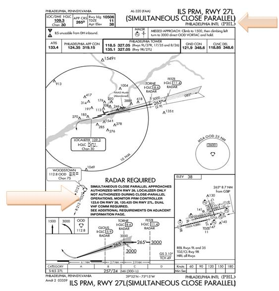
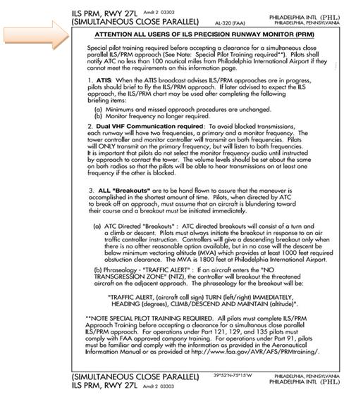

----

#### 12.10.{#12_10} Simultaneous Offset Instrument Approaches (SOIA).

Simultaneous Offset Instrument Approaches (SOIA) are procedures used to conduct simultaneous approaches to a set of parallel runways using a straight-in ILS approach to one runway and an offset LDA with glide slope instrument approach to the other runway. (Figure 12.10). The parallel runway centerlines are separated by less than 3,000 feet, but are at least 750 feet apart. Controllers monitor the approaches with a PRM system using high update radar and high-resolution ATC radar displays. The procedures and system requirements for SOIA are identical with those used for simultaneous close parallel ILS/PRM approaches until the MAP--at which time visual separation between aircraft on the adjacent approach courses must be applied. An understanding of the previous section, paragraph 12.9 is essential to conduct SOIA operations. When flying appropriately equipped aircraft and trained as outlined in AFI 11-202V3 and MAJCOM directives, USAF aircrews are authorized to fly SOIA approaches.

12.10.1. In SOIA, the approach course separation (instead of the runway separation) meets established approach criteria. A visual segment of the LDA approach is established between the LDA MAP and the runway threshold. Aircraft transition in visual conditions from the LDA course to align with the runway and be stabilized by 500 feet above ground level. The pilot of the trailing aircraft must accept responsibility for visual separation prior to the LDA aircraft reaching the LDA MAP, or a missed approach must be executed.

12.10.2. Final monitor controllers use the Precision Runway Monitor system to ensure prescribed separation standards are met. Procedures and communications phraseology are described in paragraph 12.9 ILS/PRM Approaches. PRM monitoring is provided to the LDA MAP or when the pilot has accepted visual separation responsibility. Final monitor controllers will not notify pilots when radar monitoring is terminated.

##### Figure 12.10. SOIA Approaches.
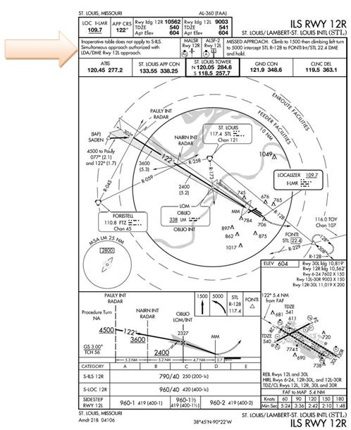
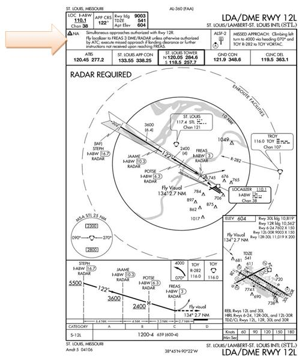

----

#### 12.11.{#12_11} Transponder Landing Systems (TLS).

Transponder Landing Systems (TLS) (Figure 12.11) are designed to provide approach guidance utilizing existing airborne ILS, localizer, glide slope, and transponder equipment. Ground equipment consists of a transponder interrogator, sensor arrays to detect lateral and vertical position, and ILS frequency transmitters. The TLS detects the aircraft's position by interrogating its transponder. It then broadcasts ILS frequency signals to guide the aircraft along the desired approach path. The TLS ground equipment tracks one aircraft, based on its transponder code, and provides correction signals to course and glidepath based on the position of the tracked aircraft. Even though the TLS signal is received using the ILS receiver, no fixed course or glidepath is generated. The concept of operation is very similar to an air traffic controller providing radar vectors. As with radar vectors, the guidance is only valid for the intended aircraft.

12.11.1. TLS ground equipment provides approach guidance for only one aircraft at a time.

12.11.2. When properly trained IAW MAJCOM directives, USAF aircrews are authorized to fly TLS approaches.

12.11.3. TLS signals are displayed on the ILS receiver in the aircraft the same as a conventional ILS. Cockpit set-up and course intercept procedures for a TLS approach are the same as a conventional ILS (i.e. set correct frequency, dial the published front course into the course select window, etc).

12.11.4. Aircrews must receive a clearance for the TLS approach.

+ 12.11.4.1. WARNING: If more than one aircraft is on final when another is conducting a TLS approach, the non-cleared aircraft will receive course and glide path information based on the position of the cleared aircraft.

12.11.5. Aircrews must complete required coordination with TLS ground equipment operator prior to commencing the approach.

12.11.6. Navigation fixes based on conventional ground-based radio NAVAIDS or GPS are provided in the approach procedure to allow aircrews to verify TLS guidance. Navigation equipment must be set-up to reference these fixes during the approach.

##### Figure 12.11. TLS Approach.
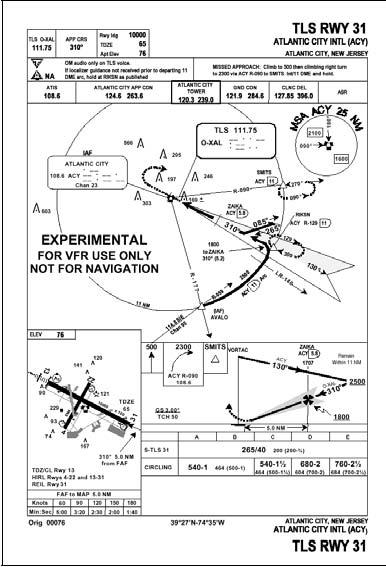
