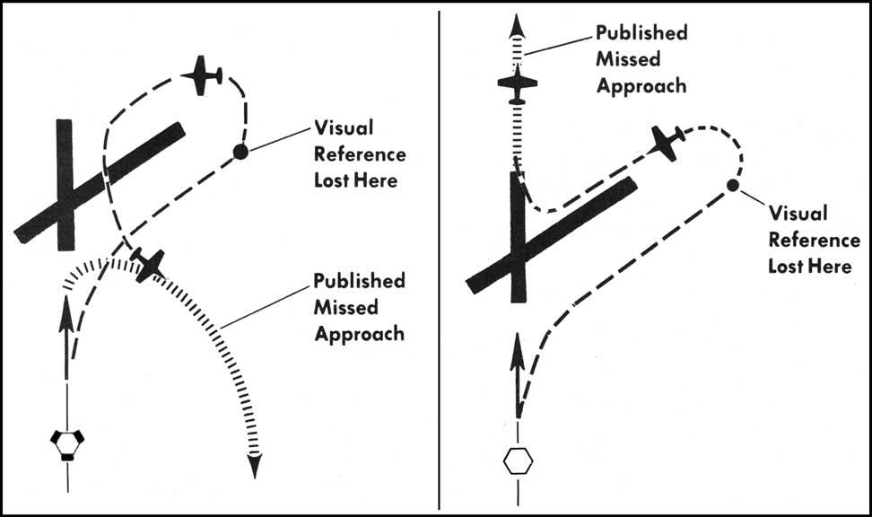

# Chapter 14: MISSED APPROACH

#### 14.1.{#14_1} Planning.

Performing a missed approach successfully is the result of thorough planning. You should familiarize yourself with the missed approach departure instructions during preflight planning. The missed approach departure instruction is designed to return the aircraft to an altitude providing en route obstruction clearance. In some cases the aircraft may be returned to the initial segment of the approach.

----

#### 14.2.{#14_2} Missed Approach Point (MAP).

The missed approach point for a nonprecision straightin approach is located along the final approach course and no farther from the FAF than the runway threshold (or over an on-airport navigation facility for a no-FAF procedure and some selected FAF procedures). To determine the location of the MAP, compare the distance from the FAF to the MAP adjacent to the timing block. It may not be the same point as depicted in the profile view. If there is not a timing block, the MAP should be clearly portrayed on the IAP.

14.2.1. NOTE: The MAP depicted on the IAP is for the non-radar approach with the lowest HAT. For example, on an ILS approach designed by the FAA, the MAP printed will be for the ILS DA/DH. The MAP for the localizer will probably be at the approach end of the runway and the only way to determine this is by the distance listed on the timing block.

14.2.2. Circling. The MAP for a circling approach is also located along the final approach course. It will be no farther from the FAF than the first portion of the usable landing surface (or over an on-airport navigation facility for a no-FAF procedure).

14.2.3. Precision. The missed approach point for any precision approach is the point at which the DA/DH is reached. This is normally the point depicted on the IAP as the start of a climbing dashed line.

14.2.4. Obstacle Clearance. The published missed approach procedure provides obstacle clearance only when the missed approach is conducted on the missed approach segment from or above the missed approach point. If the aircraft initiates a missed approach at a point prior to the missed approach point, from below MDA or DH, or on a circling approach, obstacle clearance is not necessarily provided by following the published missed approach procedure. During pre-approach planning, the pilot should assess the actions to be taken in the event of a balked landing beyond the missed approach point or below the MDA or DA(H) based on the anticipated weather conditions and available aircraft performance. If balked landing occurs at a position where it is no longer possible to fly the published missed approach and alternative missed approach instructions are not available from ATC, obstacle clearance is the pilot's responsibility. When a missed approach is initiated in this situation, the pilot must consider other factors such as the aircraft's geographical location with respect to the prescribed missed approach point, direction of flight and/or minimum turning altitudes in the prescribed missed approach procedure, aircraft performance, visual climb restrictions, charted obstacles, takeoff obstacle departure procedure, takeoff visual climb requirements as expressed by nonstandard takeoff minima, or other factors not specifically expressed by the approach procedures. If the pilot executes any procedure other than the published missed, they should advise ATC as soon as possible with current actions and intentions.

+ 14.2.4.1. Note: For copter only approaches, the missed approach is based on a climb gradient of at least 400 feet per mile; twice the angle used for fixed-wing instrument approach procedures. If a 90 knot (no wind) missed approach is performed, then this climb gradient equates to a 600 foot per minute minimum rate of climb.

14.2.5. Initiation. <strong><em>When the missed approach is initiated prior to the MAP, the pilot shall, unless otherwise cleared by ATC, fly the IAP as specified on the approach plate to the MAP at or above the DA/DH before executing a turning maneuver.</em></strong>

14.2.6. Delayed Decision. <strong><em>If on arrival at the MAP or DH/DA (or at any time thereafter) any of the requirements in paragraph 12.1.2.2 are not met, the pilot shall immediately execute the appropriate missed approach procedure, ATC issued climb out instructions or other ATC clearance.</em></strong> Missed approach obstacle clearance is predicated on beginning the missed approach procedure at the MAP from DA/DH and then climbing 200 ft/NM or greater. Initiating a go-around after passing the published MAP may result in loss of obstacle clearance. See 14.2.4.

14.2.7. Radar Approach. When flying a radar approach, missed approach departure instructions will be given if weather reports indicate that any portion of the final approach will be conducted in IFR conditions. At USAF bases where missed approach instructions are published in base flying regulations, controllers may not issue missed approach instructions to locally assigned aircraft.

----

#### 14.3.{#14_3} Missed Approach/Departure Instructions.

A clearance for an approach includes clearance for the missed approach published on the IAP, unless ATC issues alternate missed approach instructions.

14.3.1. Multiple Approaches. Prior to the FAF, the controller is required to issue appropriate departure instructions to be followed upon completion of approaches that are not to full stop landings. The pilot should tell the controller how the approach will terminate prior to beginning the approach. The controller will state, "After completion of your low approach/touch-and-go/stop-and-go/option, climb and maintain (altitude), turn right/left heading (degrees)." These instructions are often referred to as "climb out instructions" and are designed to return you to the traffic pattern. <strong><em>At locations where ATC radar service is provided, the pilot should conform to radar vectors when provided by ATC in lieu of the published missed approach procedure. Unless otherwise instructed, initiate an immediate climb to the assigned altitude. Delay any turns until past the departure end of the runway, if visible, and 400 feet AGL. If the departure end is not visible, climb on runway heading until 400 feet AGL before beginning your turn. If you are unable to comply with previously issued climb out instructions, comply with the published missed approach procedure and inform ATC immediately.</em></strong> This will ensure ATC is aware of your intentions and can issue alternative instructions if necessary.

+ 14.3.1.1. When practicing instrument approaches under VFR IAW AFI 11-202V3, you are expected to comply with climb out instructions and are NOT automatically cleared for the published missed approach procedure if you cannot comply with the climb out instructions. <strong><em>When practicing instrument approaches under VFR, the pilot must request and receive a specific clearance to execute the published missed approach procedure.</em></strong>

14.3.2. Circling Approaches. Executing climb out instructions in conjunction with a circling approach is more complicated. <strong><em>If upon reaching the missed approach point the airport environment is not in sight, execute the climb out instructions from the missed approach point. If the circling maneuver has begun and the airport environment is visually lost, begin an initial climbing turn toward the landing runway to ensure the aircraft remains within the obstruction clearance area. Continue this turn until established on the climb out instructions.</em></strong>

----

#### 14.4.{#14_4} Actual Missed Approach.

If you have been cleared to land (full stop), ATC expects you to land; therefore, <strong><em>if you have been cleared to land and must subsequently execute a missed approach, the pilot shall notify ATC as soon as possible and execute the published missed approach unless issued alternate climb out instructions.</em></strong>

14.4.1. Various Terms. There are various terms in the missed approach departure instruction written on the IAP that have specific meanings with respect to climbing to an altitude, executing a turn for obstruction avoidance and other reasons. Here are some examples:

+ 14.4.1.1. "Climb and maintain" means a normal climb along the prescribed course.

+ 14.4.1.2. "Climb and maintain (altitude), turn right (heading)" means climbing right turn as soon as safety permits, normally to clear obstructions. This instruction may be given with the turn direction stated first.

+ 14.4.1.3. "Climb and maintain 2,400" means climb to 2,400 feet before ATC will issue a turn instruction, normally to clear obstructions. ATC may state: "Climb and maintain 2,400, then turn right (heading)," to accomplish the same.

14.4.2. Accomplishing the Missed Approach.

+ 14.4.2.1. When to do the Missed Approach. <strong><em>The pilot shall perform the missed approach when the missed approach point, decision height (DH), or decision altitude (DA) is reached and any of the 3 following conditions exists:</em></strong>

	+ 14.4.2.1.1. <strong><em>The runway environment is not in sight.</em></strong>

	+ 14.4.2.1.2. <strong><em>You are unable to make a safe landing.</em></strong>

	+ 14.4.2.1.3. <strong><em>You are directed by the controlling agency.</em></strong>

+ 14.4.2.2. Fly the Aircraft. When you decide to execute the missed approach, fly the aircraft in accordance with the flight manual missed approach procedures.

+ 14.4.2.3. Transition. Transition from the approach to the missed approach in a positive manner using precise attitude and power control changes. Establish the missed approach attitude, power setting, and configuration prescribed in the flight manual. Crosscheck the vertical velocity indicator and altimeter for positive climb indications before retracting the gear and wing flaps. Since aircraft control will require almost total attention, you should have the first heading, course, and altitude in mind before reaching the missed approach point.

	+ 14.4.2.3.1. If you decide to execute a missed approach prior to reaching the missed approach point, <strong><em>continue along the IAP routing at or above the DA/DH until reaching the missed approach point.</em></strong> You may climb to the missed approach altitude while following the IAP routing. <strong><em>Do not initiate any turns on the missed approach until reaching the missed approach point.</em></strong> If ATC issues you a vector on the missed approach, consider this your new clearance.

+ 14.4.2.4. Lose Visual Reference. <strong><em>If visual reference is lost while circling to land, the pilot shall follow the missed approach specified for the approach procedure just flown, unless otherwise directed.</em></strong> An initial climbing turn toward the landing runway will ensure that the aircraft remains within the circling obstruction clearance area. Continue to turn until established on the missed approach course (Figure 14.1). An immediate climb must be initiated to ensure climb gradient requirements are met.

##### Figure 14.1. Missed Approach from the Circling Approach.

14.4.3. Climb Gradient. <strong><em>The pilot shall ensure that the aircraft can achieve the published climb gradient. When the gradient is not published, climb at least 200 feet per nautical mile in order to clear obstructions. See AFI 11-202V3, for engine out performance requirements.</em></strong>

14.4.4. Request clearance. As soon as practical after initiating the missed approach, advise ATC and request clearance for specific action; that is, to an alternate airport, another approach, or holding. Do not sacrifice aircraft control for the sake of a voice transmission.

14.4.5. Obstacle Clearance. Terrain clearance is provided within established boundaries of the approach course and the missed approach path. It is essential that you follow the procedure depicted on the IAP chart or the instructions issued by the controller. Be aware of the minimum safe altitudes found on the IAP charts. Remember that the missed approach climb gradient begins at the published MAP.