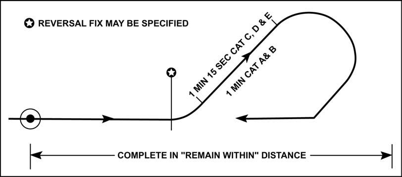
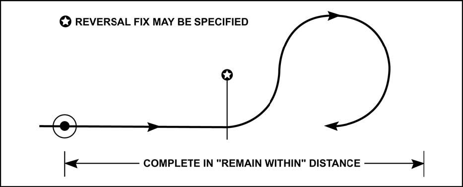
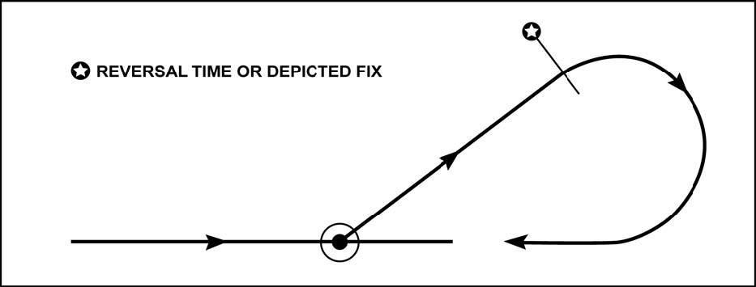
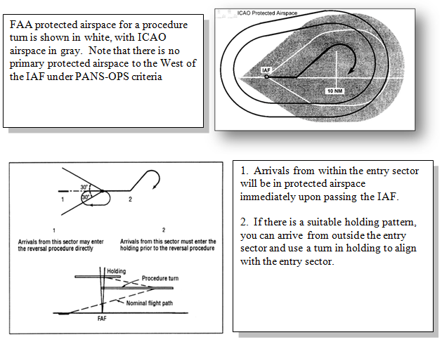
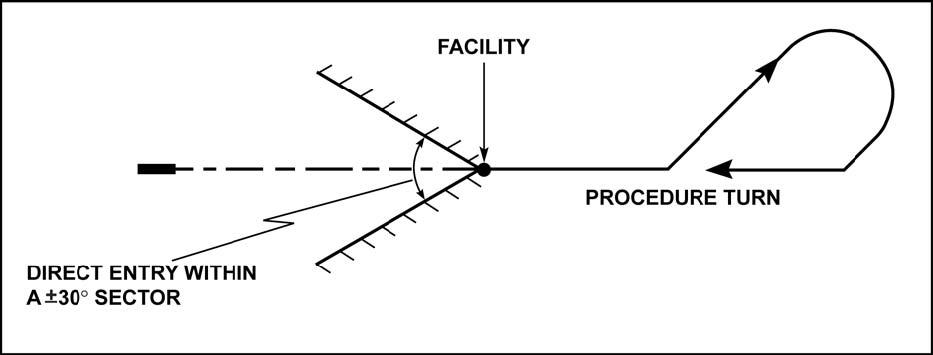
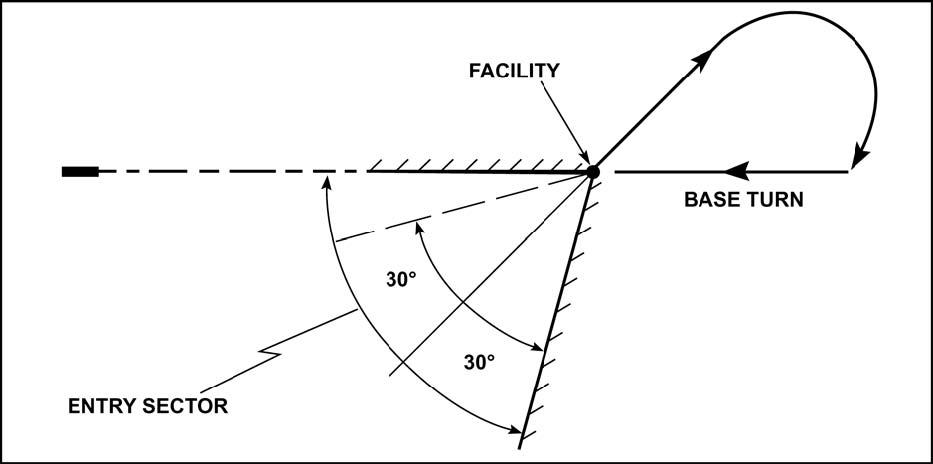
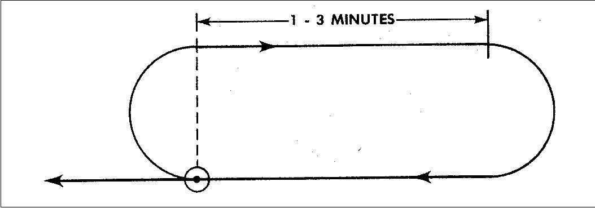
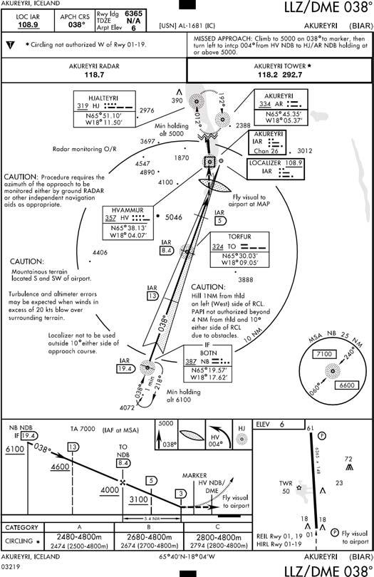
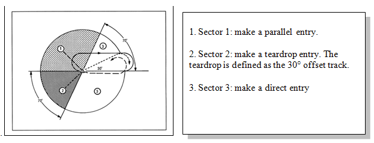

# Chapter 15: INTERNATIONAL CIVIL AVIATION ORGANIZATION (ICAO) PROCEDURES

#### 15.1.{#15_1} Introduction.

The ICAO is composed of over 180 member nations and is a part of the United Nations. Unlike the FAA, whose regulations are directive, ICAO is an advisory organization that jointly agrees on procedural criteria. Although the ICAO does not have any enforcement authority, ICAO member nations do undertake an obligation to adopt the annexes and procedures adopted as standard by the ICAO. These are published in a document called Procedures for Air Navigation Services-Aircraft Operations (PANS-OPS), in the Annexes to the Convention, and Standards and Recommended Practices (SARPS). Member nations are required to publish their exceptions to PANS-OPS and SARPS in their individual Aeronautical Information Publication (AIP). Most nations do this and follow the ICAO publication of aeronautical information SARPS in Annex 15. These procedures are intended to be strictly adhered to by flight crews in order to achieve and maintain an acceptable level of safety in flight operations. USAF aircrews will find pertinent information extracted from the AIPs in FLIP AP and the Foreign Clearance Guide (FCG).

15.1.1. The ICAO Convention does contain an exemption for state aircraft. However, there should be a due regard exercised for the safety of navigation of civil aircraft. <strong><em>USAF crews shall comply with guidance in AFI 11-202V3 regarding compliance with ICAO procedures.</em></strong>

+ 15.1.1.1. NOTE: Although an ICAO signatory, the United States uses none of the PANS-OPS procedures. We use the Federal Aviation Regulations for procedural guidance instead as an equivalent to an AIP.

15.1.2. The Continuum of Safety. Even more so than in the United States, international flying requires good judgment on the part of the pilot. The Air Force expects and encourages you to apply it. No book of hard and fast rules could ever hope to cover all the various situations you may encounter everywhere in the world. The global mission of the USAF means that you may well be required to operate in countries without a well developed aviation system, or into airfields where the ICAO rules have been ignored, replaced or poorly applied. The PIC must necessarily be the final judge of what is safe and prudent for any given mission on any given day. A thorough review of all flight planning documents prior to departure is critical.

+ 15.1.2.1. While English is the standard language of aviation, in many parts of the world you will hear native languages being spoken over ATC frequencies. Knowing, and using, standard terms from FLIP GP, AIM, the ICAO nation's AIP, and the Pilot-Controller glossary reduces the chance of misinterpreting a clearance or misunderstanding information from controllers with heavy accents. At all times, and especially when working with ATC controllers whose native language is not English, <strong><em>USAF pilots shall use standard aviation terminology and phraseology. USAF pilots are required to clarify with ATC any clearance that is not completely understood.</em></strong>

+ 15.1.2.2. While most terminology has been standardized between the FAA and ICAO, there are minor differences that should be known to aircrews. Five of the most common verbiage differences include:

	+ 15.1.2.2.1. "Position and Hold" (FAA) – "Line up and Wait" (ICAO)

	+ 15.1.2.2.2. "Say Altitude" (FAA) – "Verify Level" (ICAO)

	+ 15.1.2.2.3. "Hold Short Line" (FAA) – "Holding Point" (ICAO)

	+ 15.1.2.2.4. "Back Taxi" (FAA) – "Back Track" (ICAO)

	+ 15.1.2.2.5. "Airport" (FAA) – "Aerodrome" (ICAO)

+ 15.1.2.3. SID STAR Phraseology. Approximately half of the world's aircraft operations experience SID and STAR altitude (level) restrictions that are automatically cancelled with a new altitude assignment; the remainder experience SID and STAR altitude (level) restrictions that continue to apply until explicitly cancelled, potentially causing confusion amongst aircrews. ICAO signatories are attempting to alleviate this confusion with new standardized phraseology. The following verbiage may be expected while operating under ICAO rules:

	+ 15.1.2.3.1. "Climb (level) via SID", meaning "Climb following the level restrictions or requirements published on the SID."

	+ 15.1.2.3.2. "Open Climb (level)", meaning "Climb to (level) without stopping at any vertical restriction on the SID and without being required to meet any vertical requirement on the SID."

	+ 15.1.2.3.3. "Descend (level) via STAR", meaning "Descend following the level restrictions or requirements published on the STAR."

	+ 15.1.2.3.4. "Open Descent (level)", meaning "Descend to (level) without stopping at any vertical restrictions on the STAR and without being required to meet any vertical requirements on the STAR."

+ 15.1.2.4. Aircrew should familiarize themselves with country and area specific requirements prior to flying into an unfamiliar region. ICAO publications can be found online at http://dcaa.slv.dk:8000/icaodocs/. AIP information is available at http://www.faa.gov/air_traffic/publications/ifim/.

15.1.3. Applicability. Procedures described in this chapter apply only in airspace not under FAA control. These procedures are ICAO standard procedures and may be modified by each country (as the U.S. has).

+ 15.1.3.1. When determining whether to apply FAA or ICAO procedures in flying an instrument procedure, the nationality of the air traffic controller or who produced the procedure is not relevant. The geographic location of the aircraft is the determining factor, unless local procedures (detailed in FLIP and/or local directives) are in place. Regardless of the nationality of the air traffic controller and/or the origin of the instrument procedure you are using, <strong><em>if you are flying outside US National Airspace, apply ICAO instrument procedures unless otherwise published.</em></strong>

+ 15.1.3.2. US National Airspace is defined as airspace controlled by the FAA. This airspace is defined geographically as overlying the 50 United States, the District of Columbia, the Commonwealth of Puerto Rico, and the several territories and possessions (ex. Marianas Islands, etc.) of the United States. By Presidential proclamation in December 1988, this airspace also overlies the waters up to 12 miles from the coast.

	+ 15.1.3.2.1. IAW ICAO Article 12 and Annexes 2 and 11, the United States has accepted responsibility for providing air traffic services within airspace overlying the high seas beyond 12 miles from the coast (also known as international airspace). These flight information regions of international airspace are: Oakland Oceanic, Anchorage Oceanic, Anchorage Continental, Anchorage Arctic, Miami Oceanic, Houston Oceanic, and New York Oceanic. Although the FAA in these areas is providing air traffic services, they are considered international airspace and ICAO rules apply.

15.1.4. Finding Current Information and Procedures. Changes to ICAO standard procedures can be numerous and may even vary from airfield to airfield within a country. FLIP Area Planning (AP) generally contains a comprehensive consolidation of procedural requirements, but a thorough review of all applicable preflight planning sources is essential to ensuring compliance with ICAO, host nation, and USAF requirements. Other preflight planning sources include, but are not limited to: NOTAMS, the ASRR, Specific Theatre Information Files (STIF), and MAJCOM/Unit Flight Crew Information File (FCIF).

15.1.5. Terminal IAPs. There are many different kinds of approaches published in the DoD FLIP books for regions outside the United States. You may find approaches designed using U.S. TERPS at overseas bases. You may also find approaches designed under the civil PANS-OPS criteria. Or you may find procedures that use host nation criteria that are different from PANS-OPS. Aircraft executing maneuvers other than those intended by the host nation approach design could exceed the boundaries of the protected airspace or may cause overflight of unauthorized areas. <strong><em>All ICAO procedures must be flown as they are depicted.</em></strong>

+ 15.1.5.1. NOTE: For procedures designed in accordance with host nation or PANS-OPS criteria, the original foreign procedures may have been modified or edited as a result of the DoD TERPS review, which is conducted before these procedures are published in DoD FLIP.

----

#### 15.2.{#15_2} Definitions.

Here are a few ICAO definitions that differ from those commonly used in the United States.

15.2.1. PANS-OPS. PANS-OPS is a two-part document. The first volume is for pilots, and is similar to the FAA's AIM. The second volume contains the ICAO "TERPS." The document is intended for the use of the international civilian aviation community, not the military. There have been a number of editions of PANS-OPS published since the creation of the ICAO, each with significant changes in the details of instrument approach procedure design. This means that you may find approaches in different parts of the world that have been designed with entirely different rules.

15.2.2. Aircraft Categories. Aircraft approach categories play a much bigger role in the design of ICAO instrument procedures than they do in the U. S. In addition to affecting final approach minimums, PANS-OPS references maximum speeds by category for such operations as holding, departures, and the intermediate segments of instrument approaches. To make matters even more confusing, these additional "category" restrictions specify speeds that are completely different from the familiar approach speeds on final. The appropriate PANS-OPS "category" speeds appear in tables later in this chapter.

15.2.3. Track. The projection on the earth's surface of the path of an aircraft, the direction of which path at any point is usually expressed in degrees from North, specifying true or magnetic. This means you must apply any known winds/drift to maintain the ground path. Obstacle clearance in ICAO procedures is provided under the assumption that pilots will maintain the depicted track.

15.2.4. Bank Angle. Procedures are based on average achieved bank angle of 25 degrees, or the bank angle giving a rate of turn of 3 degrees per second, whichever is less.

15.2.5. Established on Course. Established on course is defined as being within half fullscale deflection for an ILS or VOR/DME and within ± 5° of the required bearing for an NDB. <strong><em>Do not consider yourself "established on course" until you are within these limits.</em></strong> ICAO obstacle clearance surfaces assume that the pilot does not normally deviate from the centerline more than one-half scale deflection after being established on track. Despite the fact that there is a range of "acceptable" variation, make every attempt to fly the aircraft on the course centerline and on the glide path. Allowing a more than half-scale deflection (or a more than half-scale fly-up deflection on glideslope) combined with other system tolerances could place the aircraft near the edge or at the bottom of the protected airspace where loss of protection from obstacles can occur.

----

#### 15.3.{#15_3} Departure Procedures.

15.3.1. Screen Heights. It may be difficult or impossible to accurately determine screen height used for a particular departure procedure. For PANS-OPS, the origin of the OIS begins at 16 ft (5 m) above the DER. See Chapter 7 for guidelines to determine screen height.

15.3.2. Climb Gradient. ICAO does not apply the FAA 24% ROC formula and has retained the traditional 48 ft/nm (0.8%) ROC for departures. ICAO obstacle clearance during departures is based on a 2.5% gradient obstacle clearance (152 feet/NM) and an increasing 0.8% obstacle clearance (48 feet/NM). This equates to a minimum climb gradient of 3.3% (200 feet/NM). Minimum climb gradients exceeding 3.3% will be specified to an altitude/height after which the 3.3% will be used.

15.3.3. Basic Rules for All Departures. Unless the procedure specifies otherwise, <strong><em>you must climb on runway heading at a minimum of 200 feet/NM (3.3%) until reaching 400 feet above the DER. Continue to climb at a minimum of 200 feet/NM until reaching a safe enroute altitude.</em></strong>

15.3.4. Omnidirectional Departures. The PANS-OPS "Omnidirectional Departure" is somewhat similar to the FAA's "Diverse Departure." It is a departure procedure without any track guidance provided. There are some very important differences, though, because an Omnidirectional Departure may be published even though obstacles penetrate the 40:1 Obstacle Identification Surface. If this is the case, PANS-OPS gives the departure designer a number of ways to publish departure restrictions. These restrictions may be published singly, or in any combination.

+ 15.3.4.1. Standard case. Where no obstacles penetrate the 40:1 OIS, then no departure restrictions will be published. Upon reaching 400 feet above DER, you may turn in any direction.

+ 15.3.4.2. Specified turn altitude. The procedure may specify a 3.3% climb to an altitude where a safe omnidirectional turn can be made.

+ 15.3.4.3. Specified climb gradient. The procedure may specify a minimum climb gradient of more than 3.3% to an altitude before turns are permitted.

+ 15.3.4.4. Sector departure. The procedure may identify sectors for which either a minimum turn altitude or a minimum climb gradient is specified. (For example, ―Climb straight ahead to 2000 feet before commencing a turn to the east/sector 180°- 270°).

15.3.5. Departures with Track Guidance (SIDs). PANS-OPS uses the term Standard Instrument Departure (SID) to refer to departures using track guidance. Minimum climb gradients may apply. There are two basic types: straight and turning.

+ 15.3.5.1. Straight departures. Whenever possible, a straight departure will be specified. A departure is considered "straight" if the track is aligned within 15° of the runway centerline.

+ 15.3.5.2. Turning departures. Where a departure route requires a turn of more than 15°, a turning departure may be constructed. Turns may be specified at an altitude/height, at a fix or at a facility. If an obstacle prohibits turning before the departure end of the runway or prior to reaching an altitude/height, an earliest turning point or a minimum turning altitude/height will be specified. When it is necessary, after a turn, to fly a heading to intercept a specified radial/bearing, the procedure will specify the turning point, the track to be made good and the radial/bearing to be intercepted.

	+ 15.3.5.2.1. Turning departures are designed with maximum speed limits. These maximum speeds may be published by category or by a note. For example, these procedures may be annotated, "Departure limited to CAT C Aircraft" or "Departure turn limited to 220 KIAS maximum." <strong><em>You must comply with the speed limit published on the departure to remain within protected airspace. If you require a higher speed, ATC may approve the higher speed or assign an alternative departure procedure.</em></strong>

	+ 15.3.5.2.2. If the departure is limited to specific aircraft categories, the applicable speeds are found in Table 15.1. 

##### Table 15.1. Maximum Airspeed on Departure. 

|Aircraft Category | Max Airspeed (KIAS)
|:---:|:---:|
|A|120|
|B|165|
|C|265|
|D|290|
|E|300|

----

#### 15.4.{#15_4} Low Altitude Approach Procedures.

15.4.1. Procedural Tracks. Procedural Track approaches are the most common way of transitioning from the enroute structure. These approaches are often much more complicated than a comparable U.S. approach, and may include multiple NAVAIDs, fixes and course changes, but they are flown essentially the same as described in Chapter 11.

15.4.2. Reversal Procedures and Racetrack Procedures. If the instrument approach cannot be designed as a procedural track arrival, then a reversal procedure or a racetrack or a holding pattern is required.

+ 15.4.2.1. Reversal Procedures. ICAO "Reversal Procedures" are similar in concept to FAA "Procedure Turns." The ICAO recognizes three distinctly different methods of performing a "reversal procedure," each with its own airspace characteristics: the 45°/180° Procedure Turn (Figure 15.1), the 80°/260° Procedure Turn (Figure 15.2), and the Base Turn (Figure 15.3).

	+ 15.4.2.1.1. Entry is restricted to a specific direction or sector. To remain within the airspace provided requires strict adherence to the directions and timing specified.

		+ 15.4.2.1.1.1. NOTE: The protected airspace for "reversal procedures" does not permit a racetrack or holding maneuver to be conducted unless so specified. <strong><em>You may not enter an ICAO procedure turn using the "Holding Technique" described in Chapter 11.</em></strong> Instead, refer to the entry procedures below.

	+ 15.4.2.1.2. The 45°/180° Procedure Turn. This procedure starts at a facility or fix and consists of:

		+ 15.4.2.1.2.1. A straight leg with track guidance; this straight leg may be timed or limited by a radial or DME distance;

		+ 15.4.2.1.2.2. A 45° turn; commenced at the designated radial or DME fix, or at the completion of the published timing requirement;

		+ 15.4.2.1.2.3. A straight leg without track guidance. This straight leg is timed; it is 1 minute from the start of the turn for categories A and B aircraft and 1 minute 15 seconds from the start of the turn for categories C, D and E aircraft;

		+ 15.4.2.1.2.4. A 180° turn in the opposite direction to intercept the inbound

			+ 15.4.2.1.2.4.1. NOTE: You must adjust the time or distance on the outbound track to ensure the reversal is initiated at a point specified on the IAP if so depicted, or the maneuver is completed within the specified "remain within" distance.

	+ 15.4.2.1.3. The 80°/260° Procedure Turn. This procedure starts at a facility or fix and consists of:

		+ 15.4.2.1.3.1. A straight leg with track guidance; this straight leg may be timed or limited by a radial or DME distance;

		+ 15.4.2.1.3.2. An 80° turn; commenced at the designated radial or DME fix, or at the completion of the published timing requirement, followed immediately by;

		+ 15.4.2.1.3.3. A 260° turn in the opposite direction to intercept the inbound track.

			+ 15.4.2.1.3.3.1. NOTE: You must adjust the time or distance on the outbound track to ensure the reversal is initiated at a point specified on the IAP if so depicted, or the maneuver is completed within the specified "remain within" distance.

		+ 15.4.2.1.3.4. While executing this procedure, comply with the speeds in paragraph 15.4.2.2.8.1 or as published on the procedure. Also, comply with the bank angle restrictions of paragraph 15.2.4.

	+ 15.4.2.1.4. The Base Turn. This procedure consists of intercepting and maintaining a specified outbound track, timing from the facility or proceeding to a specified fix, followed by a turn to intercept the inbound track.

		+ 15.4.2.1.4.1. NOTE: The base turn procedure is not optional. <strong><em>You may not fly one of the "procedure turns" described above instead of the depicted base turn.</em></strong> More than one track may be depicted depending on aircraft category.

##### Figure 15.1. 45°/180° Course Reversal.

##### Figure 15.2. 80°/260° Course Reversal.

##### Figure 15.3. Base Turns.

+ 15.4.2.2. Reversal Procedure Entry (Figure 15.4). Of all the differences between FAA and ICAO procedures, the entry into the three course reversal maneuvers has historically been the area of greatest confusion for USAF pilots. A short discussion is in order:

	+ 15.4.2.2.1. The 30° Entry Sector. The reason PANS-OPS specifies this entry sector is because, unlike in the U. S., the course reversal protected airspace may not include any airspace except that on the outbound side of the procedure turn fix. In the U.S., protected airspace includes a large "entry zone" surrounding the fix.

	+ 15.4.2.2.2. <strong><em>Unless the procedure specifies particular entry restrictions, the 45°/180°, 80°/260°, and base turn reversal procedures must be entered from a track within ± 30° of the outbound reversal track</em></strong> (Figure 15.5). There is a special rule for base turns: for base turns where the ± 30° entry sector does not include the reciprocal of the inbound track, the entry sector is expanded to include the reciprocal. (Figure 15.6). If the aircraft's arrival track is not within the entry sector:

		+ 15.4.2.2.2.1. Comply with the published entry restrictions or arrival routing; or

		+ 15.4.2.2.2.2. If there is a suitable arrival holding pattern published, enter holding prior to the reversal procedure; or

		+ 15.4.2.2.2.3. If there is no published routing or suitable holding pattern, use good judgment while maneuvering the aircraft into the entry sector.

		+ 15.4.2.2.2.4. For racetrack entry, see paragraph 15.4.2.3.

	+ 15.4.2.2.3. What if you Arrive From Outside the Entry Sector?

		+ 15.4.2.2.3.1. Arrival Routing. There is often some form of published arrival routing into the course reversal IAF, such as a STAR, feeder routing, or arrival airway. This arrival routing may not fall into the 30-degree entry sector. Such arrival routes will be blended into the reversal approach, and protected airspace is provided to allow the pilot to turn onto the outbound reversal track. Pilots need not request "maneuvering airspace" to perform an alignment maneuver. Such requests are often met with confusion by ATC. You should remain within protected airspace on the published arrival routing, whether or not that happens to align you with the 30° entry sector.

		+ 15.4.2.2.3.2. Using the Arrival Holding Pattern. On most ICAO course reversals, a holding pattern is published at or near the IAF to accommodate arrivals from outside the 30-degree sector and not on a published arrival routing. PANS-OPS directs pilots arriving from outside the entry sector to enter holding prior to the reversal procedure. In most cases, the holding pattern will align you for the approach.

		+ 15.4.2.2.3.3. Off-airway Arrivals. What if there is no suitable Holding Pattern? The danger arises when attempting to perform the course reversal when arriving into the IAF from a direction not anticipated by the approach designer, such as when you request to proceed direct to the fix from a point off the arrival airway. Sometimes there is no holding pattern published for your alignment, or there is a holding pattern that does not turn you into the entry sector. In this case, you will need to maneuver into the entry sector somehow. You must understand how small the protected airspace is, especially when compared to an FAA procedure turn. You may be operating completely outside of protected airspace while proceeding to the IAF, and terrain and obstacle clearance may be totally up to you. Use good judgment, consider the published minimum safe/sector altitudes, and do not rely solely on ATC to keep you safe.

##### Figure 15.4. Comparison of FAA and ICAO Protected Airspace for a Procedure Turn.

##### Figure 15.5. Procedure Turn Entry (45°/180° or 80°/260°).

##### Figure 15.6. Base Turn Entry.

+ 
	+ 15.4.2.2.4. Timing. Begin timing to comply with published times or "remain within" distances when outbound abeam the facility or fix. If the abeam position cannot be determined while in a turn, start timing after completing the turn.

	+ 15.4.2.2.5. Descent. A descent can be depicted at any point along a course reversal. When a descent is depicted at the IAF, start descent when abeam or past the IAF and on a parallel or intercept heading to the depicted outbound track. For descents past the IAF, be established on a segment of the IAP before beginning a descent to the altitude associated with that segment.

	+ 15.4.2.2.6. NOTE: According to the ICAO's definition, "established on a segment" is considered being within half full-scale deflection for an ILS or VOR and within ± 5° of the required bearing for the NDB.

	+ 15.4.2.2.7. Remaining Within Protected Airspace. To ensure that you remain within protected airspace while executing ICAO course reversals, you must comply with the following:

		+ 15.4.2.2.7.1. Fly no faster than the maximum speed for your category in Table 15.2 or the maximum airspeed published on the procedure, whichever is lower;

		+ 15.4.2.2.7.2. <strong><em>Comply with the entry sector requirements of paragraph 15 4.2 (i.e. 30° entry sector);</em></strong>

		+ 15.4.2.2.7.3. <strong><em>Begin the course reversal at the fix specified in the procedure;</em></strong>

		+ 15.4.2.2.7.4. <strong><em>Comply with the bank angle restrictions in paragraph 15 2.4;</em></strong>

		+ 15.4.2.2.7.5. <strong><em>Begin required timing at the appropriate location;</em></strong>

		+ 15.4.2.2.7.6. <strong><em>Apply drift corrections to track the published ground track.</em></strong>

+ 
	+ 15.4.2.2.8. <strong><em>Airspeed Restrictions. Before reaching the IAF, reduce to maneuvering airspeed. Use holding speed if maneuvering speed is not specified for your aircraft.</em></strong>

##### Table 15.2. Maximum Approach Speeds.

| CATEGORY | MAXIMUM SPEED |
|:---:|:---:|
|A|110|
|B|140|
|C|240|
|D|250|
|E|250| 

+ 

	+ 

		+ 15.4.2.2.8.1. Additional speed restrictions may be charted on individual IAPs and must be complied with. <strong><em>However, the maximum speeds by category, as shown above, will not be exceeded without approval of the appropriate ATC agency.</em></strong>

##### Figure 15.7. Racetrack Procedure.

+ 15.4.2.3. The Racetrack (Figure 15.7). The ICAO "Racetrack Procedure" is similar in concept to an FAA "Holding In Lieu of Procedure Turn." This maneuver consists of a holding pattern with outbound leg lengths of 1 to 3 minutes, specified in 30-second increments. As an alternative to timing, a DME distance or an intersecting radial or bearing may limit the outbound leg.

	+ 15.4.2.3.1. Racetrack Entry Procedure. Normally a racetrack procedure is used when aircraft arrive overhead the fix from various directions. Entry procedures for a racetrack are the same as entry procedures for holding patterns with several exceptions:

		+ 15.4.2.3.1.1. The teardrop offset should be planned using 30° from the inbound course.

		+ 15.4.2.3.1.2. The teardrop entry from sector 2 is limited to 1 1/2 minutes wings level on the 30-degree teardrop track, after which the pilot is expected to turn to a heading to parallel the outbound track for the remainder of the outbound time. If the outbound time is only 1 minute, the time on the 30 degree teardrop track will be 1 minute also.

		+ 15.4.2.3.1.3. Parallel entries may not return directly to the facility without first intercepting the inbound track.

		+ 15.4.2.3.1.4. All maneuvering will be done as much as practical on the maneuvering side of the inbound track.

			+ 15.4.2.3.1.4.1. NOTE: When necessary due to airspace limitations, entry into the racetrack procedure may be restricted to specified routes. When so restricted, the entry routes will be depicted on the IAP. Racetrack procedures are used where sufficient distance is not available in a straight segment to accommodate the required loss of altitude and when entry into a reversal maneuver is not practical. They may also be specified as alternatives to reversal procedures to increase operational flexibility.

+ 

	+ 15.4.2.3.2. Shuttle Procedure. A "Shuttle" is a descent or climb conducted in a holding pattern. A shuttle is normally specified where the descent required between the end of the initial approach and the beginning of the final approach exceeds standard ICAO approach design limits.

	+ 15.4.2.3.3. Alternate Procedures: There may be alternate procedures specified to any of the procedures described above. IAPs will contain the appropriate depiction and the words "alternative procedure." Pilots should be prepared to execute either procedure. <strong><em>Prior to accepting clearance for an approach that depicts an alternative procedure, determine which procedure the controlling agency expects.</em></strong>

	+ 15.4.2.3.4. Circling Procedures. ICAO circling protected airspace is typically larger than US TERPS and the ROC is higher. One important distinction to make is between the terms "runway environment" and "airport environment." <strong><em>While circling using an ICAO-designed procedure, you must maintain visual contact with the runway environment (as defined in paragraph 12.1.2.2) throughout the entire circling maneuver.</em></strong> In the United States, you are only required to maintain visual contact with the airport environment while circling to land, but cannot descend out of the circling MDA until the runway environment is in sight. Use Table 15.3 to determine maximum airspeeds for circling. 

##### Table 15.3. Maximum Airspeeds for Circling Approaches. 
|APPROACH CATEGORY | MAXIMUM SPEED|
|:---:|:---:|
|A|100|
|B|135|
|C|180|
|D|205|
|E|240| 

15.4.3. Localizer (LLZ) (Figure 15.8). PANS-OPS abbreviates the localizer facility as LLZ. The accuracy of the signal generated by the LZZ is the same as a LOC. PANS-OPS normally requires the LLZ final approach track alignment to remain within 5° of the runway centerline. However, in certain cases, the alignment can exceed 5°. Where required, PANSOPS allows an increase of the final approach track to 15° for categories C, D, and E. For aircraft categories A and B, the maximum angle formed by the final approach track and the runway centerline is 30°.

+ 15.4.3.1. NOTE: Prior to flying a LDA or LLZ, compare the final approach course with the runway heading. The aerodrome sketch should provide a visual indication of the angle formed between the final approach track and the runway centerline.

##### Figure 15.8. LLZ Approach.

15.4.4. Constant Descent Final Approach (CDFA). Member States of the European Union are beginning to publish non-precision approaches as CDFAs. These procedures differ from traditional nonprecision approaches in that instead of being flown as "dive and drive" (descend from the FAF at 1200-1500 fpm to the MDA and then drive to the MAP), they are intended to be flown as a continuous descent, without level off, to the Decision Altitude (Height), annotated as DA(H). The CDFA technique simplifies the final segment of the nonprecision approach by incorporating techniques similar to those used when flying a precision approach procedure. CDFA instrument procedures include tabular information in the minima section with ground speed in knots and descent angle. Flying the resulting VVI will result in arriving at the DA(H) at the VDP.

+ 15.4.4.1. NOTE: Unlike the DH on a precision approach procedure which accounts for height-loss (dip under) on a missed approach, that is not the case for a DA(H). The airspace below the DA(H) does not guarantee obstacle clearance. A technique to avoid descending through the DA(H) is to create a derived DA by adding a buffer (e.g. 50 feet) to the minimum.

+ 15.4.4.2. If the visual references required to land have not been acquired when the aircraft reaches the DA(H), the vertical (climbing) portion of the missed approach is initiated at an altitude above the DA(H) sufficient to prevent the aircraft from descending through the DA(H). At no time is the aircraft flown in level flight at or near the DA(H). Any turns on the missed approach shall not begin until the aircraft reaches the MAP. Likewise, if the aircraft reaches the MAP before descending to near the DA(H), the missed approach shall be initiated at the MAP.

15.4.5. Timing for Missed Approach and FAF to MAP. Some host nations use non-standard timing for determining the MAP on a procedure. This means timing may go from the FAF to the runway threshold or from a step-down fix to the runway threshold. When these host nation procedures are published in DoD FLIP, these non-standard timing blocks will be converted to the US standard of FAF to MAP. This can induce some errors due to rounding of numbers. For this reason, when using timing to determine the MAP on a DoD procedure produced by a host nation, it is imperative that crews correctly determine the timing based on groundspeed, and then fly that groundspeed to avoid exaggerating errors already induced due to the conversion from host nation to DoD format.

----

#### 15.5.{#15_5} Holding.

15.5.1. Bank Angle. Make all turns at a bank angle IAW paragraph 15.2.4. ICAO procedures do not allow correcting for winds by adjusting bank angle. The "triple-drift" technique described in Chapter 8 is a good way to correct for winds without varying your bank angle.

15.5.2. Tracks. All procedures depict tracks. <strong><em>Attempt to maintain the track by allowing for known winds and applying corrections to heading and timing during entry and while flying in the holding pattern.</em></strong>

15.5.3. Limiting Radial. When holding away from a NAVAID, where the distance from the holding fix to the NAVAID is short, a limiting radial may be specified. A limiting radial may also be specified where airspace conservation is essential. If you encounter the limiting radial first, initiate a turn onto the radial until you turn inbound. Do not exceed the limiting DME distance, if published.

15.5.4. Holding Entry Procedure. <strong><em>The ICAO holding entry procedure is a mandatory procedure. All timing, distances, and limiting radials must be complied with. Enter the holding pattern based on your heading (±5°) relative to the three entry sectors depicted in Figure 15.9 Upon reaching the holding fix, follow the appropriate procedure for your entry sector:</em></strong>

+ 15.5.4.1. <strong><em>Sector 1 (Parallel). Turn onto an outbound heading for the appropriate time or distance, and then turn towards the holding side to intercept the inbound track or to return to the fix.</em></strong>

+ 15.5.4.2. <strong><em>Sector 2 (Offset). Turn to a heading to make good a track making an angle of 30° from the reciprocal of the inbound track on the holding side. Fly outbound for the appropriate period of time described in paragraph 15.4.2.3.1.2, until the appropriate limiting DME is attained, or where a limiting radial (paragraph 15.5.3) is also specified, either until the limiting DME is attained or until the limiting radial is encountered, whichever occurs first, then turn right to intercept the inbound holding track.</em></strong>

+ 15.5.4.3. <strong><em>Sector 3 (Direct). Turn and follow the holding pattern.</em></strong>

##### Figure 15.9. ICAO Holding Pattern Entry Sectors.

15.5.5. Airspeeds. There is little standardization of maximum holding airspeeds in PANSOPS. There are three completely different tables of holding airspeeds that an approach designer could have used, depending on which edition of PANS-OPS was used when the holding pattern was constructed. Many countries publish their own holding pattern airspeeds. This information is supposed to be published in FLIP, but it may be quite difficult or impossible for to you to actually find it. Some holding pattern airspeeds are published on IAPs. You must understand, though, that the concept is the same as in the United States: maximum holding airspeeds are defined by PANS-OPS (or the host country) and have no relation to the holding speed specified in the aircraft flight manual. Table 15.4 reproduces the airspeeds from PANS-OPS and is the most common table used. 

##### Table 15.4. ICAO Holding Airspeeds. 
|ALTITUDE | AIRSPEED | AIRSPEED|
|---|---|---|
||Normal Conditions|Turbulence*|
|Up to 14,000 Feet Inclusive (CAT A and B)	|170|170|
|Up to 14,000 Feet Inclusive (CAT C thru E)	|230|280|
|Above 14,000-20,000						|240|280 or .8 Mach, whichever is less|
|Above 20,000-34,000						|265|280 or .8 Mach, whichever is less|
|Above 34,000								|.83 Mach|.83 Mach|
*The speeds published for turbulence conditions shall be used for holding only after prior clearance with ATC, unless the relevant publications indicate that the holding area can accommodate aircraft flying at these high holding speeds.

15.5.6. Holding Pattern Lengths. On the second and subsequent arrivals over the fix, turn and fly an outbound track that will most appropriately position the aircraft for the turn onto the inbound track. Continue outbound until the appropriate limiting distance or time. ICAO outbound legs are the limiting factor for both timed and fixed distance holding patterns. The standard times are: 1 minute outbound at or below 14,000 feet MSL, or 1 1/2 minutes outbound above 14,000 feet MSL.

15.5.7. Wind Corrections. Attempt to correct both heading and timing to compensate for the effects of wind to ensure the inbound track is regained before passing the holding fix inbound. Indications available from the NAVAID and estimated or known winds should be used in making these corrections. If a limiting radial is published and encountered prior to the outbound limits, it must be followed until a turn inbound is initiated at the appropriate distance/time.

----

#### 15.6.{#15_6} ICAO Altimeter Setting Procedures.

There are three different methods of reporting the altimeter measurements and four different units of measure used to express altimeter settings. For aircraft that have only one type of altimeter scale, or for areas where the altimeter setting is not converted for you, the FIH contains conversion tables. It is critical that crewmembers understand how to apply the conversions prior to flight into airspace using other than inches of mercury QNH for altimeter settings. Refer to FLIP AP for specific altimeter setting procedures for each country.

15.6.1. Methods of Reporting Altimeter Settings.

+ 15.6.1.1. QNH Settings. A QNH altimeter setting represents the pressure that would, in theory, exist at sea level at that location by measuring the surface pressure and correcting it to sea level pressure for a standard day. <strong><em>Set the reported QNH when descending through, or operating below, the published MSL Transition Level.</em></strong> With the proper QNH set, the altimeter will indicate your height above MSL. All DOD approach criteria are based upon using QNH altimeter settings. Some also provide QFE altitudes in parenthesis.

+ 15.6.1.2. QNE Settings. QNE is used to indicate your height above an imaginary plane called the "standard datum plane," also known as "FL 0". The established altimeter setting at FL 0 is 29.92 inches of Mercury (IN HG), or 1013.2 millibars or hectopascals. <strong><em>Set QNE (29.92) when climbing through, or operating above the Transition Altitude.</em></strong>

+ 15.6.1.3. QFE Settings. QFE is the altimeter setting issued to aircraft to indicate the AGL height above the airport. With the proper QFE set, your altimeter should indicate "0" on the ground. The Royal Air Force and the Royal Navy in the United Kingdom, and in many parts of the Pacific and Eastern Europe commonly use QFE.

15.6.2. Units of Measure for Altimeter Settings.

+ 15.6.2.1. Inches of Mercury. The unit of measure used in the US is inches of mercury.

	+ 15.6.2.1.1. WARNING: In some areas, controllers will use shorthand to issue an altimeter setting, which can cause confusion for crews. For example, "992" could mean 29.92 inches or 992 mb. Insure you are using the correct units of measure when setting your altimeter.

	+ 15.6.2.1.2. NOTE: Most USAF altimeters have the ability to display either inches of mercury or millibars/hectopascals by use of two different barometric scales in the window of the altimeter. Insure you are using the proper scale to set the altimeter setting.

+ 15.6.2.2. Millibars and Hectopascals. In most other parts of the world, the metric system is used and you will hear the term "millibars (MB)" or "hectopascals (HPa)." Both MB and HPa equal the same unit of pressure per square centimeter, and thus can be used interchangeably.

+ 15.6.2.3. Millimeters of Mercury. This is primarily used in Eastern Europe and nations of the former USSR, and is not to be confused with millibars, which is a different unit of measure.

	+ 15.6.2.3.1. WARNING: Do not set a millimeters value from ATC on your altimeter using the millibars scale that is part of your altimeter because they are NOT equivalent.

15.6.3. Transition Altitude. The altitude in the vicinity of an airport at or below which the vertical position of an aircraft is determined from an altimeter set to QNH or QFE as appropriate. Transition altitude is normally specified for each airfield by the country in which the airfield exists. Transition altitude will not normally be below 3,000 feet HAA and must be published on the appropriate charts.

15.6.4. Transition Level. The lowest flight level available for use above the transition altitude. Transition level is usually passed to the aircraft during the approach or landing clearances. The transition layer may be published, or it may be supplied by ATC via the ATIS or during arrival. Half flight levels may be used: for example, "FL 45."

15.6.5. Transition Layer. That area between the transition altitude and transition level. Aircraft are not normally assigned altitudes within the transition layer.

15.6.6. Transition Between Flight Levels and Altitudes. The vertical position of an aircraft at or below transition altitude shall be expressed in altitude (QNH or QFE as appropriate). Vertical position at or above the transition level shall be expressed in terms of flight levels (QNE). When passing through the transition layer, vertical position shall be expressed in terms of flight levels (QNE) when climbing and in terms of altitudes (QNH or QFE as appropriate) when descending. After an approach clearance has been issued and the descent to land is commenced, the vertical positioning of an aircraft above the transition level may be by reference to altitude (QNH or QFE as appropriate) provided that level flight above the transition altitude is not indicated or anticipated. This is intended for turbo jet aircraft where an uninterrupted descent from high altitude is desired and for airfields equipped to reference altitudes throughout the descent.

15.6.7. Altimeter Errors. The allowable altimeter errors at a ground checkpoint in ICAO are different than in the US and vary by airport elevation and atmospheric pressure. <strong><em>Use Tables 15.5, 15.6, and 15.7 to determine allowable altimeter errors. If your aircraft flight manual is more restrictive than the values shown in these tables, comply with the guidance in your aircraft flight manual.</em></strong> 

##### Table 15.5. Allowable Altimeter Errors at Ground Checkpoint for Airports Up to 3500 Feet Elevation With Atmospheric Pressure at or Above Standard. 

|Airport Elevation|Atmospheric Pressure|Altimeter Range|Allowable Difference|
|---|---|---|---|
|3500 Feet or Below|At or Above Standard | 0-30,000 Feet |±60 Feet| 
|3500 Feet or Below|At or Above Standard | 0-50,000 Feet |±80 Feet| 

###### Table 15.6. Allowable Altimeter Errors at Ground Checkpoint for Airports Above 3500 Feet Elevation or Atmospheric Pressure Lower Than Standard (Altimeter Range 0-30,000 Feet). 

|Airport Elevation | Allowable Difference|
|:---:|:---:|
| 2000 Feet |±60 Feet|
| 3000 Feet |±70 Feet|
| 4000 Feet |±75 Feet|
| 5000 Feet |±80 Feet|
| 6000 Feet |±85 Feet|
| 7000 Feet |±95 Feet|
| 8000 Feet |±105 Feet|
| 9000 Feet |±115 Feet|
| 10000 Feet |±125 Feet|
| 11000 Feet |±135 Feet|
| 12000 Feet |±145 Feet|
| 13000 Feet |±155 Feet|
| 14000 Feet |±165 Feet|
| 15000 Feet |±175 Feet|

##### Table 15.7. Allowable Altimeter Errors at Ground Checkpoint for Airports Above 3500 Feet Elevation or Atmospheric Pressure Lower Than Standard (Altimeter Range 0-50,000 Feet). 

|Airport Elevation | Allowable Difference|
|:---:|:---:|
| 2000 Feet |±100 Feet|
| 3000 Feet |±105 Feet|
| 4000 Feet |±115 Feet|
| 5000 Feet |±125 Feet|
| 6000 Feet |±135 Feet|
| 7000 Feet |±145 Feet|
| 8000 Feet |±155 Feet|
| 9000 Feet |±165 Feet|
| 10000 Feet |±175 Feet|
| 11000 Feet |±185 Feet|
| 12000 Feet |±195 Feet|
| 13000 Feet |±205 Feet|
| 14000 Feet |±215 Feet|
| 15000 Feet |±225 Feet|

15.6.8. Altimeter Use in Flight. <strong><em>Prior to take-off at least one altimeter will be set to the latest QNH/QFE altimeter setting. Set the altimeter to QNE (29.92) climbing through transition altitude. Prior to commencing the initial approach to an airfield, the number of the transition level should be obtained from the appropriate air traffic services unit. Obtain the latest QNH/QFE before descending below the transition level.</em></strong>

----

#### 15.7.{#15_7} Units of Measure for Altitudes.

15.7.1. Some countries, particularly in Eastern Europe and nations of the former USSR, use meters to define altitudes. Most USAF aircraft do not have altimeters that can display meters. FLIP AP contains information on units of measure for each country. The FIH has a conversion chart for feet to meters. It is imperative to correctly convert from feet to meters when flying in these areas.

+ 15.7.1.1. WARNING: In some areas you may be required to fly altitudes or flight levels in meters and use an altimeter setting other than inches of mercury QNH. For example, altitude in meters using millibars QFE. Misapplication of conversions in these areas can cause mid-air collision or collision with the ground. Crews must insure they are thoroughly familiar with their aircraft system limitations and conversions prior to flight in these areas.