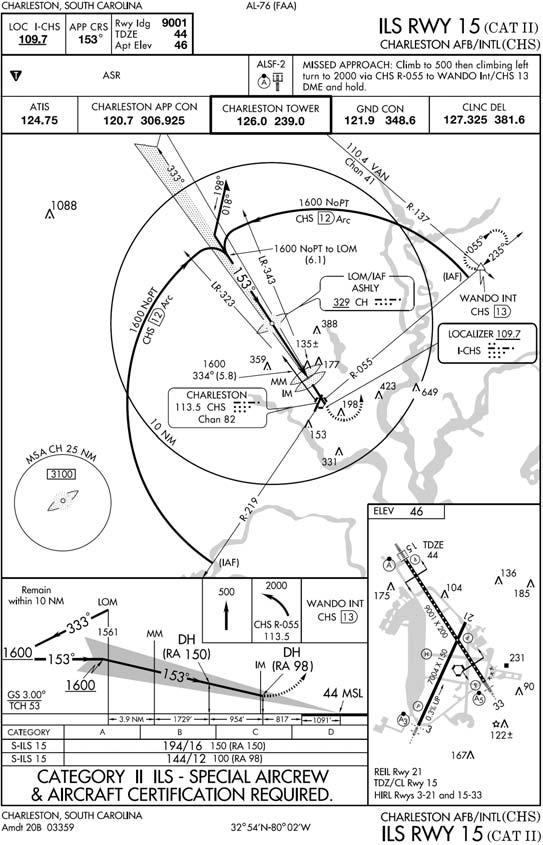
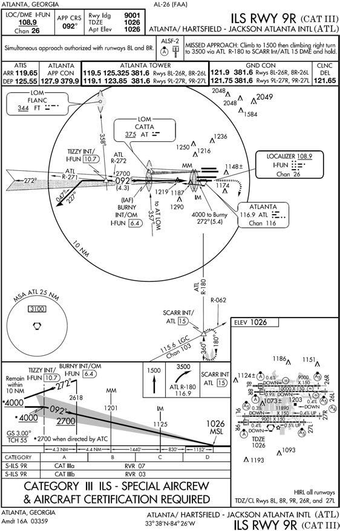

# Chapter 16: CATEGORY II AND III ILS

#### 16.1.{#16_1} Category II ILS Approach (Airport, Aircraft, and Aircrew Certification Required) (Figure 16.1).

A Category II ILS approach provides the capability of flying to minima as low as a DH of 100 feet and an RVR of 1200. The DH for a Category II approach is identified by a preselected height on the aircraft radar altimeter. This figure is enclosed in parentheses on the IAP and is prefaced by RA (Radar Altimeter), example: (RA 113).

16.1.1. Check flight directors, barometric and radar altimeters, and any other Category II equipment. Set the DH on the radar altimeter (if required for the approach).

+ 16.1.1.1. On certain Category II ILS approaches, the terminology "RA-NA" will be annotated in the minimums section of the procedure. This indicates that the DA must be determined solely from the barometric altimeter, not the radar altimeter.

16.1.2. Brief Category I procedures as a backup approach if appropriate.

16.1.3. Announce the illumination of any Category II system fault identification light.

+ 16.1.3.1. If any required Category II component fails prior to 300 feet AGL, the system is capable of a Category I approach only unless the failure can be corrected prior to 300 feet AGL.

+ 16.1.3.2. Any failure of a required Category II component below 300 feet AGL requires the pilot to execute an immediate missed approach unless visual cues are sufficient to complete the approach and landing.

16.1.4. PM will make appropriate advisory altitude calls on the approach, including a call 100 feet above the DH.

+ 16.1.4.1. NOTE: Tolerances for continuing the approach from 100 feet above DH are: airspeed ±5 knots of computed final approach speed or the speed directed by the flight manual for Category II approaches, and deviation from glide slope and localizer not to exceed one-half dot.

16.1.5. From 100 feet above the DH to the Category II DH, the PM will concentrate primarily on outside references to determine if visual cues are sufficient to complete the landing visually.

16.1.6. Continue the approach at DH only if the following conditions are met:

+ 16.1.6.1. Runway environment (as defined in para 12.1.2.2.) is in sight.

+ 16.1.6.2. Airspeed is within ± 5 knots of the computed final approach speed or as directed by the flight manual.

+ 16.1.6.3. Localizer or glide slope deviations do not exceed one-half dot.

+ 16.1.6.4. The aircraft's position is within, and tracking to remain within, the extended lateral confines of the runway.

+ 16.1.6.5. The aircraft is stabilized with reference to attitude and airspeed.

16.1.7. Go around at DH if the runway environment is not in sight or if any of the above tolerances are exceeded.

+ 16.1.7.1. NOTE: These procedures are intended for use by Category II ILS certified aircrews only. Individual MAJCOM directives and aircraft manuals have established minimum equipment requirements and restrictions that must be complied with prior to initiating a Category II ILS approach.

##### Figure 16.1. Category II ILS.

----

#### 16.2.{#16_2} Category III ILS (Airport, Aircraft, & Aircrew Certification Required) (Figure 16.2).

16.2.1. Definitions.

+ 16.2.1.1. ILS Category III. A precision instrument approach and landing without a DH, or a DH below 100 feet (30 meters) and controlling runway visual range not less than 700 feet (240 meters).

	+ 16.2.1.1.1. ILS Category IIIa. An ILS approach procedure that provides for approach without a DH or RVR not less than 700 feet.

	+ 16.2.1.1.2. ILS Category IIIb. An ILS approach procedure that provides for approach without DH and with RVR not less than 150 feet.

	+ 16.2.1.1.3. ILS Category IIIc. An ILS approach procedure that provides for approach without DH and without RVR minimum.

+ 16.2.1.2. Alert Height (AH). A height defined as 100 feet above the highest elevation in the touchdown zone, above which a Category III approach would be discontinued and a missed approach initiated if a failure occurred in one of the required redundant operational systems in the airplane or in the relevant ground equipment. Below this height, the approach, flare, touchdown, and rollout may be safely accomplished following any individual failure in the associated Category III systems.

16.2.2. Operational Concepts. The weather conditions encountered in Category III operations range from adequate visual references for manual rollout in Category IIIa, to inadequate visual references even for taxi operations in Category IIIc. To maintain a high level of safety during approach and landing operations in very low visibilities, the airborne system and ground support system requirements established for Category III operations should be compatible with the limited visual references that are available. The primary mode of Category III operations is automatic approach to touchdown using automatic landing systems that does not require pilot intervention. However, pilot intervention should be anticipated in the unlikely event that the pilot detects or strongly suspects inadequate aircraft performance as well as when it is determined that an automatic touchdown cannot be safely accomplished within the touchdown zone.

+ 16.2.2.1. Fail Operational Category III Operations. Aircraft certification is based on the total airborne system being operative down to AH height of 100 feet. The aircraft will accomplish an automatic landing and rollout using the remaining automatic systems following failure of one system below AH. Equipment failures above AH must result in a go-around or reversion to another approach if those requirements can be met. For Category IIIa fail-operational approach and landing without a rollout control system, visual reference with the touchdown zone is required and should be verified prior to the minimum height specified by the operator for the particular aircraft type. These visual cues combined with controlling transmissometer RVR report of visibility at or above minima are necessary to verify that the initial landing rollout can be accomplished visually. A go-around should be accomplished if there is no visual reference prior to the specified minimum height or upon receiving a report of controlling RVR below minima prior to this height. For Category IIIa fail-operational approach and landing with a rollout control system, the availability of visual reference is not a specific requirement for continuation of an approach to touchdown. The design of the cockpit instrumentation, system comparators, and warning systems should be adequate in combination to assure that the pilot can verify that the aircraft will safely touchdown within the touchdown zone and safely rollout if the controlling RVR is reported at or above approved minima. The aircraft may go-around safely from any altitude to touchdown. Use manual go-around after touchdown.

16.2.3. Procedures. See individual MAJCOM directives and aircraft manuals for minimum equipment requirements, restrictions, and procedures used when initiating Category III ILS approaches.

##### Figure 16.2. Category III ILS.

