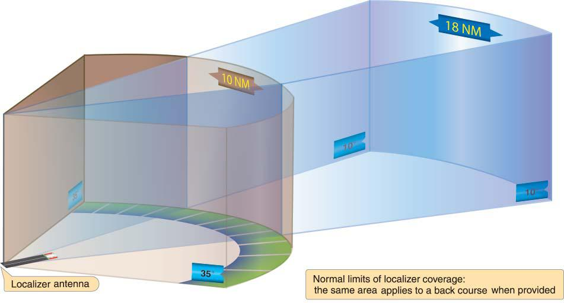
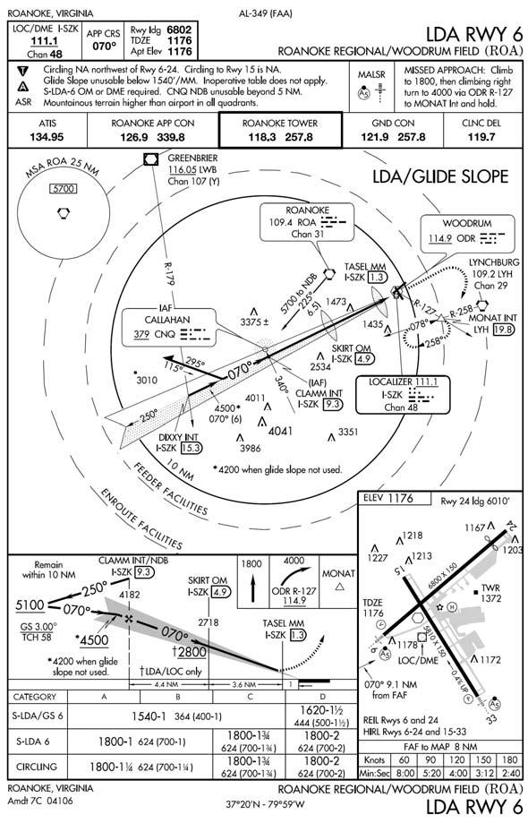
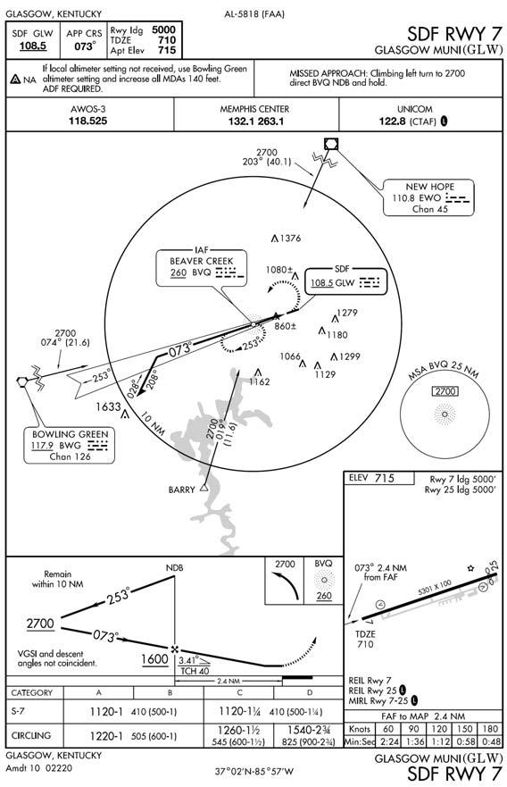

# Chapter 4: NAVIGATION AIDS

#### 4.1.{#4_1} Precautions.

Various types of navigation aids are in use today, each serving a special purpose. Although operating principles and cockpit displays will vary among navigation systems, there are several precautionary actions that must be taken to prevent in-flight use of erroneous navigation signals:

4.1.1. Identification. The pilot will check the identification of any navigation aid and monitor it during flight IAW Chapter 7 of this manual.

4.1.2. Crosscheck Information. Use all suitable navigation equipment aboard the aircraft and crosscheck heading and bearing information.

4.1.3. Estimated Time of Arrival. Never overfly an estimated time of arrival (ETA) without a careful crosscheck of navigation aids and ground checkpoints.

4.1.4. Notices to Airmen. The pilot will check notices to airmen (NOTAM) and flight information publication (FLIP) before flight for possible malfunctions or limitations to navigation aids.

4.1.5. Suspect Navigation Aid. Discontinue use of any suspect navigation aid and confirm aircraft position with radar (ground or airborne) or other equipment. Advise ATC of any problems receiving NAVAIDs. The problem may be the ground station and not the aircraft equipment.

----

#### 4.2.{#4_2} VHF Omni-Directional Range (VOR).

The theoretical and technical principles of operation of VOR equipment are discussed in depth in AFMAN 11-217V3.

----

#### 4.3.{#4_3} Tactical Air Navigation (TACAN).

The theoretical and technical principles of operation of TACAN equipment differ from those of VOR; however, the end result, as far as reading the cockpit display is concerned, is the same. TACAN components and operation are discussed in depth in AFMAN 11-217V3.

----

#### 4.4.{#4_4} VHF Omni-Directional Range/Tactical Air Navigation (VORTAC).

A VORTAC is a unified navigation aid consisting of two components, VOR and TACAN, which provides three individual services: VOR azimuth, TACAN azimuth, and TACAN distance (DME) from one site. Both components of a VORTAC operate simultaneously and provide the three services at all times. Additional information on VORTACs is available in AFMAN 11-217V3.

----

#### 4.5.{#4_5} Distance Measuring Equipment (DME).

DME operation utilizes paired pulses transmitted from the aircraft to a ground station at a specific spacing. The ground station then transmits paired pulses back to the aircraft at the same pulse spacing but on a different frequency. The time required for the round trip of this signal exchange is measured in the airborne DME unit and is displayed to the pilot as a distance in nautical miles from the aircraft to the ground station. Additional information on DME is available in AFMAN 11-217V3.

----

#### 4.6.{#4_6} Instrument Landing System (ILS).

The theoretical and technical principles of operation of ILS equipment are discussed in depth in AFMAN 11-217V3.

4.6.1. The ILS is designed to provide an approach path for exact alignment and descent of an aircraft on final approach to a runway. The ground equipment consists of two highly directional transmitting systems, optional DME transmitters, and as many as three marker beacons or compass locators. The directional transmitters are known as the localizer and glide slope which are received by aircraft ILS equipment and displayed on the cockpit instrument panel. A runway serviced by ILS equipment will also include approach, touchdown, and sometimes centerline lighting systems. Figure 4.1 offers a visual depiction of a standard ILS configuration.

4.6.2. ILS System on Each End of Runway. Some locations have a complete ILS system installed on opposite ends of a runway. Such ILS systems should not be operating simultaneously. In most cases, each ILS will have its own frequency. Sometimes the frequency for both runways will be the same, however each runway will have its own unique Morse code identifier.

+ 4.6.2.1. WARNING: The pilot shall listen to the Morse code identifier or monitor the alphanumeric display IAW Chapter 7, especially when flying an ILS where the same frequency is used for two runways. If both ILSs are inadvertently left on, or the incorrect ILS is turned on, it is possible to receive back course and false glide slope indications.

4.6.3. False Course Indications. False course indications may be received when the aircraft is not within the depicted area of coverage. Therefore, localizer course information received outside the area depicted in Figure 4.2 should be considered invalid unless the procedure is published otherwise (for example, localizer type directional aid or back course localizer). There is also a remote chance electromagnetic interference may cause false course indications within the depicted area of coverage. For these reasons, it is essential to confirm the localizer on course indication by reference to aircraft heading and any other available navigation aids, such as an ADF bearing pointer, before commencing final descent. Any abnormal indications experienced within 35 degrees of the published front course or back course centerline of an ILS localizer should be reported immediately to the appropriate ATC facility.

4.6.4. False Glideslope Indications. False glideslope indications may be received when the aircraft is not within the depicted area of coverage, or the glide slope power status is in alarm. There is also a chance that aircraft or vehicles parked in the ILS Critical Area may interfere with the glideslope signal. For these reasons, it is essential to confirm glideslope intercept altitudes and expected altitudes as depicted on the IAP. If indications are suspect, transition to localizer procedures or execute a missed approach.

4.6.5. ILS Facilities with Associated DME. ILS facilities sometimes have associated DME. These facilities are usually found at civilian fields. Some instrument approach procedures require TACAN or VOR associated DME on the initial segment and the ILS associated DME during the final portion of the approach. Pilots must exercise extreme caution to ensure the proper DME channel is tuned to preclude premature or late descents.

##### Figure 4.1. Standard ILS Characteristics and Terminology.

##### Figure 4.2. Normal Localizer Signal Coverage.

----

#### 4.7.{#4_7} Microwave Landing System (MLS).

The MLS provides precision navigation guidance for exact aircraft alignment and descent during an approach to a selected runway. It integrates azimuth (AZ), elevation angle (EL), and range (DME) information to provide precise aircraft positioning. The components of an MLS are similar to an ILS. Instead of a glide slope antenna, the MLS has an elevation station, and instead of a localizer antenna, it has an azimuth station. The MLS also has a precision DME (DME/P) transmitter. The DME/P signal is more accurate than traditional DME. Additional information on MLS is available in AFMAN 11-217V3.

----

#### 4.8.{#4_8} Marker Beacon (Figure 4.1).

Marker beacons are discussed in depth in AFMAN 11-217V3.

----

#### 4.9.{#4_9} Localizer Type Directional Aid (LDA).

The LDA is of comparable utility and accuracy to a localizer but is not always aligned with the centerline of the runway. TERPS requires the Localizer (LOC) signal alignment within 3° of the runway alignment. If the alignment exceeds 3°, the LOC will be identified as an LDA. Once designated as an LDA, the maximum angle of convergence of the final approach course and the extended runway centerline is 30°. The signal accuracy of the LDA is the same as a LOC, however the LDA course alignment will be greater than 3°, not to exceed 30°. Straight-in minima can be published only where alignment conforms to the straight-in criteria specified in AFMAN 11-226 (TERPS). Circling minima are published where this alignment exceeds straight-in criteria. The LDA is usually considered a non-precision approach; however, in some installations with a glide slope, a decision altitude will be published. If a decision altitude is published, it can be flown just like an ILS approach.

4.9.1. Localizer (LLZ). In International Civil Aviation Organization (ICAO) Procedures for Air Navigation Services-Aircraft Operations (PANS-OPS) abbreviates the localizer facility as LLZ. The accuracy of the signal generated by the LLZ is the same as a LOC. PANS-OPS normally requires the LLZ final approach track alignment to remain within 5° of the runway centerline. However, in certain cases, the alignment can exceed 5°. Where required, PANSOPS allows an increase of the final approach track to 15° for categories C, D, and E. For aircraft categories A and B, the maximum angle formed by the final approach track and the runway centerline is 30°.

+ 4.9.1.1. NOTE: Prior to flying a LDA or LLZ, compare the final approach course with the runway heading. The aerodrome sketch should provide a visual indication of the angle formed between the final approach track and the runway centerline.

##### Figure 4.3. LDA With Glide Slope.

----

#### 4.10.{#4_10} Simplified Directional Facility (SDF).

The SDF provides a final approach course that is similar to that of the ILS localizer and LDA. The SDF transmits signals within the range of 108.10 MHz to 111.95 MHz. However, the SDF may have a wider course width of 6° or 12°. It does not provide glide slope information. For the pilot, the approach techniques and procedures used in the performance of an SDF instrument approach are essentially identical to those used in executing a standard no glide slope localizer approach except that the SDF course may not be aligned with the runway and the course may be wider, resulting in less precision.

##### Figure 4.4. SDF Approach.

----

#### 4.11.{#4_11} Nondirectional Radio Beacon (NDB).

4.11.1. Frequencies. NDB is a low, or medium, or ultra high frequency radio beacon that transmits nondirectional signals whereby an aircraft properly equipped can automatically determine and display bearing to any radio station within its frequency and sensitivity range.

4.11.2. Compass Locator. When a radio beacon is used in conjunction with the ILS markers, it is called a "compass locator." Sometimes the low-powered NDB [i.e. compass locator] will be a stand alone NAVAID with limited range (usually less than 15 miles). These locators may be identified by an "L" and the use of the two-digit identifier.

4.11.3. Identification. Most radio beacons within the U.S. transmit a continuous three-letter identifier. A two-letter identifier is normally used in conjunction with an ILS. Some NDBs have only a one-letter identifier. Outside of the contiguous U.S., one, two, or three-letter identifiers are transmitted; for example, BB.

4.11.4. Voice Transmissions. Voice transmissions can be made on radio beacons unless the letter "W" (without voice) is included in the class designator (HW).

4.11.5. Disturbances. Radio beacons are subject to disturbances that may result in erroneous bearing information. Such disturbances result from intermittent or unpredictable signal propagation due to such factors as lightning, precipitation, static, etc. At night, radio beacons are vulnerable to interference from distant stations. Nearly all disturbances that affect the ADF bearing also affect the facility's identification. Noisy identification usually occurs when the ADF needle is erratic. Voice, music, or erroneous identification will usually be heard when a steady false bearing is being displayed.

+ 4.11.5.1. WARNING: Since ADF receivers do not have a "flag" to warn the pilot when erroneous bearing information is being displayed, the pilot must continuously monitor the NDBs identification.

----

#### 4.12.{#4_12} Global Positioning System (GPS).

4.12.1. Principles of Operation. GPS is a satellite-based navigation system that has the capability to provide highly accurate three-dimensional position, velocity, and time to an infinite number of equipped users anywhere on or near the Earth (Figure 4.5). GPS is discussed in depth in AFMAN 11-217V3.

##### Figure 4.5. GPS.

----

#### 4.13.{#4_13} Inertial Navigation System (INS).

4.13.1. Description. The INS is a source of groundspeed, attitude, heading, and navigation information. A basic system consists of acceleration sensors mounted on a gyro stabilized, gimbaled platform, a computer unit to process raw data and maintain present position, and a control display unit (CDU) for data input and monitoring. It allows the aircrew to selectively monitor a wide range of data, define a series of courses, and update present position. The INS operates solely by sensing the movement of the aircraft. Since it neither transmits nor receives any signal, it is unaffected by electronic countermeasures or weather conditions. The INS can also supply data to many other aircraft systems.

4.13.2. Operation. Before an INS can be used, it must be aligned. During alignment, present position coordinates are inserted manually while the INS derives local level and true north. This operation must be completed before moving the aircraft. If alignment is lost in flight, navigation data may be lost, but, in some cases, attitude and heading information may still be used. Coordinate or radial and distance information describing points that define the route of flight are inserted as needed through the CDU. For complete operation procedures of any specific INS, consult the appropriate aircraft technical order.