# Chapter 6: PLANNING AN INSTRUMENT FLIGHT

#### 6.1.{#6_1} Preflight Planning.

A successful instrument flight starts with a thorough preflight planning session. This planning should include a number of items including NOTAMS, weather for the entire route of flight including the departure and arrival aerodromes, takeoff and landing data (TOLD), all publications necessary to conduct the flight (e.g. Departure procedures, enroute charts, FIH, Arrival Procedures, Instrument Approach Procedures, applicable FLIP materials, ASRR, etc.), the route of flight, and the production of a flight plan and flight plan log that determines the amount of time and fuel needed for the flight including possible diversion to an alternate, if applicable. See also AFI 11-202V3.

----

#### 6.2.{#6_2} NOTAMS.

NOTAM is defined in AFJMAN 11-208, DoD Notice to Airmen (NOTAM) System, as an unclassified notice containing information concerning the establishment of, condition of, or change in an aeronautical facility, service, procedures or hazards; the timely knowledge of which is essential for safe flight operations. Checking NOTAMs is a critical step in the flight planning process. NOTAM information is available from the U.S. NOTAM System (USNS) via the DoD Internet NOTAM Distribution System (DINS). To fully understand where and how to get all available NOTAM information, it is important to understand the USNS.

6.2.1. Defense Internet NOTAM System. DINS is composed of a large central data management system deriving information from the US Consolidated NOTAM Office at the FAA Air Traffic Control System Command Center (ATCSCC) located at Herndon, VA. Real-time NOTAM information is maintained and made available through the internet. https://www.notams.jcs.mil Coverage includes all military airfields and virtually all domestic, international, and Flight Data Center (FDC) NOTAMs. If not covered by DINS, the airfield does not transmit NOTAM data to the USNS. A plain language notice in red font is displayed advising the user of that fact. In such a case, you must contact the airfield manager or associated Flight Service Station directly for NOTAM information.

+ 6.2.1.1. NOTAM abbreviations are explained in the FIH and the Notices to Airmen Publication (NTAP). NOTAM abbreviations for DINS can be found in the FIH and FAAO 7930.2M Notice to Airmen (NOTAMS).

6.2.2. A comprehensive discussion of the U.S. and international NOTAM systems can be found in AFMAN 11-217V3, and AFI 11-208, Department of Defense Notice to Airman (NOTAM) System.

----

#### 6.3.{#6_3} Weather.

Aircrew can obtain departure, enroute and arrival weather information from a number of sources. For authorized weather sources, see FLIP IFG. At military airfields, the normal source is the DD 175-1 filled out and briefed by a military weather briefer from one of the regional Operational Weather Squadrons. At civil fields, aircrew may obtain weather by contacting the Operational Weather Squadron serving the area, or a FSS and getting a weather brief over the phone by calling 1 800 WX-BRIEF.

6.3.1. Cold Weather Altimeter Corrections. Pressure altimeters are calibrated to indicate true altitude under International Standard Atmospheric (ISA) conditions. Any deviation from these standard conditions will result in an erroneous reading on the altimeter. This error becomes important when considering obstacle clearances in temperatures lower than standard since the aircraft's altitude is below the figure indicated by the altimeter. The error is proportional to the difference between actual and ISA temperature and the height of the aircraft above the altimeter setting source. The amount of error is approximately 4 feet per thousand feet for each degree Celsius of difference. Corrections will only be made for DAs, MDAs, and other altitudes inside, but not including, the FAF. The same correction made to DAs and MDAs can be applied to other altitudes inside the FAF. For the current cold weather altimeter correction procedure, you must refer to the Flight Information Handbook (FIH). The following guidance is provided as an example of how to accomplish the procedure found in the FIH.

+ 6.3.1.1. To ensure adequate obstacle clearance the values derived from the chart below will be:

	+ 6.3.1.1.1. Added to the published DA or MDA and step-down fixes inside the FAF whenever the outside air temperature is less than 0° Celsius

	+ 6.3.1.1.2. Added to ALL altitudes in the procedure in Designated Mountainous Regions whenever the outside air temperature is 0° Celsius or less

	+ 6.3.1.1.3. Added to ALL altitudes in the procedure whenever the outside air temperature is -30° Celsius or less, or procedure turn, intermediate approach altitude Heights Above Touchdown (HAT)/Heights Above Aerodrome (HAA) are 3000 feet or more above the altimeter setting source.

##### Table 6.1. Temperature Correction Chart.
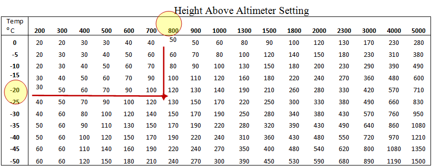

+ 
	+ 6.3.1.1.4. Example: For an approach when OAT is -20° C, and the HAA is 760' AGL on the IAP, the pilot should add 110' to the MDA for the approach. Thus, if the MDA was 940' MSL, the pilot would only descend to 1050' (940+110=1050). NOTE: Do not change the value in the RADAR ALTIMETER-you are still descending to the HAA on the IAP, you are only correcting for temperature error in the barometric altimeter (Table 6.1).

----

#### 6.4.{#6_4} Route.

Preflight planning of the enroute portion should be adequate to enseure safe and efficient flight. As a minimum, aircrew should review:

6.4.1. The intended route of flight (to include preferred routing located in AP/1) using current flight publications.

6.4.2. En route NOTAMs.

6.4.3. En route weather.

6.4.4. FLIP products. The appropriate FLIP products to ensure compliance with any special procedures that may apply.

6.4.5. Diversion fields. Emergency diversion fields and approaches.

6.4.6. Compliance. Comply with the jet route or airway system as published on the FLIP en route charts and air traffic clearances. You must also ensure your aircraft is equipped and authorized to operate in the airspace along your route of flight. For example, only aircraft certified through their MAJCOM for RNP-5 may operate in the European Basic RNAV (BRNAV) structure. Consult your MAJCOM and Mission Design Series (MDS)-specific guidance if you have any doubts concerning your aircraft's capabilities.

6.4.7. Enroute Navigation in High Latitudes. Enroute navigation in higher latitude regions may be based on reference to true or grid north instead of the customary reference to magnetic north. Procedures vary greatly between aircraft type and avionics capabilities. Thorough mission planning, including review of applicable aircraft/avionics specific procedures and limitations, is essential to accurate navigation at higher latitudes.

+ 6.4.7.1. When flying at higher latitudes, review the enroute charts carefully to ensure you are cognizant of the heading source required by the instrument procedures in the airspace you are transiting, and the orientation reference of the NAVAID. This is annotated on the enroute chart as shown in Figure 6.1.

##### Figure 6.1. Enroute Charts for Navigation in Higher Latitudes.
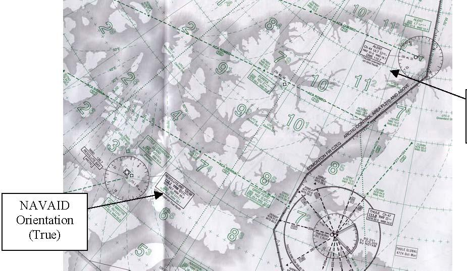

+ 6.4.7.2. Normally, navigation north of 70°North latitude or south of 60°South latitude is conducted with reference to true north or grid north. Specific procedures vary greatly depending on aircraft type, avionics capabilities, and crew complement. Unless otherwise annotated, where there is a reference to true north, the text also applies in southern latitudes and applies to navigation with reference to grid north/south.

	+ 6.4.7.2.1. There are areas officially designated Areas of Magnetic Unreliability (AMU). Aircraft capable of displaying only magnetic heading are prohibited from operating in designated AMUs. For areas north of 70°North and south of 60° South that are not officially designated as AMUs, MAJCOMs will determine the highest allowable latitude for aircraftcapable of displaying only magnetic heading (Figure 6.2).

		+ 6.4.7.2.1.1. NOTE: Although partly south of 70° North, the entire Canadian Northern and Arctic Control Areas and areas of Northern Domestic Airspace are designated as AMUs.

	+ 6.4.7.2.2. MAJCOMs must provide aircraft-specific operational approval prior to enroute and terminal area operations using navigation aids oriented to true or grid. Operational approval shall be based on development of aircraft specific procedures and training. As a minimum, procedures and training should address: identification of areas where reference to true or grid north is required, procedures for displaying true or grid heading reference, procedures for verifying magnetic variation information from the aircraft navigation computer, procedures for inputting manual magnetic variation information, procedures for returning to automatic magnetic variation computation, minimum equipment requirements, and emergency procedures in the event of true or grid navigation equipment failure while operating in the AMU.

+ 6.4.7.3. Aircraft navigation displays must be set to display true north prior to flying true headings or courses. Suitably equipped aircraft may also use grid reference if applicable.

+ 6.4.7.4. Outside of designated AMUs, aircraft unable to display true or grid heading may use navigation aids oriented to true north for enroute navigation provided procedures listed below are followed.

##### Figure 6.2. Canadian Northern Control Area Boundaries (Areas South of 70°N Where True Tracks

	+ 6.4.7.4.1. Enroute navigation using approved RNAV equipment backed up by display of VOR/TAC/NDB data is recommended. Depending on system architecture, aircraft navigation computers (flight management systems) automatically provide magnetic variation information. Accuracy of this magnetic variation depends on the period of time since the last magnetic variation update. Some systems contain magnetic variation information that cannot be updated. Also, some navigation systems provide magnetic variation information for only a limited portion of the globe. Thus, when true or grid heading information cannot be displayed, aircraft magnetic variation information must be verified with current aeronautical charts prior to use of RNAV equipment to fly true or grid courses. For navigation using FMS or other RNAV system, procedures and system limitations vary widely among aircraft and avionics installations. Consult your aircraft flight manual and MAJCOM directives for specific FMS and RNAV procedures for navigation where reference to true or grid north is required.

+ 6.4.7.5. For navigation using VOR or TACAN, if the NAVAID is oriented to true north, use the following procedures for enroute navigation:

	+ 6.4.7.5.1. NOTE: Only VORs and TACANs can be oriented to true north. NDBs cannot be oriented to true north. ADF needles always display relative bearing to the station.

	+ 6.4.7.5.2. If your aircraft allows selection of true north as a heading reference, select true north. No additional corrections are required for courses or headings.

	+ 6.4.7.5.3. If your aircraft does not allow selection of true north as a heading reference, use the following procedures:

		+ 6.4.7.5.3.1. VOR and TACAN courses do not require correction for magnetic variation.

			+ 6.4.7.5.3.1.1. The desired true course must be set into the CDI. The aircraft CDI will indicate deviations left and right of the desired true course. However, with magnetic heading displayed, the bearing pointer will not point to the station, but will instead indicate true bearing to the station. In other words, when established on course, the CDI will be centered on the desired true course, but the bearing pointer will indicate true bearing to the station and will be displaced from aircraft no-wind heading by the amount of station magnetic variation. For example, the Thule magnetic variation is approximately 60 degrees west. When proceeding inbound on the Thule 180 degree radial true (360 course), the aircraft no wind heading will be 060, while the bearing pointer will point to 360. Be aware that this discrepancy between aircraft heading and desired course may make flight director guidance unreliable.

		+ 6.4.7.5.3.2. All headings require corrections for magnetic variation.

+ 6.4.7.6. For navigation using NDB, use the following procedures:

	+ 6.4.7.6.1. NOTE: Only VORs and TACANs can be oriented to true north. NDBs cannot be oriented to true north. ADF needles always display relative bearing to the station.

	+ 6.4.7.6.2. If your aircraft allows selection of true north as a heading reference, select true north. No additional corrections are required for relative bearings.

	+ 6.4.7.6.3. If your aircraft does not allow selection of true north as a heading reference, all relative bearings require correction for magnetic variation.

		+ 6.4.7.6.3.1. Crews should compute and fly the appropriate magnetic course by correcting the desired true course for the magnetic variation at the current aircraft location. Use the magnetic variation at your current location. This correction should be updated at least every 5° of magnetic variation or every 30 nm, whichever occurs first.

6.4.8. Minimum Altitudes.

+ 6.4.8.1. Altitude Clearances. Ensure altitude clearances received en route do not conflict with minimum en route altitudes (MEA), minimum obstruction clearance altitudes (MOCA), minimum reception altitudes (MRA), or minimum crossing altitudes (MCA) shown on en route charts.

+ 6.4.8.2. Controlled Airspace. In controlled airspace, the air traffic controller will assign altitudes that provide obstacle clearance. You should use all available navigation aids to remain position-oriented and immediately query the controller if there is any uncertainty of the obstacle clearance provided by the assigned altitude. When flying via published routing (a route with minimum altitudes depicted), compliance with the minimum altitude published on the routing ensures obstacle clearance. If a published minimum altitude is not available, aircrews must determine minimum altitudes in accordance with AFI 11202V3.

+ 6.4.8.3. Uncontrolled Airspace. In uncontrolled airspace, you must ensure the altitudes flown will provide obstacle clearance during all phases of flight.

+ 6.4.8.4. Radio Failure. In case of radio failure, you are responsible for minimum altitude selection. Comply with published radio failure procedures in the FIH.

----

#### 6.5.{#6_5} Planning the Approach.

Preparation for flying an instrument approach begins with a study of the approach depiction during preflight planning. The end result of an approach-a landing or a missed approach-can be directly dependent upon the pilot's familiarity with the approach depiction.

6.5.1. Aircraft Categories and Instrument Approach Procedures Selection.

+ 6.5.1.1. Category. Aircraft approach category is based on 1.3 times the stalling speed in the landing configuration at maximum certificated gross landing weight. An aircraft can fly an IAP only for its own category or higher, unless otherwise authorized by AF Instruction or MAJCOM directives. If it is necessary to maneuver at speeds in excess of the upper limit of a speed range for a category, the minimums for the next higher category should be used. The categories are as follows:

	+ 6.5.1.1.1. Category A - Speed less than 91 knots.

	+ 6.5.1.1.2. Category B - Speed 91 knots or more but less than 121 knots.

	+ 6.5.1.1.3. Category C - Speed 121 knots or more but less than 141 knots.

	+ 6.5.1.1.4. Category D - Speed 141 knots or more but less than 166 knots.

	+ 6.5.1.1.5. Category E - Speed 166 knots or more.

		+ 6.5.1.1.5.1. NOTE: If MAJCOMs allow aircraft to fly an IAP using a lower category, the MAJCOM must publish procedures to ensure that aircraft do not exceed TERPS airspace for the IAP being flown to include circling and missed approach.

+ 6.5.1.2. IAP chart. A current copy of the appropriate IAP chart must be available in the aircraft for the departure base, destination, and all planned alternates.

	+ 6.5.1.2.1. Approved sources for IAP charts used in aircraft include printed FLIP distributed by NGA, National Aeronautical Charting Office (NACO), or other source authorized by your MAJCOM (for example, Jeppesen).

		+ 6.5.1.2.1.1. Do not print an IAP from DAFIF and then fly that digital version. Until the DAFIF is certified for terminal IFR use in your weapon system, always use the IAP distributed electronically or via printed FLIP.

		+ 6.5.1.2.1.2. IAPs downloaded from the NGA website in PDF format are identical to those in the printed NGA approach books. Effective dates are printed on the bottom of each downloaded page. The responsibility for ensuring the current version of an IAP is onboard lies with the pilot.

			+ 6.5.1.2.1.2.1. Note that comparing amendment numbers or Julian dates on new plates against previously printed plates is not a valid way of determining currency. Information on a plate can change without an amendment number or Julian date change!

		+ 6.5.1.2.1.3. If you print an IAP from the JEPPVIEW CD distributed by Jeppesen (or another equivalent commercial product), ensure the CD is current and you are a licensed user of that CD. If you do not know the license arrangement with Jeppesen (or other commercial vendor), do not use the IAP. The vendors and USAF take copyright violations very seriously. It is the responsibility of each pilot to ensure not only currency of IAPs prior to use, but also compliance with copyright and licensing agreements. These agreements may vary from Wing to Wing.

		+ 6.5.1.2.1.4. Do not fly non-US Government IAPs unless properly trained and the procedure(s) are approved by your MAJCOM TERPS. (TERPS will not provide a review on non-US government instrument procedures if a DoD (NGA) or FAA (NACO) product for the same procedure exists.)

	+ 6.5.1.2.2. Low altitude IAP charts normally depict instrument approaches for categories A, B, C, and D aircraft. High altitude IAP charts depict instrument approaches for category C, D, and E aircraft. When an operational requirement exists, the low altitude IAP charts may depict category E procedures.

		+ 6.5.1.2.2.1. NOTE: If there is a discrepancy between stand-alone GPS approach charts and the database onboard the aircraft, the chart takes precedence.

		+ 6.5.1.2.2.2. NOTE: Consult the Terminal Change Notice (TCN) to ensure the approach selected is current.

+ 6.5.1.3. Navigation Equipment Compatibility. Ensure the approach you select is compatible with the navigation equipment installed and operating on your aircraft, including the missed approach instructions.

	+ 6.5.1.3.1. Exception: If there is a requirement to execute an approach procedure with incompatible missed approach instructions, ATC may be able to issue alternate missed approach instructions. Request alternate missed approach instructions prior to accepting approach clearance.

		+ 6.5.1.3.1.1. NOTE: This requirement for alternate missed approach instructions does not preclude practice approaches if the field is VFR according to AFI 11202V3.

##### Figure 6.3. Equipment Requirements for IAP.
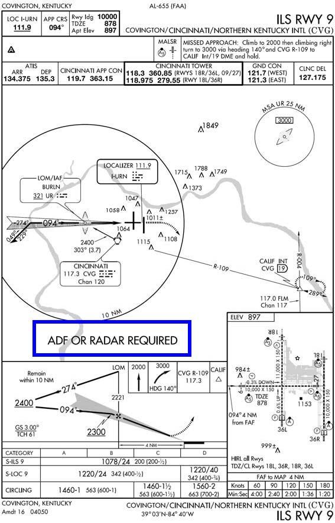

+ 

	+ 6.5.1.3.2. Straight-in approaches. The types of navigation aids that provide final approach guidance and the runway to which the final approach courses are aligned identify straight-in approaches. A slash (/) indicates that more than one type of equipment may be required to execute the final approach (VOR/DME, ILS/DME, etc.). Be aware that additional equipment may be required to execute the other portions of the procedure (Figure 6.4).

##### Figure 6.4. IAP With "/" in Title.
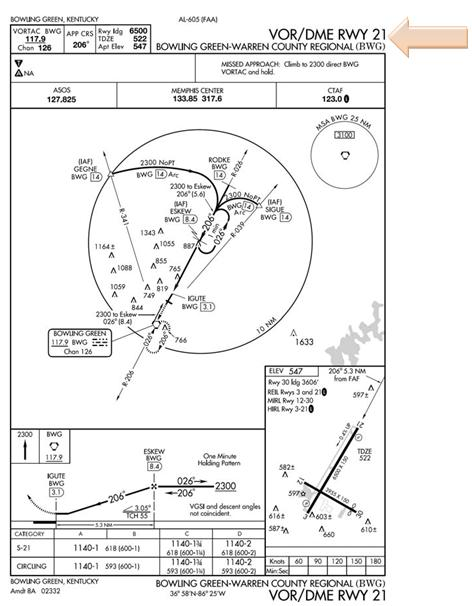
+ 
	+ 
		+ 6.5.1.3.2.1. Where more than one approach using the same final approach guidance is developed to the same runway, each runway/navigational aid combination will be identified with an alphabetical suffix beginning at the end of the alphabet; e.g. ILS Z RWY 28L (first procedure), ILS Y RWY 28L (second procedure), ILS X RWY 28L (third procedure), etc. Suffixes will be used in reverse alphabetical order, beginning with "Z" (Figure 6.5).

##### Figure 6.5. More Than One Approach With Same Final Approach Guidance.
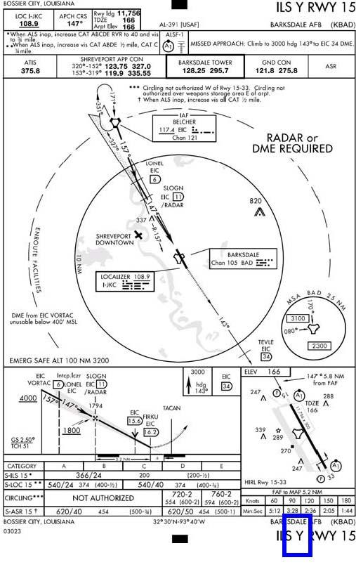

+ 
	+ 6.5.1.3.3. VOR approaches. Some VOR approaches are approved for use by TACAN equipped aircraft. These will be designated by the term "(TAC)" printed adjacent to the name of the procedure, for example, VOR-A (TAC).

	+ 6.5.1.3.4. Circling approaches. When the name of the approach is followed by a letter such as A, B, C, etc., the approach is designed for circling minimums only. Circling approaches are designated VOR-A, TACAN-B, NDB-C, etc. Circling approach designators will begin at the beginning of the alphabet (Figure 6.6).

##### Figure 6.6. Circling Approach.
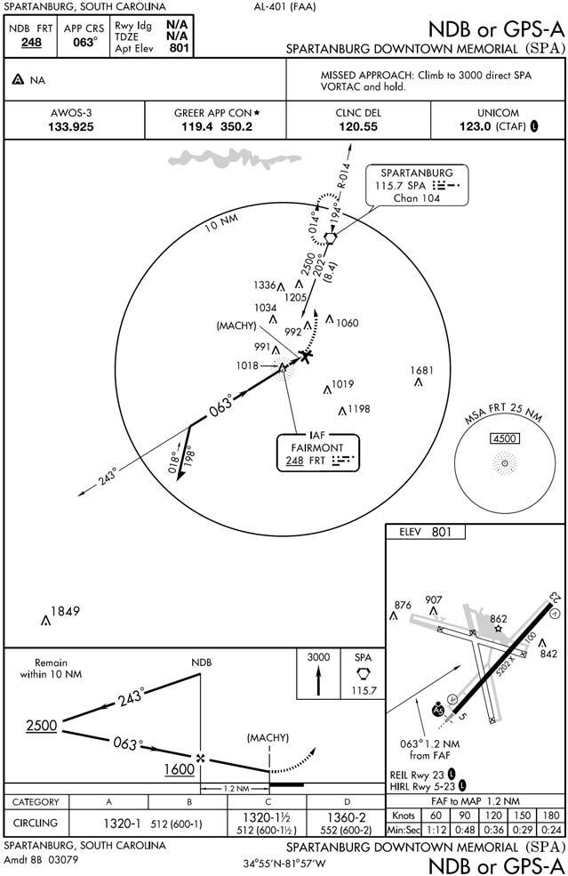

+ 6.5.1.4. Radar Minimums. Radar minimums by aircraft category may be found in a separate section in the IAP book. 6.5.2. True Approach Procedures.

+ 6.5.2.1. Selected instrument approach procedures in higher latitude regions may be based on reference to true or grid north/south instead of the customary reference to magnetic north/south. Procedures vary greatly between aircraft type and avionics capabilities. Thorough mission planning, including review of applicable aircraft/avionics specific procedures and limitations, is essential to safely flying an instrument approach at higher latitudes.

	+ 6.5.2.1.1. When flying at higher latitudes, review the IAP carefully to ensure you are cognizant of the heading source required by instrument procedures and the orientation reference of the NAVAID. This is annotated on the IAP as shown in Figures 6.7, 6.8 and 6.9.

		+ 6.5.2.1.1.1. NOTE: At airfields with true or grid approaches, the runway direction number will also be based on reference to true or grid, as appropriate.

	+ 6.5.2.1.2. USAF aircrews are authorized to fly true or grid approaches in accordance with their aircraft flight manuals and MAJCOM directives.

	+ 6.5.2.1.3. Except as noted below, aircraft must possess a true or grid heading source, and be able to display true or grid heading on appropriate navigation displays in order to fly terminal area true or grid instrument procedures in night or IMC.

	+ 6.5.2.1.4. Aircraft without a true or grid heading source may fly true or grid RNAV (GPS) approaches and true or grid RNAV departure procedures in night or IMC providing the RNAV procedure provides all required magnetic course information.

	+ 6.5.2.1.5. For terminal area procedures referenced to true north, the following guidance applies:

		+ 6.5.2.1.5.1. Note: This section covers general true approach procedures, your flight manual and/or MAJCOM may have additional procedures or limitations.

		+ 6.5.2.1.5.2. Radar vectors should be provided with reference to true north. If in doubt, query the controller.

		+ 6.5.2.1.5.3. Orientation of an IAP to true north will be indicated by inclusion of the word "true" in the procedure title.

		+ 6.5.2.1.5.4. Select true as a heading source IAW with your aircraft flight manual and MAJCOM directives.

			+ 6.5.2.1.5.4.1. NOTE: ADF needles always display relative bearing to the station. Localizer signals emanate along a fixed path along the final approach course. CDIs always indicate position relative to the final approach course regardless of what is dialed into the CSW.

		+ 6.5.2.1.5.5. Select the published true final approach course as appropriate for the type of approach and aircraft equipment. For aircraft capable of displaying true heading, no further corrections to headings, courses or bearings are required.

	+ 6.5.2.1.6. For aircraft not capable of displaying true north, instrument approaches in night or IMC are not authorized. If your aircraft does not allow selection of true north as a heading reference, use the following procedures when flying a true approach (Day, VMC Only):

		+ 6.5.2.1.6.1. WARNING: In certain areas, magnetic heading indications may be unreliable or erratic. If magnetic heading indications are suspect, do not commence the approach. If already established on the approach and magnetic heading indications are suspect, execute a missed approach.

		+ 6.5.2.1.6.2. WARNING: Flight director commands and CDI deflection may be grossly inaccurate on aircraft without a true heading source even with proper setup of courses, bearings, and headings.

		+ 6.5.2.1.6.3. VOR and TACAN approaches. VOR and TACAN final approach courses do not require correction for magnetic variation. Dial in the true final approach course as depicted on the IAP. Although the CDI will be centered when on course, the bearing pointer will point to the true bearing to the station. When selecting a heading to fly to intercept/maintain the course, corrections for magnetic variation are required. Use the magnetic variation at the NAVAID the approach is based upon.

		+ 6.5.2.1.6.4. NDB Approaches. NDBs cannot be oriented to true north. ADF needles always display relative bearing to the station. Corrections for magnetic variation must be applied to the published bearing(s). When selecting a heading to fly to intercept/maintain the published bearing, corrections for magnetic variation are also required. Use the magnetic variation at the NAVAID the approach is based upon.

		+ 6.5.2.1.6.5. ILS and Localizer Approaches (includes LDA, SDF, and LOC BC). Localizer signals emanate along a fixed path along the final approach course and cannot be oriented on true north. CDIs always indicate position relative to the final approach course regardless of what is dialed into the CSW. However, selection of the correct final approach course is critical to insuring consistent cockpit indications of position relative to the final approach course. When selecting a course to dial in, corrections for magnetic variation must be applied to the published front course to insure consistent cockpit indications while on final approach. When selecting a heading to fly to intercept/maintain the published final approach course, corrections for magnetic variation are also required. Use the magnetic variation at the airport.

		+ 6.5.2.1.6.6. PAR, ASR, and Radar Vectors. When being radar vectored in the vicinity of an airport using true north as a heading reference, all vectors will be issued in true headings. If your aircraft does not allow selection of true north as a heading reference, corrections for magnetic variation are required.

##### Figure 6.7. True VOR Approach.
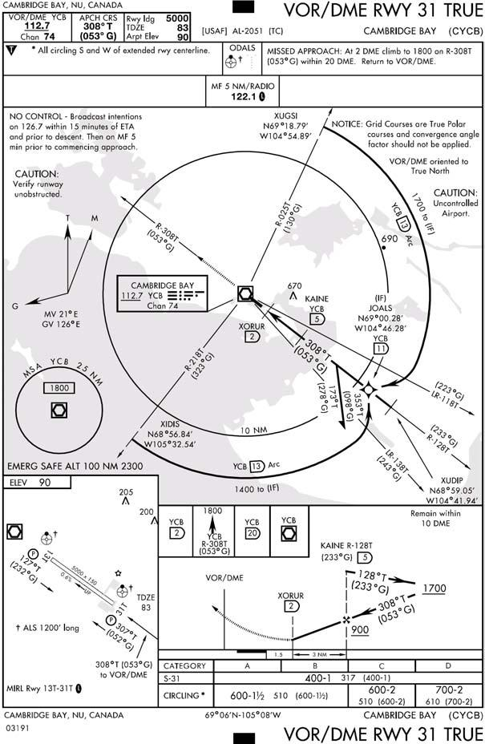

##### Figure 6.9. True ILS Approach.
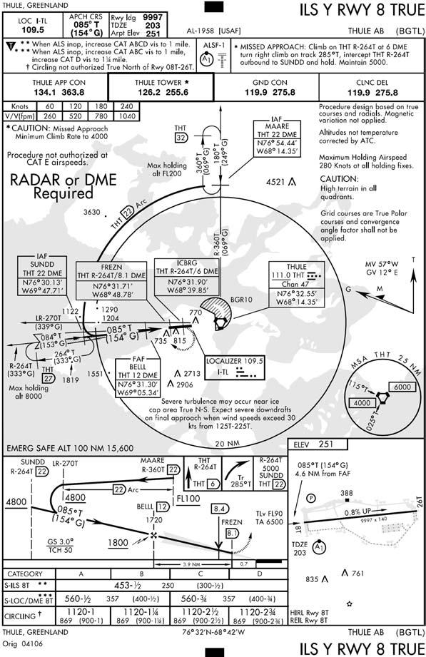

6.5.3. Grid Approach Procedures. (Figures 6.10 and 6.11) In some cases a NAVAID may be oriented on grid north, or a grid final approach course may be published alongside a magnetic or true final approach course. Use the following general procedures to fly a grid approach. Consult your aircraft flight manual and MAJCOM directives for specific equipment, procedures, and crew complement to fly grid.

+ 6.5.3.1. The heading reference of the primary means of navigation on final approach, the heading reference of the NAVAID the approach is based on, and the orientation of the runway direction number should all be the same.

	+ 6.5.3.1.1. NOTE: The NAVAID the approach is based on and the runway direction number normally will use the same heading reference.

	+ 6.5.3.1.2. When a final approach course using another heading reference is published on the IAP in parenthesis, this is provided for situational awareness, and is not to be used as the primary means of navigation on final approach. Use the grid course IAW with the aircraft flight manual and MAJCOM directives.

	+ 6.5.3.1.3. If the NAVAID and runway direction number are oriented on grid north, then grid is the primary means of navigation along final approach. Use aircraft flight manual procedures and MAJCOM directives to fly a grid approach. If a magnetic or true final approach course is published alongside the grid course it should only be used as a situational awareness tool, not the primary means of navigation.

##### Figure 6.10. Magnetic Heading Reference With Grid Course.
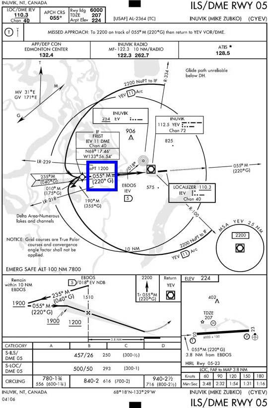

##### Figure 6.11. Grid Approach.
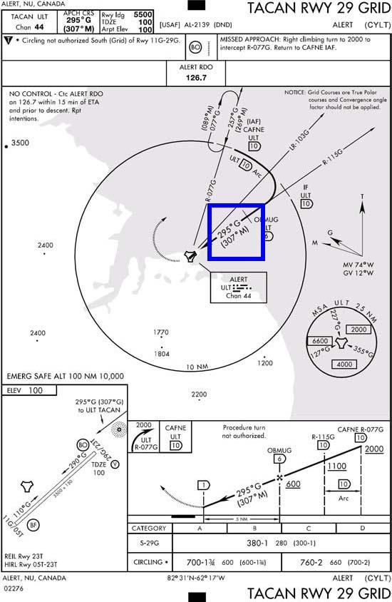

6.5.4. Reviewing an IAP (Figure 6.12). Prior to departure, you should become familiar with all aspects of the IAP so that during the recovery you can concentrate on flying the maneuver rather than trying to fly and interpret it simultaneously. Here are some important areas to consider and techniques to use:

##### Figure 6.12. Review of the IAP.
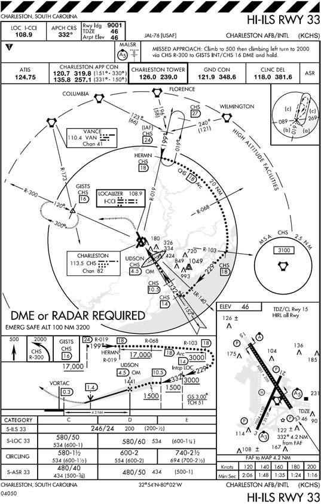

+ 6.5.4.1. Plan View.

	+ 6.5.4.1.1. Ground Track. Note the general ground track of the approach, the NAVAIDs that provide the course guidance, and the NAVAID location. (The NAVAIDs that appear in the name of an IAP are the NAVAIDs that provide the final approach guidance. Other types of NAVAIDs may be required to accomplish the approach and missed approach.)

	+ 6.5.4.1.2. Initial Approach Fix. Note the location of the IAF you plan to use as well as the NAVAID used to define the fix. Sometimes the IAF is displayed on the IAP by name only, and the NAVAID and radial/DME that defines the point is not listed. In this case, refer to the appropriate en route and terminal charts for the area to determine the NAVAID and the radial/DME that defines the IAF.

	+ 6.5.4.1.3. Holding Pattern. Note the location of the holding pattern and its relation to the IAF. It is extremely important that you review the altitude of the holding pattern at the IAF and determine if your aircraft can meet the holding speed restrictions associated with that altitude. If you are unable to comply with that holding speed, coordinate with ATC prior to arriving at the IAF and entering holding. You could exit TERPS protected airspace if you fly faster than the holding pattern design speed.

	+ 6.5.4.1.4. Plan the Approach. Mentally fly the approach from the IAF to the MAP and determine the lead points for radial, course, or arc interceptions. Identify the point where the aircraft should be configured for landing.

	+ 6.5.4.1.5. Missed Approach. Review the missed approach departure instructions and determine if your aircraft can comply with the required climb gradient if one is published. It is extremely important to review the Missed Approach holding pattern and determine if your aircraft can meet the holding speed restrictions associated with that altitude. If you are unable to comply with the holding speed, coordinate with ATC prior to arriving at the IAF and commencing the approach. If you lose communications and subsequently execute the published missed approach procedures, you could exit TERPS protected airspace if you fly faster than the missed approach holding pattern was designed for. Even when in radio contact, waiting to notify ATC of your requirement for alternate missed approach instructions, it may be too late for ATC to react and you could still exit protected airspace.

	+ 6.5.4.1.6. Published Routings. Terminal routings from en route or feeder facilities normally provide a course and range from the en route structure to the IAF but may take the aircraft to a point other than the IAF if operational circumstances so require (Low altitude feeder routes provide minimum altitudes).

	+ 6.5.4.1.7. Minimum Safe/Sector Altitudes. Minimum Safe Altitudes consist of minimum sector altitudes and emergency safe altitudes. When more than one Minimum Safe Altitude is required, it is referred to as a Minimum Sector Altitude. A minimum safe altitude is the minimum altitude that provides at least 1000 feet of obstacle clearance for emergency use within a specified distance from the navigation facility upon which the procedure is based (for example VORTAC, VOR, TACAN, NDB, or locator beacon at OM or MM). The minimum sector altitude provides the 1000 feet of obstacle clearance within 25 NM of the facility. An emergency safe altitude is normally developed only for military procedures and will provide 1000 feet of obstacle clearance (2000 feet in designated mountainous areas) within 100 NM of the facility. If it is not clear on which facility the altitude is based, a note should state the facility that is used. Minimum safe altitudes do not guarantee NAVAID reception.

	+ 6.5.4.1.8. Scale. The inner ring gives a scale presentation of the approach that is normally within a 10 NM radius for low altitude approaches and 20 NM for high altitude approaches. However, it should be noted that the radius of the rings may differ. Some, but not necessarily all, obstacles are depicted. This inner ring is normally necessary for better portrayal of the IAP. On IAPs with a single ring, the entire plan view is to scale. Instrument approach procedure plan views can use up to three rings to show the approach information needed for the IAP. The addition of outer or middle rings indicates that only approach information inside the inner ring is to scale.

+ 6.5.4.2. Profile View.

	+ 6.5.4.2.1. Altitude Restrictions. Note the altitude restrictions. Minimum, maximum, mandatory, and recommended altitudes normally precede the fix or facility to which they apply. If this is not feasible, an arrow will indicate exactly where the altitude applies. In some cases altitude restrictions are published in the plan view and not in the profile view. This is often the case with multiple IAFs where it is not feasible to show all the routings in the profile view.

	+ 6.5.4.2.2. Descent Gradients. Consider the descent gradient. For a low altitude IAP, the initial descent gradient will not exceed 500 ft/nm (approximately 5°); and for a high altitude approach, the maximum allowable initial gradient is 1,000 ft/nm (approximately 10°).

+ 6.5.4.3. Landing Minimums. Review the landing minimums for your aircraft category to see how low you can descend on the approach and to determine if the forecast weather conditions will permit use of the IAP.

	+ 6.5.4.3.1. NOTE: The minimums published in FLIP must be the lowest possible minimums in accordance with TERPS criteria; however, MAJCOMs may establish higher minimums for their pilots. The visibility values determine whether a straightin approach may be flown. These values are based on all approach lighting being operational. When approach lighting is inoperative, the visibility minimums will normally be one-half mile higher or as listed in the airfield NOTAMS. If a circling approach is to be flown, the weather must be at or above both the published ceiling and visibility.

	+ 6.5.4.3.2. NOTE: There may be situations when you are required to fly a circling approach which does not have a ceiling requirement published. In this case, the required ceiling will be the HAA plus 100 feet rounded up to the next one hundred foot value. For example, if the HAA is 757 feet, add 100 feet to get 857 feet and then round up to the nearest one hundred foot value, which would be 900 feet. Your ceiling for the approach must be at or above 900 feet.

+ 6.5.4.4. Aerodrome Sketch.

	+ 6.5.4.4.1. Field elevation. Check the field elevation. This is the highest point on any usable landing surface.

	+ 6.5.4.4.2. Touchdown zone elevation (TDZE). Note the touchdown zone elevation. This is the highest point in the first 3,000 feet of the landing surface.

	+ 6.5.4.4.3. Runway. Observe the runway dimensions and layout.

	+ 6.5.4.4.4. Lighting systems. Check the types of approach lighting systems available.

	+ 6.5.4.4.5. Navigation facility location. Note the direction and distance of the runways from the navigation facility.

	+ 6.5.4.4.6. Obstructions. Check the location of prominent obstructions.

	+ 6.5.4.4.7. Final Approach Direction. The arrow shows the direction the final approach brings you in relation to the runway. This information can help you know where to look for the runway. It is also useful in determining how much maneuvering may be required to align the aircraft with the runway. A straight-in approach may bring your aircraft to the runway as much as 30 degrees off of the runway centerline and still be considered a straight-in approach.

+ 6.5.4.5. Additional Information. Look carefully for notes on the IAP. Notes are used to identify either nonstandard IAP criteria or to emphasize areas essential for the safe completion of the approach.

+ 6.5.4.6. Alternate minimums. Some civil and foreign approaches may have  or  NA in the remarks. The  tells civilian pilots that the alternate minimums for the approach are non-standard and they must look in the front of the IAP book for new alternate minimums. Since Air Force alternate minimums are published in AFI 11-202V3, Air Force pilots may disregard the weather minimums listed under the . The  NA does apply to USAF aircrews and has very serious implications. The  NA tells civilian and military pilots that the specific approach cannot be used to qualify the field as an alternate either because of lack of weather reporting facilities and/or the lack of capability to monitor the NAVAID. Without weather reporting facilities at the airport a pilot will not be able to get a specific forecast for that airport as required by AFI 11202V3. The lack of monitoring capability of the navigation facilities is a bigger problem. Without a monitoring capability the pilot won't get any advance warning if the NAVAID is not operating. This means if the NAVAID goes off the air, there is no one to issue a NOTAM to inform the pilot of the situation before an attempt is made to identify and use the NAVAID.

+ 6.5.4.7. Declared Distances. Declared distances are normally associated with airports affected by close-in development, or encroachment. In order to maintain standard "safety zones" around runways, the airport manager may implement declared distances to artificially reduce the size of the runway for the purpose of increasing the distance from the runway to close-in encroachment. Runways outside of the NAS and ICAO airports may also have declared distances. These may not be indicated on the IAP or airfield diagram, and additional pre-flight planning may be required to determine what the distances are. During mission planning, you will know if the airport you intent to transit has declared distances assigned if you see a black square with a white D ( D ) on the aerodrome sketch portion of the approach plate and the Airport Diagram. Since this symbol is in negative writing, it is referred to as the "Negative D". The distances referred to by the "Negative D" symbol are found in the NACO produced Airport/Facility Directory (A/FD) or region supplement, and in the NGA-produced IFR Supplement. If checking the IFR Supplement, they are listed in the "RMKS" section under the "RSTD" title. Declared distances do not affect the actual runway dimensions as published in the airport sketch. Declared distances for takeoff and landing are not provided on airport diagrams. Stored runway data in the FMS NAV database does not include declared distances.

	+ 6.5.4.7.1. Declared distances include the following four terms (which may or may not match the definitions in your aircraft performance manual).

		+ 6.5.4.7.1.1. TORA. TAKE-OFF RUN AVAILABLE-The length of runway declared available and suitable for the ground run of an airplane take-off.

		+ 6.5.4.7.1.2. TODA. TAKE-OFF DISTANCE AVAILABLE-The length of the takeoff run plus the length of the clearway, if provided.

		+ 6.5.4.7.1.3. ASDA. ACCELERATE-STOP DISTANCE AVAILABLE–The runway plus stopway length declared available and suitable for the acceleration and deceleration of an airplane aborting a takeoff. (A stopway is comparable to a US Military "overrun"; it is paved and weight-bearing).

		+ 6.5.4.7.1.4. LDA. LANDING DISTANCE AVAILABLE-The length of runway which is declared available and suitable for the ground run of an airplane landing.

	+ 6.5.4.7.2. Declared distances are in place to meet certain FAA airport design criteria. The Runway Safety Area, Runway Obstacle Free Area, and Runway Protection Zone affect the declared distance lengths at certain airfields. Declared distances are a means of obtaining a standard safety area by reducing the usable runway length. A mathematical method is used to determine runway length available. For more information on declared distance standards, see FAA AC 150/5300-13. It may not be possible for transiting aircrews to know specifically why declared distances are published as they are. USAF aircrews must adhere to Declared Distances to meet the FAA's intent of providing the best possible safety areas around the runway.

		+ 6.5.4.7.2.1. Some runway elements associated with declared distances may be identifiable through runway markings or lighting (displaced threshold or a designated overrun or stopway), but the individual declared distance limits are not marked or otherwise identified on the runway. Further, aircrews are reminded that climb gradient restrictions are generated from the physical departure end of the runway, not necessarily any specific declared distance.

		+ 6.5.4.7.2.2. Takeoff and Landing Data (TOLD) correctly computed from the aircraft performance manual gives the aircrew the distance requirements for takeoff and landing. PICs will ensure TOLD computations for the aircraft's takeoff ground run, or landing distance, falls within the published declared distances before the pilot accepts that runway for takeoff or landing.

			+ 6.5.4.7.2.2.1. NOTE: As long as TOLD calculations fall within the Declared Distance limitations, a USAF aircrew may operate beyond a declared distance limit during any takeoff, landing or taxi operation, provided the runway surface is appropriately marked as usable runway. Therefore, when aircraft weight, configuration, and environmental factors allow the aircraft TOLD to meet Declared Distance limits, USAF pilots may operate normally on the runway.

	+ 6.5.4.7.3. USAF Aircrews should apply declared distance information in the following manner:

		+ 6.5.4.7.3.1. TORA: PICs must operate their aircraft at a weight that makes it POSSIBLE to be airborne at or before the TORA distance and then meet or exceed the published climb gradient. Normally, the published climb gradient starts at the end of the published physical runway length, at the appropriate screen height.

		+ 6.5.4.7.3.2. TODA: PICs will not incorporate TODA into planning, but will instead be limited by TORA. If TODA is longer than the depicted physical runway length, it has taken a clearway into account. Certain non-USAF turbine powered aircraft use it in their TOLD. Clearways are NOT paved nor are they weight-bearing surfaces.

		+ 6.5.4.7.3.3. ASDA: PICs will use ASDA when computing a refusal speed (if applicable), as it provides information on stressed pavement available for stopping. If using the balanced field concept for takeoff, ASDA must be compared to TORA, and the shorter of the two used when computing TOLD.

		+ 6.5.4.7.3.4. LDA: PICs will land at a weight and configuration that makes it POSSIBLE to touchdown and stop within the LDA. LDA starts at the approach end threshold or displaced threshold. However, the full length of the runway, if appropriately marked and available, may be used for roll-out and runway exit, given the aircraft is capable of complying with the published LDA.

	+ 6.5.4.7.4. Touch and go operations at airfields with declared distances:

		+ 6.5.4.7.4.1. When considering whether the aircraft can safely accomplish touch and goes, at a field with declared distances, the PIC should treat the takeoff and landing as separate operations. Therefore, for the landing, aircraft TOLD must allow it to land, and stop, within the declared LDA for that runway. For the takeoff, aircraft TOLD must permit it to takeoff with the published TORA and ASDA—computed as if it were the initial takeoff operation at that field. Again, if using balanced field method of calculating TOLD for takeoff, use the shorter of TORA or ASDA.

		+ 6.5.4.7.4.2. As long as the PIC confirms the aircraft's weight and configuration make it POSSIBLE to make an initial takeoff and a full stop within that runway's declared distances (treated as separate operations), touch and goes are permitted on that runway. Since the PIC ensured compliance with all declared distances, it would then be permissible for the PIC to use the physical length of the runway for a touch and go just as at any other runway. Finally, the full physical runway length must meet the aircraft's flight manual and AFI 11-2MDSV3 series required runway length for touch and go operations.

6.5.5. Reviewing a Radar Approach. Depictions of radar approaches are not normally included in flight publications, but some important aspects of the approach are available.

+ 6.5.5.1. IAP. It is helpful to review a published IAP for the airfield. In addition to helping you prepare for a backup approach in the event of radio failure, the IAP provides:

	+ 6.5.5.1.1. NAVAIDs. NAVAID frequencies and locations for position orientation and, in some cases, additional voice reception capability.

	+ 6.5.5.1.2. Altitudes. Minimum safe altitudes in the terminal area.

	+ 6.5.5.1.3. Stepdown altitudes. A stepdown altitude between the nonprecision FAF and MAP that may alert you to the possibility of a stepdown on an airport surveillance radar (ASR) approach to the same runway.

	+ 6.5.5.1.4. Radar minimums. Depiction of radar minimums and the glide slope angle. Normally the precision approach radar (PAR) glide slope will coincide with the ILS glide slope.

	+ 6.5.5.1.5. Airport sketch. The airport sketch and all the information associated with it.

+ 6.5.5.2. Operating hours. The IAP books contain complete radar minimums. The IFR Supplement contains time periods when the aerodrome and its NAVAIDs are operational. It also indicates when NAVAIDs will be off the air for NO-NOTAM preventive maintenance, as well as other items unique to the particular operation of the airfield.

6.5.6. Reviewing RNAV (GPS) IAPs. The following section highlights elements of RNAV (GPS) IAPs that differ from IAPs based on conventional NAVAIDs.

+ 6.5.6.1. Equipment requirements. The "TERMS/LANDING MINIMUMS DATA" (Section A) of the U.S. Government Terminal Procedures books provide a description of the aircraft equipment requirements for RNAV (GPS) IAPs. More detailed information can be obtained via the AFFSA web page. Pilots are responsible for ensuring that the aircraft is suitably equipped for the level of minimums used. Be aware that very few RNAV (GPS) IAPs may be flown using DME/DME RNAV systems. Note that the "(GPS)" in the approach title does not indicate the approach may be flown in aircraft with any GPS equipment. GPS equipped aircraft must meet the equipment requirements described in AFI 11-202V3 and FAA AC 91-100A.

	+ 6.5.6.1.1. Use of LNAV/VNAV DA requires certified VNAV functionality or WAAS on the aircraft. Use of LPV (see 6.5.6.3.3 below) minimums requires WAAS equipment on the aircraft.

+ 6.5.6.2. Procedure name. Where multiple RNAV procedures exist to the same runway, subsequent RNAV procedure titles will be followed by the suffix X, Y, or Z (e.g.,"RNAV (GPS) Z RWY 22"). ATC clearance for the RNAV procedure will authorize the pilot to use any landing minimums for which the pilot and/or aircraft is capable and authorized.

+ 6.5.6.3. Chart Terminology.

	+ 6.5.6.3.1. Decision Altitude (DA). On some approaches, DA replaces the familiar term Decision Height (DH). DA conforms to the international convention where altitudes relate to MSL (i.e. referenced on a pressure altimeter) and heights relate to AGL. DA is the correct terminology for CAT I ILS, CAT II ILS with RA-NA published, LNAV/VNAV, LPV etc. The published descent profile is flown to the DA, where a missed approach will be initiated if visual references for landing are not established. Obstacle clearance criteria accounts for a momentary descent below DA while transitioning to the missed approach. Decision Height is a height above touchdown referenced by a RADAR altimeter and should only be referenced for CAT II/III ILS or those procedures using a RADAR altimeter to define minimums/decision points.

	+ 6.5.6.3.2. Minimum Descent Altitude (MDA). MDA carries the same meaning as in conventional IAPs, and is associated with LNAV minimums. Obstacle clearance is based on no descent below MDA. Thus, if vertical guidance is used down to LNAV minimums, pilots must ensure that the descent is broken in time to level off at MDA if visual references for landing are not established.

	+ 6.5.6.3.3. LPV. Localizer Performance with Vertical Guidance (LPV) minimums are based on augmented GPS systems (WAAS) providing near ILS accuracy. LPV minima can be as low as a DA(H) of 250 feet above the ground, with visibility as low as 1/2 mile.

	+ 6.5.6.3.4. Minimums: RNAV instrument approach procedure charts incorporate all types of approaches using Area Navigation systems, both ground and satellite based. The approach charts may contain as many as four lines of approach minimums: Lateral Navigation (LNAV); LNAV/Vertical Navigation (VNAV) (LNAV/VNAV); GNSS Landing System (GLS), also known as LPV; and Circling. The minima are dependent on the navigational equipment capability as outlined in the Terms/Landing Minima Data section at the front of the approach plate book. Typically, the approach chart will indicate the equipment required for the approach, i.e. GPS or RNP-.03 Required (Figure 6.14).

##### Figure 6.14. RNAV (GPS) Approach Minimums.
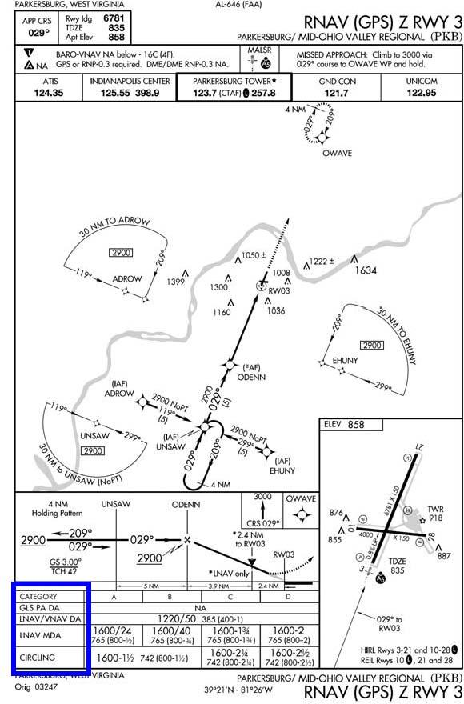

		+ 6.5.6.3.4.1. LNAV. These minimums are for LNAV (lateral) –only guidance. Because vertical guidance is not provided, the procedure minimum altitude will be published as a MDA. With an approved VNAV system, VNAV guidance may be used if provided by the RNAV system as long as the aircraft is level prior to MDA.

		+ 6.5.6.3.4.2. LNAV/VNAV. LNAV/VNAV minimums are based on lateral and vertical guidance to the published DA.

			+ 6.5.6.3.4.2.1. NOTE: Barometric VNAV (BARO-VNAV) systems compute a vertical path based on aircraft barometric altimetry systems. This vertical path may be greatly affected by non-standard temperatures, incorrect or rapidly changing altimeter settings, and altimeter error. Pilots should closely monitor compliance with step down fix altitude constraints and may not use Baro-VNAV guidance for reference below the published DA. Also note that deviations from the VNAV path are often linear as opposed to angular, i.e. one dot deviation represents a fixed number of feet from the vertical path, regardless of distance to the runway waypoint.

			+ 6.5.6.3.4.2.2. LPV minimums. LPV minimums may support precision approach minimums as low as 200' HAT and 1/2 statute mile (SM) visibility. Pilots will be informed that the notation "LPV PA" or "GLS" on the first line of minimums in U.S. Government Terminal Procedure Publication charts satisfies all the requirements of the precision system. Pilots will be informed that the precision system requirements are not met by the notation "LPV" without the letters "PA" on the first line of minimums. In this latter case, since the landing environment does not support the low visibility operations, minimums no lower than 300' HAT and 3/4 SM visibility will be published. LPV minimums are published as a Decision Altitude (DA).

##### Figure 6.15. RNAV (GPS) Chart Symbology.
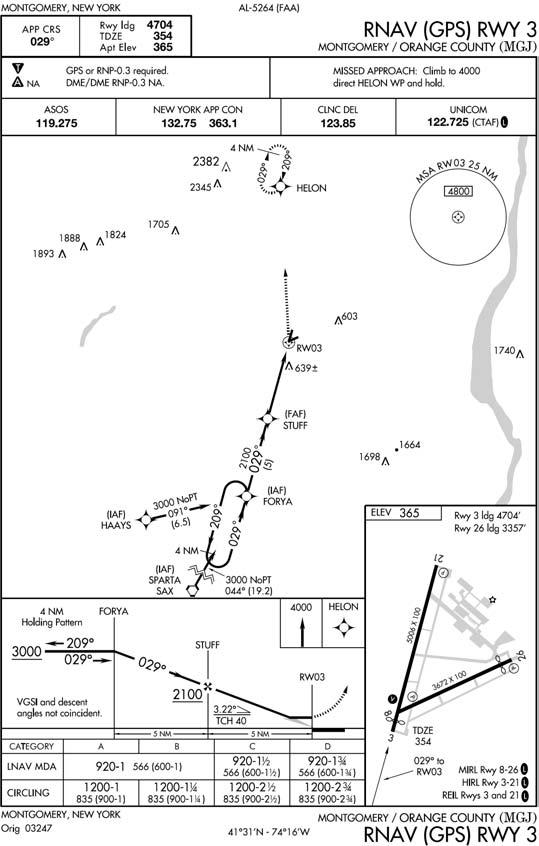

6.5.7. Chart Symbology (Figure 6.15).

+ 6.5.7.1. Descent Angle. The RNAV (GPS) IAP format provides descent angle to the hundredth of a degree (e.g., 3.00°), with a range from 2.75° to 3.5°. The angle is provided in the graphically depicted descent profile. The optimum RNAV (GPS) descent angle is 3.00°.

	+ 6.5.7.1.1. For RNP and WAAS approaches just now being fielded, the minimum descent angle is still 2.75°. However, the maximum angle is based on aircraft category as shown in the table below.

##### Table 6.2. Maximum Descent Angle for RNP and WAAS Approaches. 

|Aircraft Category |Maximum Descent Angle|
|:---:|:---:|
|CAT A (less than 80 kts) | 6.4 Degrees |
|CAT A (81-90 kts) | 5.7 Degrees |
|CAT B | 4.2 Degrees |
|CAT C | 3.6 Degrees |
|CAT D and E | 3.1 Degrees |

+ 6.5.7.2. Threshold Crossing Height (TCH). The concept of TCH is the same as in conventional IAPs. On RNAV (GPS) IAPs, TCH refers to the point where the descent angle crosses above the threshold. Unless required by larger type aircraft, the typical TCH will be 30-50 feet.

+ 6.5.7.3. VDP. The VDP on an RNAV (GPS) IAP only pertains to aircraft using LNAV minimums (not LNAV/VNAV or LPV). The VDP will be accompanied by the notation "*LNAV only."

+ 6.5.7.4. Missed Approach Symbology. In addition to a textual description of the missed approach procedure in the "pilot briefing" at the top of the IAP, missed approach instructions will be graphically depicted in the profile view. Up to four icons will be shown. These icons are intended only for quick reference and may not depict the full missed approach procedure.

+ 6.5.7.5. Waypoints. Two types of waypoints appear in RNAV procedures – "fly-over" and "fly-by" waypoints. "Fly-by" waypoints will be depicted using the standard WP symbol. Turn anticipation is allowed for fly-by waypoints. Fly-over waypoints are indicated by the standard waypoint symbol enclosed in a circle. For a fly-over WP, turn anticipation is not allowed. No turn may be accomplished until the aircraft passes over the waypoint. Note: A "Fly By" vertical waypoint is a WP for which an aircraft may initiate a vertical rate change and depart the specified vertical path to the active WP prior to reaching that WP, in order to asymptotically capture the next vertical path. A "Fly Over" vertical waypoint is a WP for which an aircraft must stay on the defined vertical path until passing the active WP, and may not initiate the necessary vertical rate change to capture the next vertical path until after passing the active WP. Hence, after passing the active WP, as the next WP becomes active, and if there is a vertical path change, then the aircraft must re-adjust vertical rate to re-capture the vertical path after having already overshot the first opportunity for an asymptotic capture of that new path.

+ 6.5.7.6. Approach waypoints, except for the MAWP and the missed approach holding waypoint (MAHWP), are normally fly-by waypoints. Overlay approach charts and some early stand alone GPS approach charts may not reflect this convention.

+ 6.5.7.7. Pilots may see terminal 5 letter waypoints outside the U.S. The first 2 letters are airport ID, third letter is cardinal direction from airfield and the fourth/fifth positions are sequential numbers. Approach waypoints may use 4 or 5 alphanumeric characters, where first 3 characters represent runway designation (e.g., 24L, where C/L/R is optional), the fourth character is G for waypoint-type code and last digit is for uniqueness (e.g., 24LG2).

+ 6.5.7.8. Pilot Briefing Area. The pilot briefing consolidates, in one location, pertinent information needed to conduct the approach. It includes final approach course, runway/airport data, procedure restrictions, approach light data, missed approach text, WAAS and BARO-VNAV information, and various NAVAID/ATC radio frequencies.

	+ 6.5.7.8.1. Cold Temperature Limitations. The upper left hand area of the pilot briefing lists the airport temperature below which BARO-VNAV will not be authorized to LNAV/VNAV minimums. Cold weather corrections should still be applied to all barometrically derived approach minimums and step-down altitudes, whether Baro-VNAV is used or not. (Use of barometric VNAV DA is not authorized with a remote altimeter setting.)

+ 6.5.7.9. Terminal Arrival Areas (TAA) (Figure 6.16). The standard TAA consists of three areas defined by the extension of the IAF legs and the intermediate segment course. These areas are called the straight-in, left-base, and right-base areas. TAA area lateral boundaries are identified by magnetic courses TO the IF (IAF). The straight-in area can be further divided into pie-shaped sectors with the boundaries identified by magnetic courses TO the IF (IAF), and may contain stepdown sections defined by arcs based on RNAV distances (DME or along track distance (ATD)) from the IF (IAF). The right/leftbase areas can only be subdivided using arcs based on RNAV distances from the IAFs for those areas. Minimum MSL altitudes are charted within each of these defined areas/subdivisions that provide at least 1,000 feet of obstacle clearance, or more as necessary in mountainous areas.

##### Figure 6.16. Terminal Arrival Area (TAA).
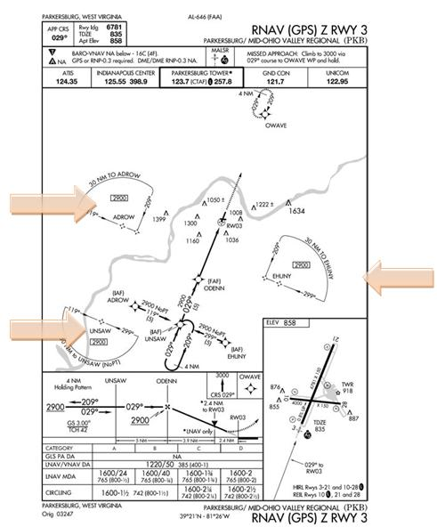

6.5.8. Reviewing GPS instrument approaches. AFI 11-202V3 lists specific equipment requirements for GPS stand-alone and overlay instrument approaches.

+ 6.5.8.1. RNAV (GPS) Approaches (Figure 6.17). RNAV (GPS) stand-alone approaches are constructed specifically for use by RNAV and/or GPS equipped aircraft and are not based on ground based NAVAIDS. RNAV (GPS) stand-alone approaches are identified by the absence of other NAVAIDS in the approach title, for example GPS RWY 35 or RNAV (GPS) RWY 35. RNAV (GPS) approaches are authorized in IMC for appropriately equipped and certified USAF aircraft.

##### Figure 6.17. Stand Alone GPS Approach.
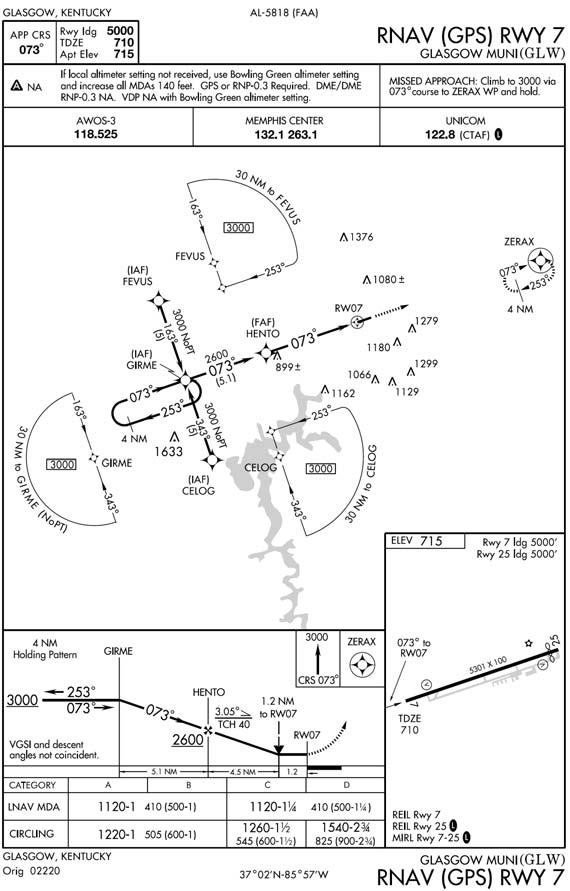

+ 6.5.8.2. Approaches where ‖or GPS" is included in the title of the procedure are retrievable from the database (e.g., "VOR or GPS RWY 35")(Figure 6.18). USAF aircraft may fly these approaches in VMC or IMC if the approach was constructed by a US TERPS authority (USAF/FAA/USN). For approaches without "or GPS" in the title, see RNAV substitution discussion below.

	+ 6.5.8.2.1. NOTE: When retrieving an "or GPS" approach from the navigation database, it will be titled in the database by the title of the conventional NAVAID. For example: VOR or GPS Rwy 5 will be titled in the aircraft database as "VOR Rwy 5". The title on the published IAP chart determines the type of approach, not how it is named in the aircraft database.

##### Figure 6.18. "or GPS" Approach.
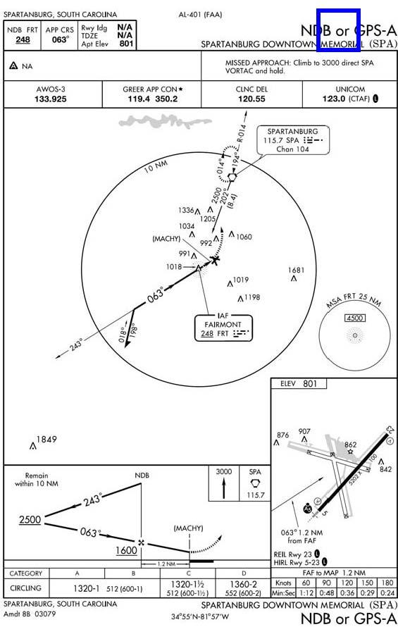

+ 

	+ 6.5.8.2.2. Procedures Without a Final Approach Fix. Procedures without a FAF and without a stepdown fix have a Sensor FAF waypoint coded in the database at least 4 NM Actual Track Distance (ATD) to the MAP waypoint. The MAP, in this case, is always located at the NAVAID facility. A Sensor FAF is a final approach waypoint created and added to the database sequence of waypoints to support GPS navigation of an FAA or DoD published, no-FAF, nonprecision instrument approach procedure. The coded name or Sensor FAF appears in the waypoint sequence. If a stepdown fix exists on the published procedure and it is greater than 2 NM to the MAP, the stepdown fix is coded in the database as the Sensor FAF waypoint for the waypoint sequence. If a stepdown fix distance is 2 NM or less to the MAP, a Sensor FAF waypoint is coded at least 4 NM to the MAP.

+ 6.5.8.3. RNP SAAAR Approaches (Figure 6.19). USAF pilots shall not fly these procedures until completing MAJCOM-defined training and certification. SAAAR procedures are to be conducted by aircrews meeting special training requirements in aircraft that meet the specified performance and functional requirements. RNP SAAAR approaches are clearly marked with (RNP) in the instrument procedure name and SPECIAL AIRCRAFT AND AIRCREW AUTHORIZATION REQUIRED in the comment block.

##### Figure 6.19. RNP SAAAR.
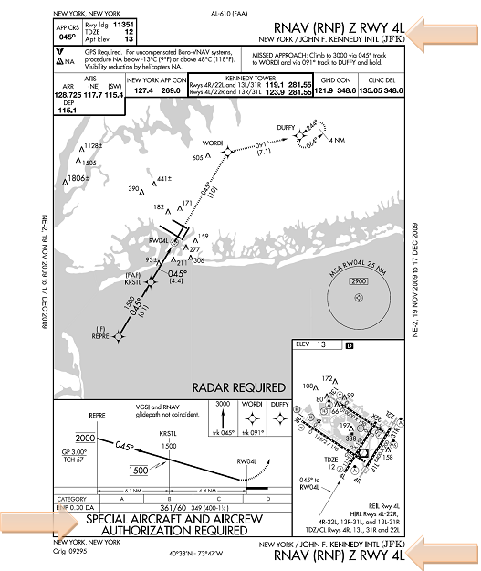

+ 6.5.8.4. RNAV Substitution. IAW AFI 11-202V3, for procedures developed by a US TERPS authority (FAA/USAF/USN), MAJCOM-approved suitable RNAV systems may be used as a substitute means of navigation for a named fix, VOR, TACAN, NDB, DME or compass locator. In such terminal areas, following a successful predictive RAIM check, approved RNAV systems may be substituted for required NAVAIDS or named fixes on arrivals, departures, and non-localizer based instrument procedures. Any such substitution must be extracted from a current database. These operations are allowable even when a facility is explicitly identified as required on a procedure (e.g., "Note ADF required"), but not if the procedure is NOTAM'ed as NA. Pilots using approved RNAV systems as a substitute means of navigation guidance in lieu of an out of service NAVAID should advise ATC of this intent and capability. Pilots will tune, identify, monitor and display the appropriate ground-based NAVAIDs whenever practicable.

6.5.9. Relationship of Avionics Displayed Waypoints to Charted Data. The GPS Approach Overlay Program waypoints contained in the database represent the waypoints, fixes, NAVAIDs, and other points portrayed on a published approach procedure beginning at the initial approach fix. Certain unnamed points and fixes appearing on a chart are assigned a database identifier. Although there currently is no requirement to provide these database identifiers, most charting agencies are publishing them at their discretion. Database identifiers should not be used for pilot/controller communications or on flight plans.

----

#### 6.6.{#6_6} Instrument Cockpit Check.

Before flight, accomplish a thorough instrument cockpit check. You should check the applicable items listed below (unless your flight manual or command directives dictate otherwise):

6.6.1. Publications. Ensure appropriate, up-to-date publications obtained from an authorized source are in the aircraft.

+ 6.6.1.1. If you are authorized to carry Jeppesen products, ensure you have Book 1 (summary, notices, legend information, etc.) and ALL the pages for the appropriate airport. Important information is contained on the back of the airfield diagram page. Radio out procedures are often contained on a different page from the IAP you are using. Without Book 1 and all the pages for the airport, you may miss crucial information.

+ 6.6.1.2. Host nation FLIP documents, enroute charts, IAPs, etc, will not be used without MAJCOM approval IAW AFI 11-202V3.

6.6.2. Pitot Heat. Check for proper operation.

6.6.3. ADIs.

+ 6.6.3.1. Erect. Ensure it is erect and that the bank pointer is aligned vertically with the zero bank index. Check your flight manual for tolerance limits.

+ 6.6.3.2. Flags. Ensure the warning flags are not visible.

+ 6.6.3.3. Alignment. Check the pitch trim knob alignment and ensure it is within limits, then set the miniature aircraft or horizon bar for takeoff.

6.6.4. Magnetic Compass. Check the accuracy of heading information.

6.6.5. Clock. Ensure the clock is running and the correct time is set.

6.6.6. VVI. Ensure the pointer is at zero. If the indicator does not return to zero, adjust it with a small screwdriver or use the ground indication as the zero position in flight.

6.6.7. Altimeters.

+ 6.6.7.1. Current setting. Set current altimeter setting on barometric scale.

+ 6.6.7.2. Known elevation. Check the altimeter at a known elevation and note any error in feet. If the error exceeds 75 feet, the instrument is out of tolerance for flight.

+ 6.6.7.3. Check pointers. Ensure the 10,000/1000/100 counter-drum-pointers indicate approximate field elevation. Check and ensure the low altitude warning symbol is in view.

+ 6.6.7.4. Modes. Check both reset and standby modes on AIMS altimeter and set in accordance with the flight manual or command directives.

	+ 6.6.7.4.1. NOTE: Helicopter rotor operation may affect altimeter indications. Check individual helicopter flight manual for altimeter limitations if published.

6.6.8. Turn and Slip Indicator.

+ 6.6.8.1. Turn needle. Check and ensure the turn needle indicates proper direction of turn.

+ 6.6.8.2. Ball. Check the ball for freedom of movement in the glass tube.

6.6.9. Heading Indicators.

+ 6.6.9.1. Accuracy. Check the accuracy of heading information. In lieu of guidance in aircraft technical orders the aircraft's primary heading indicator should be within approximately 5 degrees of a known heading (i.e., runway heading or designated ground checkpoint).

+ 6.6.9.2. Indicators. Ensure the heading indicators indicate correct movement in turns.

+ 6.6.9.3. Set. Set adjustable heading indicators to the desired heading.

+ 6.6.9.4. Bank steering. For flight director systems, check the bank steering bar for proper commands in the heading mode.

6.6.10. Airspeed and Mach Indicators.

+ 6.6.10.1. Set. Set the airspeed or command mach markers as desired or as directed in the flight manual.

+ 6.6.10.2. Indicators. Check the pointers or rotating airspeed scale for proper indications.

6.6.11. Airspeed Mach Indicator (AMI).

+ 6.6.11.1. Airspeed Warning Flag. Ensure it is out of view.

+ 6.6.11.2. Command Airspeed Marker. rotation, climb speed, etc.
 Set the marker as desired; that is, decision,

6.6.12. Altitude Vertical Velocity Indicator (AVVI)

+ 6.6.12.1. Vertical velocity. Check for zero indication.

+ 6.6.12.2. Altimeter. Make same check as for conventional altimeter. Ensure warning flag is out of view.

+ 6.6.12.3. Command Altitude Marker. Set the command altitude marker as desired; that is, first anticipated level off, emergency return DH/MDA, etc.

	+ 6.6.12.3.1. CAUTION: The command airspeed or altitude slewing switches should not be placed in the side detent position for takeoff due to the possibility of misreading those instruments.

6.6.13. Navigation Equipment and Instruments.

+ 6.6.13.1. Tune and identify.

+ 6.6.13.2. Pointers. Ensure the bearing pointers point to the station.

+ 6.6.13.3. Flags. Check and ensure the range warning flag on the range indicator is out of view and the distance indicated is within one-half mile or 3 percent of the distance to the facility, whichever is greater.

+ 6.6.13.4. Course set knob. displacement.
 Rotate the course set knob and check for proper CDI

+ 6.6.13.5. To-from. Rotate the course set knob and check that the TO-FROM indication changes when the selected course is approximately 90° to the bearing pointer.

+ 6.6.13.6. Designated checkpoints. When checking the VOR/TACAN at a designated ground checkpoint, the allowable CDI error is ±4° and the CDI and bearing pointer should agree within the tolerances specified for the aircraft. Ensure that distance indicated is within one-half mile or 3% of the distance designated on the checkpoint.

+ 6.6.13.7. Dual systems. If the aircraft has dual VOR or dual TACAN receivers, the systems are considered reliable for instrument flight if they check within ±4° of each other. However, if the VOR/TACAN is also checked at a designated ground checkpoint, the equipment must meet the requirement in the above bullet.

	+ 6.6.13.7.1. NOTE: The self-test mode incorporated into some VOR/TACAN/ILS sets provides an operational test of the set. The self-test does not, however, provide a test of the aircraft antennas. If the VOR/TACAN set self-test function checks within the aircraft's flight manual tolerances and the VOR/TACAN station identifier is received, the requirements of the paragraph above are satisfied.

+ 6.6.13.8. VOR Test Facility (VOT). VOT is an FAA facility that transmits a test signal for either a ground or airborne operational test of VOR equipment.

	+ 6.6.13.8.1. When using a VOT on the ground, allowable error is ±4 degrees. When using an airborne VOT, allowable error is ±6 degrees.

	+ 6.6.13.8.2. Airborne checks using a VOT are limited to those areas/altitudes specifically authorized.

	+ 6.6.13.8.3. VOT frequencies are listed in the NAVAIDS section of the Enroute Supplement entry for each airport and on the air/ground voice communications panels on the Enroute Low Altitude charts and Area charts.

	+ 6.6.13.8.4. When using a VOT to test VOR equipment, accomplish the following procedures:

		+ 6.6.13.8.4.1. Tune the appropriate VOT frequency on your VOR receiver.

		+ 6.6.13.8.4.2. With the CDI centered, the Omni Bearing Selector (OBS) should read 0 degrees with a "from" indication; or the OBS should read 180 degrees with a "to" indication. The RMI will indicate 180 degrees regardless of OBS setting.

		+ 6.6.13.8.4.3. Identify the VOT station by listening for a series of dots or a continuous tone.

+ 6.6.13.9. Other equipment. Check all other flight and navigation instruments and equipment for proper operation and accurate information.

+ 6.6.13.10. GPS Navigation Database: Ensure the GPS navigation database is current. See AFI 11-202V3 for current database restrictions.

----

#### 6.7.{#6_7} IFR Flight in Uncontrolled Airspace.

6.7.1. Uncontrolled airspace is that airspace not otherwise designated as controlled airspace. There is little uncontrolled airspace within the CONUS. However, once outside the CONUS, there can be significant areas of uncontrolled, or Class G, airspace.

+ 6.7.1.1. FAA controllers will only assign an IFR route through Class G airspace when requested by the pilot.

+ 6.7.1.2. For IFR flights in Class G airspace outside the CONUS, consult the appropriate FLIP AP volume, NOTAMs, and local procedures for any specific instructions unique to each theater, area, country, or airport.

6.7.2. IFR operations are permitted in uncontrolled airspace. All normal IFR equipment requirements and rules apply to include minimum altitude and flight levels.

+ 6.7.2.1. While operating in VMC, pilots are solely responsible to see and avoid other traffic, terrain, and obstacles.

+ 6.7.2.2. While operating under IFR in Class G airspace, pilots must strictly maintain the correct altitude for the direction of flight.

6.7.3. Air traffic control only provides separation between aircraft in controlled airspace. Therefore, caution should be exercised when operating in IMC under IFR in uncontrolled airspace.

----

#### 6.8.{#6_8} Instrument Approaches to Uncontrolled Airports.

6.8.1. Instrument approaches to uncontrolled airports are authorized for USAF aircrews unless otherwise restricted by MAJCOM. For VFR procedures at uncontrolled airports, see AFMAN 11-217 Volume 2, Visual Flight Procedures.

6.8.2. All operations at uncontrolled airports require additional vigilance on the part of the aircrew. Conducting instrument approaches at uncontrolled airports are especially challenging as the ground track of the instrument approach may not coincide with the ground tracks of the VFR traffic pattern, the instrument approach may not terminate at the active runway, altitudes may not coincide with the prevailing traffic patterns, and not all VFR pilots are familiar with the instrument approach procedures at the airport. Aircrews must thoroughly brief reporting procedures and crew coordination procedures prior to accomplishing an instrument approach at an uncontrolled airport.

+ 6.8.2.1. A critical point to remember is that any person on the ground providing traffic advisories at a non-towered airport is only providing advisories. Personnel on the ground are not air traffic controllers. Pilots operating at uncontrolled airports are responsible for their own traffic avoidance, sequencing, and separation.

+ 6.8.2.2. Pilots conducting actual or practice instrument approaches at uncontrolled airports must be especially vigilant for traffic departing in the opposite direction.

6.8.3. Common Traffic Advisory Frequency (CTAF). The CTAF is a frequency designed for the purpose of carrying out airport advisory practices while operating to or from an airport without an operating control tower. The CTAF may be a UNICOM, MULTICOM, FSS, or tower frequency and is identified on the approach plate.

+ 6.8.3.1. A UNICOM is a non-governmental communication facility, which may provide airport information. The frequency will be published on the approach plate as "UNICOM". Many times these radios are located in the airport office or at a fixed base operator (FBO).

+ 6.8.3.2. A MULTICOM is a mobile service not open to public correspondence used to provide communications essential to conduct the activities being performed by or directed from private aircraft. Where there is no tower, FSS, or UNICOM station on the airport, use MULTICOM frequency 122.9.

+ 6.8.3.3. A FSS physically located on an airport may provide airport advisory service (AAS) at an airport that does not have a control tower or where a tower is operated on a part-time basis and the tower is not in operation.

+ 6.8.3.4. When a control tower is not operational 24 hours a day, the CTAF frequency will normally be the same as the tower frequency listed on the approach plate and will be annotated, "TOWER (CTAF)."

6.8.4. There are two ways for pilots to communicate their intentions and obtain airport/traffic information when operating at an airport that does not have an operating tower: by communicating with an FSS that is providing airport advisories on a CTAF or by making a self-announced broadcast on the CTAF.

+ 6.8.4.1. A FSS provides pilots with wind direction and velocity, favored or designated runway, altimeter setting, known traffic, NOTAMs, airport taxi routes, airport traffic pattern, and instrument approach procedures information. Pilots may receive some or all of these elements depending on the current traffic situation. Some airport managers have specified that under certain wind or other conditions, designated runways are used. Therefore, pilots should advise the FSS of the runway they intend to use. It is important to note that not all aircraft in the vicinity of an airport may be in communication with the FSS.

+ 6.8.4.2. "Self-announce" is a procedure whereby pilots broadcast their position, intended flight activity or ground operation on the designated CTAF. This procedure is used primarily at airports that do not have a control tower or an FSS on the airport. The selfannounce procedure should also be used when a pilot is unable to communicate with the local FSS on the designated CTAF.

6.8.5. Communication at Uncontrolled Airports.

+ 6.8.5.1. Aircraft operating on an IFR flight plan, landing at an uncontrolled airport will be advised to "Change to advisory frequency", when direct ATC communications are no longer required. When directed, pilots should expeditiously change to the CTAF frequency, as the ATC facility will not have runway in use or airport traffic information.

+ 6.8.5.2. Inbound aircraft should initiate contact approximately 10 miles from the airport and continue to monitor the appropriate frequency until after landing and clear of the movement area.

	+ 6.8.5.2.1. NOTE: If your aircraft only has one radio capable of transmitting on the ATC and CTAF frequency, do not leave the assigned ATC frequency until instructed to do so.

+ 6.8.5.3. Inbounds should report altitude, aircraft type, and location relative to the airport; should indicate whether landing or over flight; and should request airport advisory (if UNICOM or FSS).

+ 6.8.5.4. Make position reports at the following locations on the approach.

	+ 6.8.5.4.1. When departing the final approach fix inbound;

	+ 6.8.5.4.2. When established on the final approach segment or immediately upon being released by ATC;

	+ 6.8.5.4.3. Upon completion or termination of the approach; and

	+ 6.8.5.4.4. Upon executing the missed approach procedure.

	+ 6.8.5.4.5. When exiting the active runway.

		+ 6.8.5.4.5.1. NOTE: It is important to remember that most VFR pilots operating in the vicinity of the airport will not be familiar with fix names. Location should be referred to in the simplest terms the average VFR pilot will understand. For example, use the terminology "5 miles south" instead of "Kirby Intersection".

+ 6.8.5.5. When self-announcing your position, insure you use the following format:

	+ 6.8.5.5.1. Name of the airport, followed by the word "traffic."

	+ 6.8.5.5.2. Your call sign.

	+ 6.8.5.5.3. Your aircraft type in terms the average VFR pilot will understand.

	+ 6.8.5.5.4. Your location in terms the average VFR pilot will understand.

	+ 6.8.5.5.5. Your intentions.

	+ 6.8.5.5.6. Repeat the name of the airport.

		+ 6.8.5.5.6.1. Example: "Shenandoah traffic, Track 66, white Learjet, 5 miles south on the straight-in ILS Runway 5, touch and go, Shenandoah."

----

#### 6.9.{#6_9} Flyability Checks.

6.9.1. Instrument procedure flyability checks are flown to ensure procedures are safe, practical, and consistent with good operating procedures before general use. They may be accomplished in lieu of or in addition to an official flight check. Whenever possible, flyability checks should be conducted by instructor/evaluator pilots. Flyability checks are NOT official flight inspections ("flight checks"), but shall include the entire procedure including the missed approach segment and all holding patterns. Prior to accomplishing a flyability check, pilots will review applicable portions of AFI 11-230, Instrument Procedures.

----

#### 6.10.{#6_10} Procedure and Database Problem Reporting.

6.10.1. Despite the best quality control measures, it is still possible for aircrews to discover errors in databases, instrument procedures, charts, etc. If you discover a discrepancy or a discrepancy between two sources (ex. procedure pulled from aircraft database differs from paper IAP), report the discrepancy to your unit Standardization/Evaluation function. They, in turn, should report the details to the source of the database or procedure. All sources of databases, instrument procedures, charts, etc. have established procedures for reporting errors. Procedures and points of contact vary by vendor and organization and are located in the documentation that comes with the particular product.
