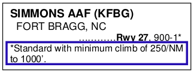
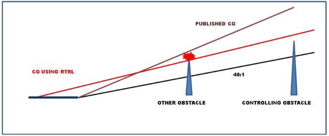

# Chapter 7: IFR DEPARTURE PROCEDURES

#### 7.1.{#7_1} Introduction.

In order to understand how to apply Air Force IFR Departure Procedures, it is important to understand that the guidance in AFI 11-202V3 and this chapter is written to maximize Air Force global combat capability. Text in this chapter is a compilation of guidance from previous versions of this manual, the Aeronautical Information Manual, the FAA Instrument Procedures Handbook, the FAA Instrument Flying Manual, AFI 11-230, and other sources. For background and other non-procedural information on TERPS criteria and departure planning, see also AFI 11-230, and AFMAN 11-217V3. For information on VFR departures, see AFMAN 11-217V2.

----

#### 7.2.{#7_2} IFR Departure Philosophy.

To maximize mission capability, and to preserve that capability by preventing mishaps, USAF pilots must be able to safely depart any location on the globe, regardless of non-USAF published weather limitations. All published IFR departure procedures are created using criteria that incorporate either a route and/or a minimum climb profile to avoid terrain, obstacles, or air traffic lanes. In determining the minimum climb profile, TERPS uses a "standard" climb rate of 200 ft/NM, normally beginning at the departure end of the runway (DER). If a gradient other than standard is required it will be published. In civil aviation, pilots may takeoff in good or marginal weather as long as they can "see and avoid" obstacles and terrain. USAF pilots departing IFR may not plan to use "see and avoid" in lieu of complying with published or standard climb gradients since Air Force aircraft are issued their own weather minima in AFI 11-202V3 and AFI 11-2MDSV3. In addition, without comparing the aircraft's performance to a TERPS defined standard, there's no way of ensuring an obstacle could be avoided even if acquired by the pilot in visual conditions. By ensuring the aircraft's climb performance meets or exceeds the published minimum climb gradient, weather (ceiling/visibility) is no longer a limiting factor in AF operations. Further, civil multi-engine fixed wing aircraft are certified as airworthy by demonstrating a certain climb capability with one engine inoperative (OEI). In response to this requirement, most manufacturers of USAF aircraft publish engine-out climb performance charts in the aircraft flight manual. Pilots must be extremely familiar with the performance capability of their aircraft and multi-engine aircraft are normally required to meet climb gradients OEI. These concepts, along with the basic rules listed in AFI 11-202V3, are the foundation of IFR departure operations for USAF pilots:

7.2.1. <strong><em>USAF pilots operating under IFR must comply with applicable IFR climb gradients (or Special MAJCOM Certification procedure).</em></strong> Exception: If the mission justifies the increased risk, and when specifically authorized by the MAJCOM/A3, USAF aircraft may depart any location, in VMC, without regard to the IFR climb gradient.

7.2.2. <strong><em>USAF pilots shall comply with takeoff weather minima IAW AFI 11-202V3 and AFI 11-2MDSV3. Pilots of USAF aircraft will not use FAA or civil takeoff weather minima nor fly "see and avoid" in lieu of IFR climb gradients unless specifically authorized by the MAJCOM/A3 or as provided by AFI 11-202V3.</em></strong> Information on VFR departures may be found in AFMAN11-217V2.

7.2.3. <strong><em>USAF pilots flying under IFR will delay all turns until at least 400 feet above the DER elevation unless an early turn is specifically required by the departure procedure.</em></strong> (Reduced Takeoff Runway Length (RTRL) and non-standard weather minimum procedures may require more than 400'.)

7.2.4. <strong><em>USAF pilots will climb at a minimum rate of 200 feet per nautical mile (200 ft/NM) unless a higher gradient is published and must always meet or exceed the minimum/published climb gradient for the runway used with all engines operating.</em></strong>

----

#### 7.3.{#7_3} Planning an Instrument Departure.

For USAF pilots, planning a safe IFR departure normally consists of three steps: selection of a valid IFR departure method, determining the minimum required climb gradient, and ensuring aircraft performance meets or exceeds that climb gradient. This chapter is organized along that process, and a summary decision tree is provided at the end (Figure 7.23.) It is important to remember that when TERPS constructs an IFR departure, the obstacle avoidance gradients calculated are absolute, and do not assume a loss of thrust on takeoff. FAA and USAF multi-engine aircraft certification requirements, however, do assume a loss of thrust on takeoff. As a result, <strong><em>USAF multi-engine aircraft must compute obstacle climb gradients assuming the loss of thrust equal to "one engine inoperative" (OEI).</em></strong> Regardless of the type of aircraft flown, on all IFR departures, <strong><em>the minimum climb gradient for any IFR departure will be the higher of: 200 ft/NM, as directed by the MAJCOM, as directed by a departure procedure, or as directed by the aircraft flight manual.</em></strong> When mission priority dictates, in the absence of more restrictive MAJCOM guidance, an operations supervisor (or equivalent mission execution authority supervisor) may authorize the pilot to reduce the required TERPS climb gradient by up to 48'/NM. (See Subtraction of 48'/NM from published climb gradient, later in this chapter, for more procedural guidance on reducing the published required climb gradient.) NOTE: <strong><em>USAF pilots must ensure their pre-mission planning includes review of IFR departure restrictions to ensure they do not arrive at, or divert to, a location they are unable to legally depart.</em></strong>

7.3.1. Diverse Departure Assessment. When an instrument approach is constructed, the TERPS specialist determines the need for a departure procedure (DP). If no obstacle or terrain penetrates a 40:1 slope (termed the obstacle clearance surface (OCS) or obstacle identification surface (OIS)) from the departure end of the runway (DER), an aircraft may turn in any direction and remain clear of obstacles while climbing at 200‗/NM. That runway has passed a diverse departure assessment (Figure 7.1) and no obstacle departure procedure (ODP) is required.

+ 7.3.1.1. If low, close-in obstacles (published in the ODP section of the approach plate book) penetrate the 40:1 OCS, a diverse departure may still be flown but the pilot must comply with the Low close-in obstacles section of this chapter.

##### Figure 7.1. Diverse Departure Obstacle Assessment to 25 / 46 NM.

7.3.2. Surrounding Areas. The pilot must be aware that beyond the diverse departure obstacle assessment area, there may be significant obstacles/terrain that must be avoided. For this reason, <strong><em>when planning ANY instrument departure or arrival, pilots must check terrain and obstacle information for areas surrounding the immediate terminal area.</em></strong> In many cases, this can be done by checking the MSA/ESA from the IAP or asking the radar controller the height of the minimum vectoring altitude (MVA) for the area of concern (beyond the 25 NM, non-mountainous and 46 NM mountainous diverse departure obstacle assessment area). In other cases, such as non-radar environments, a thorough study of terrain charts, nearby airport IAPs, or IFR enroute charts may provide the pilot with this data in the form of MSAs, ESAs, MCAs, MEAs, MOCAs, etc. Regardless of the departure/arrival method chosen, pilots must be aware of their surroundings, especially in terminal areas.

7.3.3. Runway End Crossing Height. Runway End Crossing Height or Screen Height is the aircraft's required AGL altitude at the Departure End of the Runway (DER). The OCS slope begins at the DER at the runway end crossing height. Determining and complying with the proper runway end crossing height is crucial to preventing unsafe operations below the OCS. Runway end crossing heights vary depending on location of the airport, who designed the procedure, terrain, obstacles, etc. The parenthetical notation at the top of DoD approach plates cannot reliably be used to determine what rules were used to produce a departure procedure and screen heights are not consistently published in the ODP section of the approach plates. <strong><em>USAF pilots will only consider the type of airfield when determining runway end crossing height: USAF/USN non-joint-use and all others (Civil/Joint Use/ICAO/NATO/etc.) Consult the IFR Supplement or other appropriate FLIP for this information.</em></strong> Joint use airfields will be annotated as "MIL/CIV" (Figure 7.2). If an airport is listed as an AFB or NAS and does not include "MIL/CIV" in the listing, then it is non-joint use.

##### Figure 7.2. Joint Use Designation From IFR Supplement.

+ 7.3.3.1. USAF/USN non-joint-use bases. The OCS at USAF and USN bases normally begins at zero feet AGL at the DER, but the OCS may be raised as much as 35 feet in order to clear obstacles. If the TERPS specialist raises the OCS, it will be published in the ODP (Figure 7.3.) <strong><em>At non-joint-use USAF or USN bases, assume a zero foot runway end crossing height unless a higher altitude is published.</em></strong>

##### Figure 7.3. Specific Runway End Crossing Height.

+ 7.3.3.2. Other than USAF/USN non-joint-use bases (Civil/ICAO/NATO/etc. ) If civil aircraft certification standards mandate, or obstacles penetrate the OCS, TERPS may raise the runway end crossing height up to 35 feet to maintain a normal 200'/NM climb gradient. There is no reliable way, from looking at the DoD/NACO FLIP, to know if TERPS raised the OCS or not. <strong><em>Therefore, for any departure at other than non-joint-use USAF or USN bases, if the screen height is not published in the ODP or other reliable source, pilots will plan to cross the DER at or above 35 feet.</em></strong>

	+ 7.3.3.2.1. There is no provision for a runway end crossing height greater than 35 feet. If a runway end crossing height of 35 feet does not eliminate all penetrations of the 40:1 OCS, then a higher than standard (i.e. >200 ft/NM) climb gradient will be published on the departure.

	+ 7.3.3.2.2. If in doubt, or the 35 foot restriction limits mission capability, contact the appropriate TERPS authority for the airfield. If further help is required, contact the USAF Instrument Procedures Center at DSN 339-8300 Comm. (405) 739-8300.

7.3.4. Obstacle Clearance Surface. When the diverse departure obstacle assessment identifies any obstacle that penetrates the 40:1 OCS, the TERPS specialist must construct an ODP to allow safe aircraft departure. The 40:1 slope used by the TERPS specialist equates to a 152'/NM gradient. During the assessment, the TERPS specialist is required to provide a minimum of 48'/NM or 24% obstacle clearance (Required Obstacle Clearance or ROC) to obtain the normal minimum climb gradient of 200'/NM. If obstacles penetrate the 152'/NM OCS, then the TERPS specialist should publish information so the pilot can make a safe takeoff and avoid obstacles and terrain. This information is normally found in the front of the IAP book in the section titled "IFR Takeoff Minima and (Obstacle) Departure Procedures." For airports outside the US, the separate listing will be titled "IFR Takeoff Minima and Departure Procedures" in the DoD/NACO FLIP. Commercial or foreign government products may differ in title and format. For example, Jeppesen charts do not use the "Trouble T" symbol. Instead, they publish IFR takeoff minima and departure procedures on the back of the airfield diagram page. <strong><em>USAF pilots must become familiar with, and refer to the appropriate of available instrument procedures, in order to properly plan IFR departure procedures.</em></strong>

7.3.5. Low close-in obstacles (Figure 7.4) are those that would generate an excessive climb gradient (>200 ft/NM) that terminates at or below 200 feet above the departure end of the runway. Instead of publishing a steep climb gradient or complicated routing, the TERPS specialist will publish the height and location of the obstacles (this information can also appear in NOTAMS). Low close-in obstacles must be accounted for no matter what IFR departure method a pilot chooses. <strong><em>Pilots will calculate their aircraft performance to ensure they can vertically clear applicable low close-in obstacles on all departures.</em></strong> One technique for determining what obstacles are applicable might be to consider all within 500 feet, laterally, of the planned departure (or emergency return) ground track. Additionally, in order to ensure vertical clearance of those obstacles (valid only for low-close in takeoff obstacles) compare the aircraft's calculated height at the obstacle's distance from liftoff to the height of the offending obstacle. Pilots may conclude after careful analysis of low closein obstacles that a safe IFR departure cannot be made. In this case, select an alternate departure runway or ground track, or consult your MAJCOM for guidance.

##### Figure 7.4. Low Close-in Obstacles.

----

#### 7.4.{#7_4} IFR Departure Procedures (DP).

There are two types of DPs: Obstacle Departure Procedures (ODP), printed either textually or graphically, and Standard Instrument Departures (SID), always printed graphically. In many cases, there is more than one departure procedure applicable to a given runway. <strong><em>If the pilot does not know in advance which procedure will be assigned by ATC, he or she must plan for the highest climb gradient for the runway of intended departure.</em></strong> All DPs, either textual or graphic may be designed using either conventional or RNAV criteria. RNAV procedures will have RNAV printed in the title, e.g., SHEAD TWO DEPARTURE (RNAV). The following sections define the valid IFR departure procedures listed in AFI 11-202V3.

7.4.1. Obstacle Departure Procedures  (ODP). ODPs include routings, Low Close-in Obstacles, Visual Climb Over the Airport (VCOA), Reduced Takeoff Runway Length (RTRL) procedures and Sector Departures. If TERPS determines that, for a specific runway, a climb gradient greater than 200'/NM is required to clear obstacles, the pilot must be notified and provided a safe obstacle departure procedure. This provision may take the form of listing low close-in obstacles, or the publishing of: non-standard takeoff weather minima, minimum climb gradients, specific routing, or some combination of these criteria. <strong><em>Pilots must comply with ODPs prior to commencing a SID or radar vector departure unless different procedures and minima are specified on the SID or issued with the departure clearance.</em></strong> When departing an airport and pilot compliance with the ODP is necessary for traffic separation, ATC must include the ODP in your ATC clearance. Example: "Depart via the Vandenberg Runway 32 Departure Procedure."

+ 7.4.1.1. ODP Notification. On U.S. Government produced instrument procedures, the pilot is notified that runway specific departure information exists by the placement of a special symbol on all of the IAPs and SIDs for the airport. (Figure 7.5.) The symbol is a white "T" on a black inverted triangle (), referred to by some as the "Trouble T" because it indicates potential trouble for departing aircraft. This "Trouble T" should be published in the upper left corner of Volpe-format approach plates, but may be printed elsewhere on the IAP—for this reason, pilots should carefully check for the "Trouble T" on every instrument procedure for that airfield. The presence of the "Trouble T" means IFR takeoff minima and departure procedures are prescribed for specific airports/runways. <strong><em>USAF pilots will comply with applicable departure procedures.</em></strong>

##### Figure 7.5. "Trouble T".

7.4.1.1.1. Non-Standard Takeoff Weather Minima. (Figure 7.6.) When obstacles penetrate the 40:1 OCS, non-standard takeoff weather minima are provided for commercial civil pilots to "see-and-avoid" obstacles during departure. <strong><em>Unless specifically authorized by the MAJCOM/A3, USAF aircraft are not authorized to flight plan using "see and avoid" operations in lieu of meeting standard or published climb gradients. USAF pilots may only use non-standard weather minima for takeoff if aircraft performance (if multi-engine, OEI) will allow the aircraft to climb to the non-standard ceiling requirement by the DER and comply with published (or standard if none published) climb gradient requirements thereafter to an appropriate IFR altitude.</em></strong> In the example in Figure 7.6., the pilot must climb to 500' AGL by the DER in order to takeoff under IFR from either Runway at Orangeburg. For situational awareness purposes, the visibility portion of the non-standard weather minima provides a clue to the proximity of the obstacle(s). The lower the required visibility, the closer the obstacle(s).

##### Figure 7.6. Non-Standard Weather Minima.

7.4.1.1.2. Aircraft Category. Occasionally, a departure procedure will be published that is specific to a certain category of aircraft. (Figure 7.7.) <strong><em>On procedures that specify an aircraft category, use the aircraft approach category from the aircraft flight manual or AFI 11-2MDSV3 to determine which procedure(s) to apply.</em></strong>

##### Figure 7.7. ODP Specific to Aircraft Category.

7.4.1.1.3. Minimum Climb Gradient. (Figure 7.8.) TERPS may provide a minimum climb gradient with or without takeoff weather minima. Some nonstandard takeoff weather minima may have an asterisk (*) referring to a note that lists a specific climb gradient that may be used with standard weather minima. <strong><em>When using this type of IFR departure, USAF pilots will substitute MAJCOM-directed takeoff weather minima in place of the word "standard."</em></strong>

##### Figure 7.8. Minimum Climb Gradient In Lieu of Non-Standard Weather Minima.

7.4.1.1.3.1. Occasionally, the terrain or obstacles surrounding an airport are such that the TERPS specialist has no choice but to restrict departures to weather suitable for see-and-avoid operations. In Figure 7.9. below, notice that BOTH non-standard weather minima AND a minimum climb gradient are specified. In this example, to depart IFR from Runway 7 at Eagle County Regional, a USAF pilot must be able to (if multi-engine, OEI) either: climb to 5100' AGL by the departure end of the runway in any weather down to MAJCOM minima, and continue the climb at 200'/NM thereafter, OR climb to 700' AGL by the departure end of the runway, then climb at 480‗/NM to 11,800 MSL, then climb at 200'/NM thereafter.

##### Figure 7.9. Non-Standard takeoff minima AND a required climb gradient:

7.4.1.1.4. Specific Routing. (Figure 7.10.) Another ODP method used by TERPS provides a specific route of flight. You must be careful when using this type of IFR departure as a requirement may exist to use non-standard takeoff weather minima in order to execute the procedure. This situation could indicate more than one obstacle along the departure path and would not be allowed unless you comply with paragraph 7.4.1.1.3.1. Pilots must comply with the assigned routing to be assured of obstacle clearance during a Specific Routing departure.

##### Figure 7.10. ODP with specific routing.

7.4.1.1.5. Combination ODP. In Figure 7.11. the TERPS specialist used a combination of the above methods to delineate a safe departure. In this example, the pilot must comply with each requirement: the routing dictated by the procedure along with any required climb gradient.

##### Figure 7.11. Combination of Methods.

+ 7.4.1.2. Visual Climb Over the Airport (VCOA) is an ODP that requires a climb in visual conditions over the airfield or an on-airport NAVAID to an altitude where the aircraft enters the standard obstacle protection area of the ODP. (VCOAs may also be termed as Visual Climb to Instrument Departure and abbreviated as either VCTID or VCID.) The standard 200'/NM climb gradient applies while flying the VCOA as do low close-in obstacles, if listed. While this departure is an authorized ODP, <strong><em>USAF pilots must complete MAJCOM- developed, MDS-specific training before flying VCOA departures. Except for MAJCOM- approved NVD trained and equipped aircrew, USAF pilots will not fly VCOA procedures at night.</em></strong>

	+ 7.4.1.2.1. VCOAs are developed when obstacles that are more than 3 SM from the DER require a climb gradient in excess of 200'/NM. A VCOA procedure is indicated by the words "climb in visual conditions" directly associated with a ceiling and visibility in the TAKEOFF MINIMA section of the ODP and either by a specific VCOA listing or "climb in visual conditions" in the DEPARTURE PROCEDURE section of the ODP. NOTE: There are procedures that include the verbiage "climb in visual conditions" that do not include a ceiling and visibility. These are not considered VCOA procedures.

	+ 7.4.1.2.2. To properly execute a VCOA, in the absence of more specific MAJCOM guidance, <strong><em>climb at a minimum of 200'/NM, visually avoid obstacles and terrain, remain within the published distance (or published visibility substituted for distance) from the geographic center of the airfield and climb above the published ceiling. Continue to climb to the IFR enroute altitude at a minimum of 200'/NM after the VCOA procedure.</em></strong> If the VCOA does not also include departure procedure instructions at the climb-to altitude, the aircraft can safely proceed on course while maintaining a standard climb gradient to the IFR enroute altitude. USAF pilots are prohibited from constructing their own VCOA by using circling approach minima or applying circling approach obstacle clearance standards to a VCOA.

		+ 7.4.1.2.2.1. In the example below (Figure 7.12.), a pilot departing from runway 19 must remain within 3 SM of the center of Stevens Field and visually avoiding any obstacles while climbing to 1900' AGL, then turn southbound over the field continuing the climb to 9400' MSL at 200'/NM, then via the DRO 066° radial towards DRO VOR/DME. Obviously, this is a complex maneuver that requires a thorough study of the airfield and surroundings as well as significant predeparture planning for safe accomplishment. It is also worth noting that some obstacles may be inside the visibility radius and, due to the nature of "prevailing visibility," may not be continuously visible during the maneuver. Pilots must maintain constant situational awareness throughout the maneuver to preclude an unsafe position in relation to any obstacles within the VCOA maneuver area.

##### Figure 7.12. Visual Climb Over the Airport (VCOA) Procedure.

+ 

	+ 7.4.1.2.3. TERPS specialists construct VCOAs assuming an airspeed of 250 KIAS and a bank angle of 23 degrees unless a different airspeed is published. A bank angle of 30 degrees is recommended to remain within the published visibility radius. The geographic center of the airfield is not a precisely defined point on any published diagram and must be estimated based on the layout of the runways. It is important to remember that <strong><em>USAF pilots must not exceed the published distance (or visibility requirement substituted as a distance) until above the altitude specified in the procedure.</em></strong> Aircraft turn radius at climbout speed, or aircraft flight manual takeoff procedures, may render this procedure unusable.

	+ 7.4.1.2.4. Pilots must be aware that while the VCOA may require a certain prevailing visibility in order to fly the procedure, this only accounts for half of the visibility around the airfield. There is no guarantee that the visibility in the area of the controlling obstacle will be great enough to see the obstacle. Thorough pre-departure planning and MAJCOM training are critical to safe VCOA operations.

	+ 7.4.1.2.5. The VCOA climb area is not necessarily devoid of obstacles. The pilot is still responsible for visually acquiring and avoiding obstacles while executing the VCOA procedure.

+ 7.4.1.3. Reduced Takeoff Runway Length Procedure. This procedure was formerly known as "limiting takeoff runway available" (TORA). The TERPS specialist may find that by artificially limiting the takeoff length of the runway, a normal climb gradient may avoid obstacles that penetrate an OCS that begins at the DER (Figure 7.13.) <strong><em>USAF pilots shall only use an RTRL procedure if it is published as an ODP in FLIP.</em></strong> An RTRL procedure produces a zero screen height and therefore a lower climb gradient by requiring the aircraft to lift off the runway at or prior to a specified distance from the DER. Pilots must check takeoff and landing data (TOLD) carefully when planning this type of departure. In the example below, subtract the value in the RTRL procedure from the usable runway length to determine the "reduced runway length." Compare your aircraft's "takeoff ground run" or "takeoff distance" value to the new reduced runway length. If the reduced length is equal to or greater than your aircraft's calculated "ground run", the procedure may be flown using a standard climb gradient of 200'/NM. Since the TERPS specialist has access to much more obstacle and terrain data than a pilot, and because adjusting the lift-off point may produce a new controlling obstacle (Figure 7.14.), <strong><em>USAF pilots are prohibited from creating their own RTRL procedure.</em></strong>

##### Figure 7.13. RTRL Procedure.

##### Figure 7.14. RTRL Changing Controlling Obstacle.

7.4.2. Sector Departures. (Figure 7.15) Published "sector" diverse departures (i.e.-Diverse Departure authorized 145° CW to 278° with min climb gradient of…) are authorized as an ODP. <strong><em>Pilots must ensure that they can meet or exceed any published climb gradient for the departure to be flown.</em></strong>

##### Figure 7.15. Sector Diverse Departure.

7.4.3. Standard Instrument Departure (SID). A SID is a departure procedure in graphic and/or textual form established at certain airports to simplify clearance delivery procedures, and assist in meeting environmental, capacity, and air traffic control requirements. SIDs may be requested by specific ATC facilities, the military services, or other proponents to enhance operations. SIDs also provide protection from obstacles and are depicted graphically; however, they will not contain the "(OBSTACLE)" designation following the procedure title on the chart, and may not be flown unless approved by ATC. A heavy black line on the graphic version depicts the SID; thin black lines on the graphic version show transition routings. The departure route description should be complete enough that the pilot can fly the SID without the graphic depiction. If a higher than standard climb gradient is required, it will be published on the SID.

+ 7.4.3.1. At locations where SIDs exist, expect an ATC clearance containing a SID. If unable to utilize a SID for departure, inform ATC by putting "NO SID" in the remarks section of the flight plan or as soon as possible by direct communication.

+ 7.4.3.2. SIDs constructed by either military or civilian specialists are designed using either conventional or RNAV criteria. Though both military and civil SIDs are constructed using very similar rules, there are some minor differences in how they display information to the pilot. Both civil and military SIDs may include crossing restrictions necessary for ATC and/or obstacle clearance but the reason for the crossing restriction, whether for ATC or obstacles, will not be published. Additionally, SIDs are published in two formats. In the USAF these are termed pilot navigation SIDs and vector SIDs.

	+ 7.4.3.2.1. Military SIDS are USAF/USN SIDs in the CONUS. Military SIDs provide climb rate information in a slightly different way than civil SIDS. Both, if required, will provide a table of higher than standard climb rates on the graphic depiction. Obstacle clearance climb rates will be denoted with an asterisk (*) while ATC climb rates will be denoted with a dagger (†). Military SIDs will have some obstacles charted to scale, where civil SIDs will not.

	+ 7.4.3.2.2. Civil SIDs do not depict obstacles graphically but list low, close-in obstacles textually. Obstacle climb gradients may be published directly on the SID or, in the case of a , in the ODP procedure. Civil SID climb rate tables are either due to obstacles or will be labeled "ATC Climb Rate." Army SIDs are produced by the FAA in the CONUS and should be treated as civil SIDs.

	+ 7.4.3.2.3. Pilot Navigation (NAV) SIDs. (Figure 7.16) The pilot is responsible for following the SID routing. These SIDs are established for airports when terrain and safety related factors indicate the necessity for a Pilot NAV SID. Some Pilot NAV SIDs may contain vector instructions which pilots are expected to comply with until instructed to resume normal navigation on the filed/assigned route or SID procedure. Pilot NAV SIDs normally have a graphic depiction of the departure routing (thick black lines) followed by transition routing (thin black lines). Multiple routings from multiple runways may be depicted on the same SID.

##### Figure 7.16. Pilot-Nav SID.

+ 
	+ 7.4.3.2.4. Vector SIDs. (Figure 7.17) Vector SIDs are established where ATC will provide radar navigational guidance to a filed/assigned route or to a fix depicted on the SID. Typically, a vector SID will depict only area navaids or fixes with some simple textual departure instructions. <strong><em>As on all SIDs, pilots will comply with the ODP, if published for that runway, prior to accepting radar vectors, unless otherwise directed by ATC.</em></strong>

##### Figure 7.17. Vector SID.

+ 7.4.3.3. Climb Rate Chart Usage. The climb rates published on military SIDs give vertical velocities for given groundspeeds. The easiest way to use this information is to look at the 60 knot column. Using the 60 to 1 rule, 60 knots is 1 NM/min so the vertical velocity for this speed provides the required obstacle climb gradient in ft/NM. (If there is no 60 knot block, simply divide the 120 knot block by 2, the 180 knot block by 3, etc.) (Tech order climb profiles still apply.)

+ 7.4.3.4. How to Fly a SID. If an airfield has a published SID for the expected departure runway, pilots may file the SID IAW FLIP GP. Review SIDs for textual instructions that give precise guidance on how to interpret and fly the graphic version of the SID (if included).

	+ 7.4.3.4.1. SID Altitudes/Climb Gradients. In your initial clearance, ATC will normally assign an altitude to climb and maintain. In some cases, your initial altitude will be published on the SID. In others, the altitude issued with your IFR clearance may be higher than restriction(s) on the SID. <strong><em>In all cases, you must comply with the SID restrictions. While flying a SID, if published, use the SID climb gradient.</em></strong> The memory aid "SID's stand alone" may assist in remembering which climb gradient to apply. (It is still critical, however, to reference the ODP when a  appears on the approach plate as it may apply prior to joining the SID routing.) <strong><em>Pilots must notify ATC immediately if they cannot meet the published climb gradient or, if one is not published, a minimum of 200 ft/nm on each segment of the SID up to the MEA.</em></strong> If you are radar vectored or cleared off an assigned SID, you may consider the SID cancelled unless the controller adds "Expect to resume SID." If ATC reinstates the SID and wishes any restrictions associated with the SID to still apply, the controller will state: "Comply with restrictions."

	+ 7.4.3.4.2. Amended Clearances. ATC may amend your clearance at any time. It is important to remember that the most recent ATC clearance takes precedence over all others. When the route or altitude in a previously issued clearance is amended, the controller will restate applicable altitude restrictions. In the United States if the altitude to maintain is changed or restated, whether prior to departure or while airborne, and previously issued altitude restrictions are omitted, those altitude restrictions are canceled, including SID/DP/STAR altitude restrictions. <strong><em>Pilots must ensure minimum climb gradients for obstacle clearance are still met.</em></strong>

+ 7.4.3.5. Equipment Requirements. DPs (SIDs and ODPs) are further delineated by equipment requirements as follows:

	+ 7.4.3.5.1. Non-RNAV DP. A DP established for aircraft equipped with conventional avionics using ground-based NAVAIDs; e.g., non-directional beacon (NDB), very high frequency omni-directional range (VOR), VHF omni-directional range/tactical air navigation (VORTAC), localizer (LOC), etc. These DPs may also be designed using dead reckoning navigation.

	+ 7.4.3.5.2. RNAV DP. A DP established for aircraft equipped with RNAV avionics; e.g., global positioning system (GPS), FMS, etc. Automated vertical navigation must not be required. All RNAV procedures not requiring GPS must be annotated with the note: "RADAR REQUIRED."

	+ 7.4.3.5.3. Radar DP. Radar may be used for navigation guidance for SID design. Radar SIDs are established when ATC has a need to vector aircraft on departure to a particular ATS Route, NAVAID, or Fix. Radar vectors may also be used to join conventional or RNAV navigation SIDs. SIDs requiring radar vectors must be annotated "RADAR REQUIRED."

7.4.4. Specific ATC Departure Instructions. Specific ATC departure instructions include a heading and an altitude. Though a controller assumes shared responsibility for terrain and obstacle clearance once he or she begins to provide navigational guidance, ultimate responsibility always rests with the pilot. <strong><em>When told to "fly runway heading," do not apply wind drift corrections.</em></strong>

+ 7.4.4.1. If the departure instructions do not contain a climb gradient and there are no published gradients for the runway utilized for departure, pilots are required to maintain 200 ft/NM. Controllers are required to issue climb gradients in excess of 200ft/NM with the departure instructions. If terrain or obstacles in the direction of departure appear to require a higher than standard climb gradient or if your specific departure instructions conflict with information published in an ODP, query the controller. <strong><em>Except in a Diverse Vector Area (DVA), USAF pilots must fly the ODP prior to the departure instructions.</em></strong> However, as a pilot there is nothing to inform you that you are in a DVA. Therefore, if the airport has a "Trouble T" and the departure instructions seem to conflict with the ODP or there is any question about which procedure to fly, query the controller for clarification.

+ 7.4.4.2. Definition of DVA: That area, in a radar environment, in which a prescribed departure route is not required to avoid obstacles, and radar vectors may be issued below the minimum vectoring altitude/minimum IFR altitude (established in accordance with the TERPS criteria for diverse departures, obstacles and terrain avoidance) to departing aircraft. When a DVA is developed, the standard climb gradient required is 200'/NM. ATC controllers in the US are required to issue the climb gradient for the DVA in the IFR clearance to the aircrew if it is greater than 200' /NM.

7.4.5. Diverse Departures (ICAO: Omni-Directional Departures). If no obstacles (other than low, close-in obstacles) penetrate the 40:1 Obstacle Clearance Surface (OCS) for a particular runway, then a minimum climb gradient of 200'/NM will ensure proper obstacle clearance. If a runway does not have a published DP and does not have an ODP in the IFR Takeoff Minimums and Departure Procedures section of FLIP specifically stating, "Diverse Departure Not Authorized" (Figure 7.19.), then a diverse departure is an acceptable IFR departure procedure for that runway (Figure 7.18.) A diverse departure allows the pilot to execute a turn in any direction from the runway and remain clear of obstacles. There is no special way to file a diverse departure; simply list a fix or NAVAID as the first point on the route of flight IAW FLIP GP. <strong><em>To fly a diverse departure, fly the extended runway centerline ground track until 400 feet above DER elevation before executing any turns. Maintain a minimum climb gradient of 200'/NM until reaching a minimum IFR altitude.</em></strong>

##### Figure 7.18. Diverse Departure Authorized (for Runway 10 ONLY!).

+ 7.4.5.1. ATC will not specifically clear you for a diverse departure. Do not mistake the words "cleared as filed" as clearance for a diverse departure. This is only the case if the required climb gradient is 200'/NM or less and there is no ODP published for the departure runway. <strong><em>If there is an ODP for the departure runway, USAF pilots will fly the ODP before beginning the "cleared as filed" portion of the departure.</em></strong>

+ 7.4.5.2. There are airports around the world where a diverse departure obstacle assessment has not been performed or completed to US TERPS standards. At these airports, a diverse departure may not be authorized for certain runways. The pilot should be notified via NOTAM, or in the case of DoD/NACO FLIP books, by a statement in the front of the book under the section titled, "IFR Takeoff Minima and (Obstacle) Departure Procedures." The statement will say, "Diverse Departure Not Authorized." (Figure 7.19.) Commercial or foreign government products may not follow this convention.

##### Figure 7.19. Diverse Departure Not Authorized.

+ 7.4.5.3. When a diverse departure is not authorized, it indicates penetration of the 40:1 OCS and there should be at least one SID or IFR Departure Procedure published for that airport. However, this is not always true in DoD FLIP. There are cases where a commercial or host nation procedure will contain a climb gradient not annotated in DoD FLIP. Consequently, where diverse departures are not authorized, absence of a SID or IFR Departure Procedures does NOT indicate a radar departure with a 200'/NM climb gradient is appropriate. <strong><em>Therefore, if there is no SID or IFR Departure Procedure AND diverse departures are NOT authorized, coordination with MAJCOM TERPS specialists is required to determine the best departure method and required climb gradient prior to an IFR departure.</em></strong> MAJCOM TERPS will assist in coordinating a solution with the agency responsible for the airfield's airspace.

7.4.6. Special MAJCOM Certification. At specific airfields, MAJCOMs may develop their own takeoff procedures for use by specific aircraft and MAJCOM-trained and/or certified aircrews under specific conditions. Since these special certifications by definition do not provide an equivalent level of safety as conventional departure procedures, their construction and use must be validated with an Operational Risk Management assessment to operate from that airfield under those conditions. Once developed, MAJCOMs will provide a copy to HQ AFFSA A3OF for review. HQ AFFSA A3OF will keep a copy of the procedure on file for reference.

----

#### 7.5.{#7_5} Reducing Required Climb Gradients.

As previously covered, USAF aircraft must meet or exceed published climb gradients. If multi-engine, fixed-wing aircraft must calculate this climb performance assuming a loss of thrust equal to "one engine inoperative" (OEI) in accordance with the aircraft's certification requirements.<strong><em> Mission tasking authorities and pilots will plan missions so that their aircraft always meet or exceed published IFR climb restrictions.</em></strong> However, there are instances (e.g. contingency, humanitarian relief, etc.) when the mission dictates an aircraft depart a location with less than the required/published OEI climb performance. In these cases, the only other option may be to use a pre-planned OEI "escape" route or reduce the required climb gradient. WARNING: It is important to remember that in such an instance, if the aircraft experiences a loss of thrust, no safety margin exists and the aircraft will almost certainly impact terrain and/or obstacles, especially if the departure is flown at night or in IMC. While this is always true for single-engine aircraft, aircraft certification requirements normally mitigate this risk for multi-engine aircraft. Use of any method to reduce the required climb gradient eliminates the safety factors designed into the TERPS departure procedure and the aircraft's airworthiness certification. <strong><em>When using any method to reduce the required climb gradient, the PIC must still ensure the aircraft, with all engines operating (AEO), meets or exceeds the published climb gradient and all ATC or SID climb restrictions for the method selected.</em></strong>

7.5.1. Methods to reduce required climb gradients. Delaying a mission until environmental conditions (temperature, pressure altitude, winds, etc.) or mission requirements (fuel load required, stores, cargo load, etc.) allow compliance with the required climb gradient is the safest option. IAW AFI 11-202V3, operations supervisors (or equivalent mission execution authority supervisor) may reduce the required climb gradient by the ROC safety margin. Another method to reduce the required IFR climb gradient is to use a special emergency-use-only procedure termed "Special Departure Procedure" (SDP).

+ 7.5.1.1. Subtraction of 48'/NM from published climb gradient. (Requires operations supervisor or equivalent mission execution authority supervisor approval.) If there is no SDP for the departure runway, the only other approved method to reduce the required climb gradient is to subtract 48'/NM from the published minimum climb gradient. In Figure 7.20. the resultant climb gradient the pilot must comply with is 322'/NM to 1700' MSL (370 – 48 = 322).

##### Figure 7.20. Subtracting 48'/NM.

+ 7.5.1.2. Special Departure Procedure (SDP) (Figure 7.22.) SDPs are MDS-specific, commercially designed and published procedures, that require MAJCOM training and certification before use. SDPs are especially useful for multi-engine aircraft, as the procedure often increases the allowable takeoff gross weight while simultaneously providing the pilot an "escape" routing he or she can use in the event the aircraft loses thrust on takeoff. One example (Figure 7.21.) at Albuquerque Int'l Sunport, reveals that a takeoff on Runway 8 commands an excessive climb gradient (515'/NM). A comparison with Figure 7.22. shows the SDP for runway 8 at KABQ gives maximum gross weights and temperatures which, if adhered to, allow the multi-engine aircraft to depart Rwy 8 without meeting the 515'/NM climb gradient OEI. Notice the SDP routing differs from the ODP routing. <strong><em>USAF pilots shall fly SDP routing that differs from ATC routing only in an emergency.</em></strong>

##### Figure 7.21. KABQ Normal Obstacle Departure Procedures.

+ 
	+ 7.5.1.2.1. If the mission justifies the increased risk, and the aircraft cannot meet or exceed the published climb gradient, and a current SDP exists for your aircraft and departure runway, consider using that SDP for departure planning. MAJCOMS may authorize SDP use when operationally necessary. Proper use of the SDP for OEI departure planning requires careful preflight review of the procedure. If flying the filed or cleared routing and an engine failure occurs, the pilot must be ready to immediately transition to the SDP routing and climb profile. This preflight review must also recognize that at a certain point, transition to the SDP may not be feasible (e.g. a turn during the departure takes the aircraft away from the SDP ground track.) <strong><em>MAJCOMs must train and certify their pilots prior to use of an SDP.</em></strong> Training will include detailed information about SDPs from the OpsData User's Guide. This guide is available from the vendor at https://www.jeppesen.com/main/shared/account/login.jsp. Once logged in, under Support select Support Center and click on the User Guide link under the OpsData User Guide section.

##### Figure 7.22. KABQ Special Departure Procedure.

----

#### 7.6.{#7_6} RNAV Departure Procedures (Figure 7.23).

RNAV Departure Procedures take advantage of RNAV system capabilities to provide more accurate and reliable position information than traditional NAVAID-based systems.

7.6.1. Levels of service. All public RNAV SIDs and graphic ODPs are RNAV 1 which require the aircraft's total system error remain bounded by +/- 1 NM for 95% of the total flight time.

7.6.2. Leg types. RNAV Departure Procedures contain many different leg types: Direct to Fix (DF), Heading to Altitude (VA), Track to Fix (TF), etc.

7.6.3. Waypoint types. RNAV DPs may contain both Flyover and Flyby waypoints.

+ 7.6.3.1. A fly-by waypoint is used when an aircraft should begin a turn to the next course prior to reaching the waypoint connecting the two route segments.

+ 7.6.3.2. Fly-over waypoints are used when the aircraft must fly over the point prior to starting a turn. Fly-over waypoints are normally depicted as a circled waypoint symbol.
 7.6.4. Flying RNAV Departure Procedures. In order to fly RNAV DPs, the following conditions must be met:

+ 7.6.4.1. Aircraft equipment must meet requirements specified on the DP.

+ 7.6.4.2. Aircraft RNAV system must meet appropriate certification standards as addressed in AFI 11-202V3.

+ 7.6.4.3. <strong><em>Procedure must be retrieved in its entirety from a current, approved navigation database. Waypoint and waypoint type (e.g., flyby, flyover) may not be modified.</em></strong>

+ 7.6.4.4. <strong><em>Pilots must double check all waypoint names, waypoint type (flyby vs. flyover), altitude, and airspeed information from the database against information listed on the paper copy of the terminal procedure. Should differences between the approach chart and database arise, the published approach chart, supplemented by NOTAMs, holds precedence. Users may not alter terminal procedures retrieved from the equipment database.</em></strong>

+ 7.6.4.5. <strong><em>If GPS is used, RAIM must be available to execute the procedure. Terminal (or better) RAIM must be available.</em></strong>

+ 7.6.4.6. <strong><em>Pilots must set CDI sensitivity, either manually or automatically, at terminal (+/-1nm, full scale deflection). For FMS equipped aircraft without the capability of manually setting the CDI, the departure must be flown with a flight director.</em></strong>

+ 7.6.4.7. The system must either provide RAIM alerts based on terminal criteria or the pilot must be able to monitor actual navigation performance (ANP).

	+ 7.6.4.7.1. NOTE: Terminal RAIM for departure may not be available unless the waypoints are part of the active flight plan.

	+ 7.6.4.7.2. NOTE: Actual Navigation Performance (ANP) is a technical term that describes the navigation accuracy of the system. Other terms synonymous with ANP are Figure of Merit, Estimation of Position Uncertainty, or Quality Factor.

+ 7.6.4.8. <strong><em>Monitor ground-based NAVAIDS that are part of the basic procedure as required by aircraft specific flight manuals.</em></strong>

+ 7.6.4.9. There are conventional DPs (RNAV and/or GPS does not appear in title of procedure) published in FLIP that are retrievable from selected aircraft navigation databases. These DPs may be flown using the FMS as the primary means of navigation as long as the FMS is FAA AC 90-100A (or equivalent) compliant. USAF aircraft are authorized to fly these procedures in IMC provided it is retrieved from the database and ground-based NAVAIDS are installed, operational, tuned, and monitored.

	+ 7.6.4.9.1. <strong><em>Aircrews must verify the information in the database with the published DP. The maximum allowable difference between the database course(s) and published course(s) is ±5° and distances must be within 0.1 nm.</em></strong>

	+ 7.6.4.9.2. In some cases, because of the software programming, there can be tracking inaccuracies when flying non-RNAV/FMS DPs using an FMS. These tracking inaccuracies have resulted in less-than-required air traffic control separation and air traffic control intervention to prevent a possible Controlled Flight Into Terrain (CFIT) accident. Non-RNAV/FMS procedures often require navigational tracking over all the specified fixes. Many FMS databases code the points in these procedures as FlyBy waypoints, instead of Fly-Over waypoints. Unlike an RNAV DP, which will specify on the printed FLIP which waypoints are Fly-By and which are Fly-Over, a conventional DP will not make this distinction. Consequently, the FMS will lead the turn on these points. This turn anticipation could result in a turn being started miles prior to the expected turn point depending on the amount of required track change, wind, and true airspeed. <strong><em>When verifying waypoints prior to flying a nonRNAV/FMS DP using an FMS, aircrews must determine how the points are coded (Fly-By vs. Fly-Over) in their database. If there are large course changes coded as Fly-By waypoints, the aircrew must be prepared to manually intervene to ensure the aircraft tracks the procedure as published to remain within protected airspace. This is permissible, as this is not altering the waypoints retrieved from the database; it is insuring the navigation system properly executes the procedure.</em></strong>

	+ 7.6.4.9.3. Certain segments of a DP may require some manual data input by the pilot, especially when radar vectored to a course or required to intercept a specific course to a waypoint. This is permissible, as this is not altering the waypoints retrieved from the database; it is ensuring the navigation system can comply with ATC instructions. The database also may not contain all of the transitions or departures from all runways and some GPS receivers do not contain DPs in the database.

	+ 7.6.4.9.4. <strong><em>Helicopter-only GPS departure procedures are to be flown at 70 knots or less since turning areas and segment lengths are based on this speed.</em></strong>

+ 7.6.4.10. Manually selecting aircraft bank limiting functions may reduce the aircraft's ability to maintain its desired track and are not recommended. Pilots should recognize manually selectable aircraft bank-limiting functions might reduce their ability to satisfy ATC path expectations, especially when executing large angle turns. This should not be construed as a requirement to deviate from Airplane Flight Manual procedures; rather, pilots should limit the selection of such functions within accepted procedures.

+ 7.6.4.11. RNAV Off-the-Ground Phraseology. At certain large commercial airports (i.e., CLT, DFW and ATL), the FAA is evaluating new phraseology for SIDs from parallel runways. The evaluation may result in system-wide implementation in the future. The phraseology, to be issued with the takeoff clearance, requires aircrew action to validate correct programming of runway and departure in the Flight Management System (FMS) prior to takeoff. Pilots are expected to associate the instruction with the flight path to their planned route of flight. Pilots can expect a takeoff clearance from ATC that will provide instructions to depart the runway either via an RNAV path or via an assigned heading to be maintained. An RNAV path takeoff clearance will direct aircraft to fly the required RNAV path to the initial waypoint on the SID in the ATC clearance. A typical takeoff clearance will state, for example, "REACH 55, RNAV to GIRGY, Runway 18C, Cleared for takeoff". After verifying that the correct runway and departure are loaded and that the correct lateral navigation mode is available and ready for use after takeoff, the expected pilot response is, "REACH 55, RNAV to GIRGY, Runway 18C, Cleared for takeoff". <strong><em>All read-backs must be verbatim. Pilots must immediately advise ATC if unable to comply with the RNAV SID or if a different RNAV SID is entered in the aircraft FMS.</em></strong> If the takeoff clearance does not match the planned/loaded procedure, either request an initial heading from tower or refuse the takeoff clearance until the discrepancy is resolved. Unless ATC has issued a heading to fly in place of the off-theground phraseology, engage lateral navigation flight guidance as soon as practical and fly the departure precisely. Strict compliance with the lateral and vertical tracks is imperative.

##### Figure 7.23. RNAV DP.

----

#### 7.7.{#7_7} Decision Tree For Departures.

The Departure Decision Tree (Figure 7.24) is an aid to ensure compliance with both IFR and VFR departure rules. It is important to remember that climb gradients must be taken into account when departing any airfield under any rules. Airfields with a published approach have undergone a TERPS review and obstacle assessment. So, although this chapter is specific to IFR departure procedures, it is worth noting that a climb gradient check must also be done in order to depart VFR. Hence, Figure 7.24 applies to both IFR and VFR departures. Bottom line: Even when VFR flight is an option, pilots must be aware of climb gradients, and if OEI aircraft performance makes a successful departure doubtful, then the decision to depart and the method used should be scrutinized at the proper risk mitigation level, which may be unit leadership, or as high as the MAJCOM staff.

##### Figure 7.24. Departure Decision Tree.

